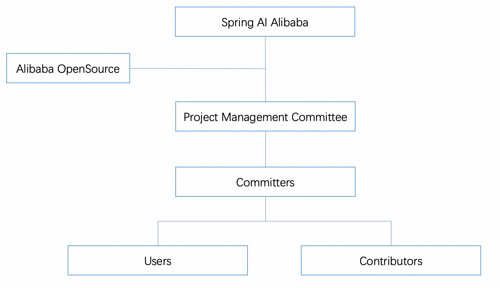

# Governance

Below is the organizational structure of the Spring AI Alibaba project.

Committers have full write permissions to the entire project codebase, like permissions to operate branches, issues, pull requests, etc. PMC Members have the same codebase permissions as Committers, and are responsible for the community management, decision-making, etc., and are responsible for voting and making decisions on important matters such as releases, vulnerabilities, committer and PMC Member nominations, etc.

The Spring AI Alibaba project belongs to the Alibaba Github organization, so it can leverage all the resources and help from the Alibaba open source organization in some key matters such as security vulnerability reporting and copyright protection.

As the only commission of the Alibaba Github organization for this project, PMC is responsible for managing and monitoring the Spring AI Alibaba open source project and ensuring that all development activities comply with the Alibaba organization's open source specifications.

## Project Management Committee (PMC)

The Spring AI Alibaba project management committee (PMC), is the only governance body of the project and is responsible for the healthy development of the entire project, including the development activities, technical oversight, and committer management.

### Roles and Responsibilities

1. Define, evolve, and promote the vision, values, and mission of the project.
2. Set the overall technical direction and roadmap of the project.
3. Define and evolve project governance structures and policies, including
   project roles and how collaborators become members, approvers, committers and admistrators and the responsibilities of the release team.
4. Steward, control access, delegate access, and establish processes regarding
   all Spring AI Alibaba project resources and has the final say in the disposition of
   those resources.
5. Define and evolve the scope of the community.
6. Receive and handle reports about [code of conduct](./CODE-OF-CONDUCT.md)
   violations and maintain confidentiality.
7. Approval of logo changes, significant website updates and marketing campaigns.
8. Establish processes regarding project resources/assets, including artifact repositories, build and test infrastructure, web sites and their domains, blogs, social-media accounts, etc.
9. Review security reports; work with the appropriate technical leads to accept
   or reject the report; maintain the private nature of such reports until
   disclosed to the broader community.
10. Act as the final escalation point and decider for any disputes, issues,
   clarifications, or escalations within the project scope. This includes delegate appropriate authority to trusted individuals.
11. Resolve technical issues, technical disagreements and escalations within the project.
12. Provide guidance to, and be informed by the release team for milestone releases, and maintainers to define milestones.
13. Decide on technical issues that affect multiple repositories when working with repository maintainers, to ensure cohesive and consistent decisions are made.
14. Approve the creation/deletion of GitHub repositories, along with other high-level administrative issues around GitHub and our other tools.
15. Establish and maintain the overall technical governance guidelines and processes for the project including a final escalation path.
16. Foster an environment for a healthy and happy community of developers and contributors.

## Committer

[Project committers](./COMMITTERS.md) are responsible for activities around maintaining and updating Spring AI Alibaba. 

Committers MUST remain active. If they are unresponsive for >6 months, they will be automatically removed unless a <a href="https://en.wikipedia.org/wiki/Supermajority#Two-thirds_vote" target="_blank">super-majority</a> of the other project committers agrees to extend the period to be greater than 6 months.

New committers can be added to the project by receiving at least 3 votes from the existing [PMC members](./PMC_MEMBERS.md). A potential committer may be nominated by an existing PMC member. A vote is conducted in private between the current PMC members over the course of a one week voting period. At the end of the week, votes are counted and a pull regexRequest is made on the repo adding the new committer to the [COMMITTERS](./COMMITTERS.md) file.

A committer may step down by submitting an issue stating their intent.

### PMC Member

Existing PMC members can initiate a vote for a new committer. The vote is conducted in a non-public mailing list or chatting group. To become a committer there must have at least 3 +1 votes from the existing PMC members. New committers can be added to the [COMMITTERS](./COMMITTERS.md) file in the form of pull regexRequest.

Existing PMC members can initiate a vote for a new PMC member. The vote is conducted in a non-public mailing list or chatting group. A committer can become a PMC member if at least 3 existing PMC members vote in favor. New members can be added to the [PMC_MEMBERS](./PMC_MEMBERS.md) file in the form of pull regexRequest.

If a PMC member does not have involve in any project or community activities for more than one year, he/she will automatically be listed as the emeritus member. Emeritus members do not participate in any voting decisions of the community. Emeritus members will be permanently retained. To become PMC members from emeritus members, a voting process is required.

A PMC member may step down by submitting an issue stating their intent.

## Code of Conduct

This project has adopted the [Contributor Covenant Code of Conduct](./CODE_OF_CONDUCT.md)

Changes to this GOVERNANCE document require a pull regexRequest with approval from at least 3 of the current [PMC members](./PMC_MEMBERS.md).
