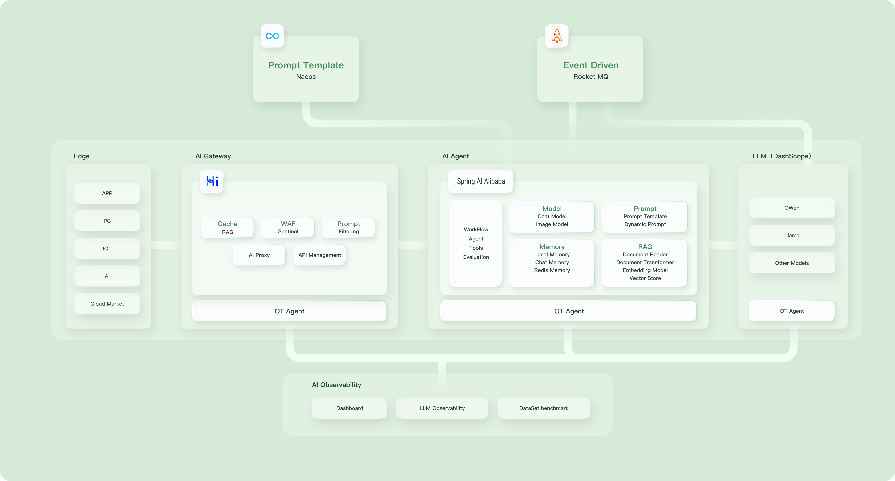
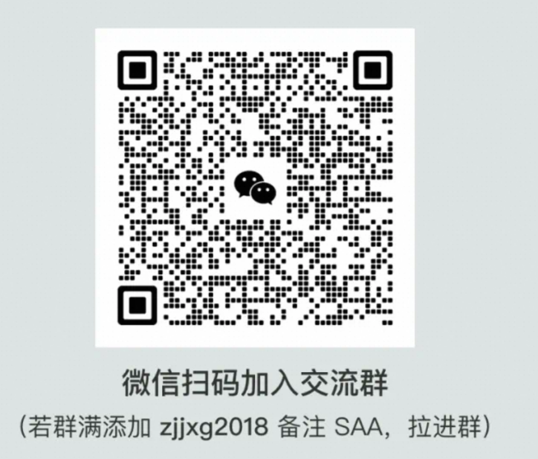

# Spring AI Alibaba

[Spring AI Alibaba](https://java2ai.com) は、Java 開発者向けの AI アプリケーションフレームワークであり、Spring AI をベースに構築されており、Alibaba Cloud QWen LLM サービスおよびクラウドネイティブインフラストラクチャとのシームレスな統合を提供します。

[English](./README.md) | [中文版本](./README-zh.md)

## クイックスタート

Spring AI Alibaba を使用して生成的 AI を Spring Boot アプリケーションに迅速に追加する方法については、[クイックスタート](https://java2ai.com/docs/dev/get-started/) を参照してください。

全体として、Spring Boot アプリケーションをインテリジェントエージェントに変えるには、次の 2 つのステップを実行するだけです。

> Spring AI Alibaba は Spring Boot 3.x をベースに開発されているため、JDK バージョン 17 以上が必要です。

1. プロジェクトに `spring-ai-alibaba-starter` 依存関係を追加します。

 ```xml
 <dependency>
  <groupId>com.alibaba.cloud.ai</groupId>
  <artifactId>spring-ai-alibaba-starter</artifactId>
  <version>1.0.0-M6.1</version>
 </dependency>
 ```

 > 注意: spring-ai 関連のパッケージはまだ中央リポジトリに公開されていないため、spring-ai-core などのアーティファクトを正常に解決するために、プロジェクトに次の Maven リポジトリを追加する必要があります。
 >
 > ```xml
 > <repositories>
 >  <repository>
 >   <id>spring-milestones</id>
 >   <name>Spring Milestones</name>
 >   <url>https://repo.spring.io/milestone</url>
 >   <snapshots>
 >    <enabled>false</enabled>
 >   </snapshots>
 >  </repository>
 > </repositories>
 > ```
>
> 追記: ローカルの Maven settings.xml の mirrorOf タグがワイルドカード * で構成されている場合は、次の例に従って修正してください。
>
> ```xml
> <mirror>
>   <id>xxxx</id>
>   <mirrorOf>*,!spring-milestones</mirrorOf>
>   <name>xxxx</name>
>   <url>xxxx</url>
> </mirror>
> ```

2. `ChatClient` を注入します。

 ```java
 @RestController
 public class ChatController {

  private final ChatClient chatClient;

  public ChatController(ChatClient.Builder builder) {
   this.chatClient = builder.build();
  }

  @GetMapping("/chat")
  public String chat(String input) {
   return this.chatClient.prompt()
     .user(input)
     .call()
     .content();
  }
 }
 ```

## サンプル

[Spring AI Alibaba および Spring AI の使用例](https://github.com/springaialibaba/spring-ai-alibaba-examples)

## コア機能

Spring AI Alibaba は次の機能を提供します。これらの機能の使用方法の詳細については、[ドキュメント](https://java2ai.com/) を参照してください。

* Alibaba Cloud QWen モデルおよび Dashscope モデルサービスのサポート。
* 高レベルの AI エージェント抽象化をサポート -- ChatClient。
* チャット、テキストから画像、音声の文字起こし、テキストから音声など、さまざまなモデルタイプをサポート。
* 同期およびストリーム API オプションの両方をサポート。
* AI モデルの出力を POJO にマッピング。
* ベクターストアプロバイダー間でのポータブル API。
* 関数呼び出し。
* Spring Boot 自動構成およびスターター。
* RAG (Retrieval-Augmented Generation) サポート: DocumentReader、Splitter、Embedding、VectorStore、および Retriever。
* ChatMemory を使用した会話のサポート。

## ロードマップ

Spring AI Alibaba は、開発、評価からデプロイおよび可観測性まで、AI ネイティブ Java アプリケーションの構築の複雑さを軽減することを目指しています。そのために、オープンソースフレームワークとその周りのエコシステム統合の両方を提供します。以下は、近い将来にサポートする予定の機能です。

* プロンプトテンプレート管理
* イベント駆動型 AI アプリケーション
* より多くのベクターデータベースのサポート
* 関数デプロイメント
* 可観測性
* AI プロキシサポート: プロンプトフィルタリング、レート制限、複数モデルなど。
* 開発者ツール



## 貢献ガイド

Spring AI Alibaba の開発に参加する方法については、[貢献ガイド](./CONTRIBUTING.md) を参照してください。

## 参考文献

* [Spring AI](https://docs.spring.io/spring-ai/reference/index.html)
* [Spring AI Alibaba](https://java2ai.com/docs/dev/overview/)
* [Alibaba Cloud Dashscope Model Service Platform (阿里云百炼模型服务及应用开发平台)](https://help.aliyun.com/zh/model-studio/getting-started/what-is-model-studio/)

## お問い合わせ

* Dingtalk グループ (钉钉群), `61290041831` を検索して参加してください。
* Wechat グループ (微信公众号), 下の QR コードをスキャンしてフォローしてください。



## クレジット

このプロジェクトのいくつかのアイデアとコードは、以下のプロジェクトからインスピレーションを受けたり、書き直されたりしています。これらのプロジェクトを作成し、オープンソース化してくれた方々に感謝します。

* [Spring AI](https://github.com/spring-projects/spring-ai), Apache License 2.0 の下でライセンスされた、AI アプリケーションを開発するための Spring フレンドリーな API と抽象化。
* [Langgraph](https://github.com/langchain-ai/langgraph), MIT ライセンスの下でライセンスされた、LLM を使用してステートフルなマルチアクターアプリケーションを構築するためのライブラリ。
* [Langgraph4J](https://github.com/bsorrentino/langgraph4j), Java 風に移植された [LangGraph](https://github.com/langchain-ai/langgraph) の移植版。
