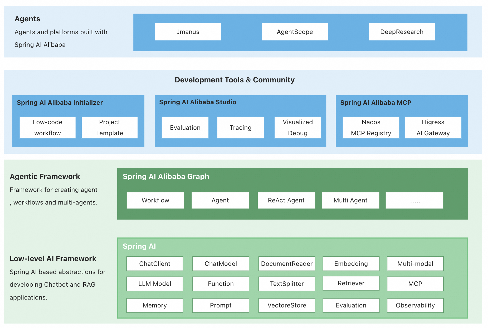
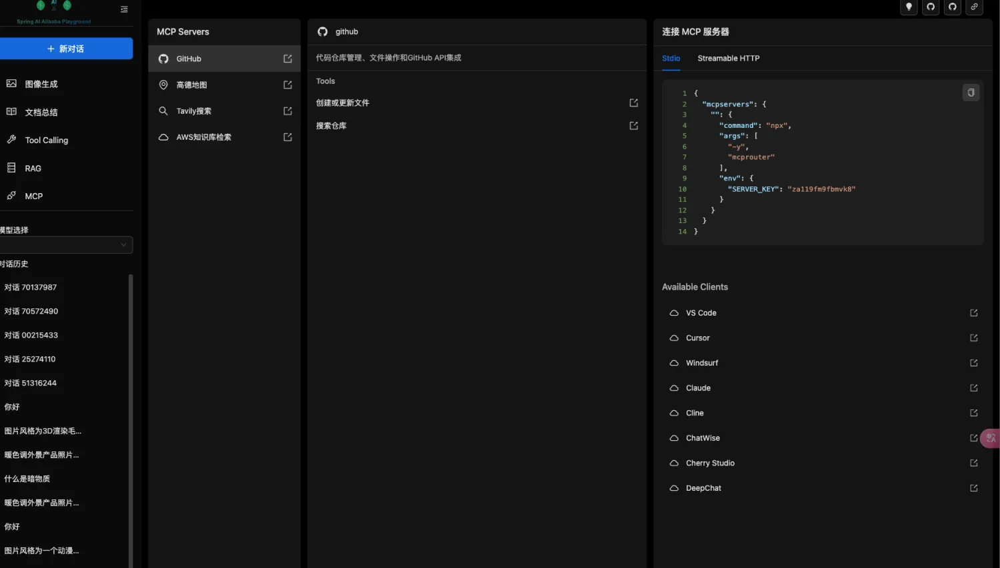
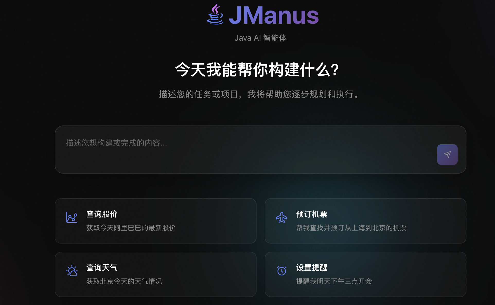
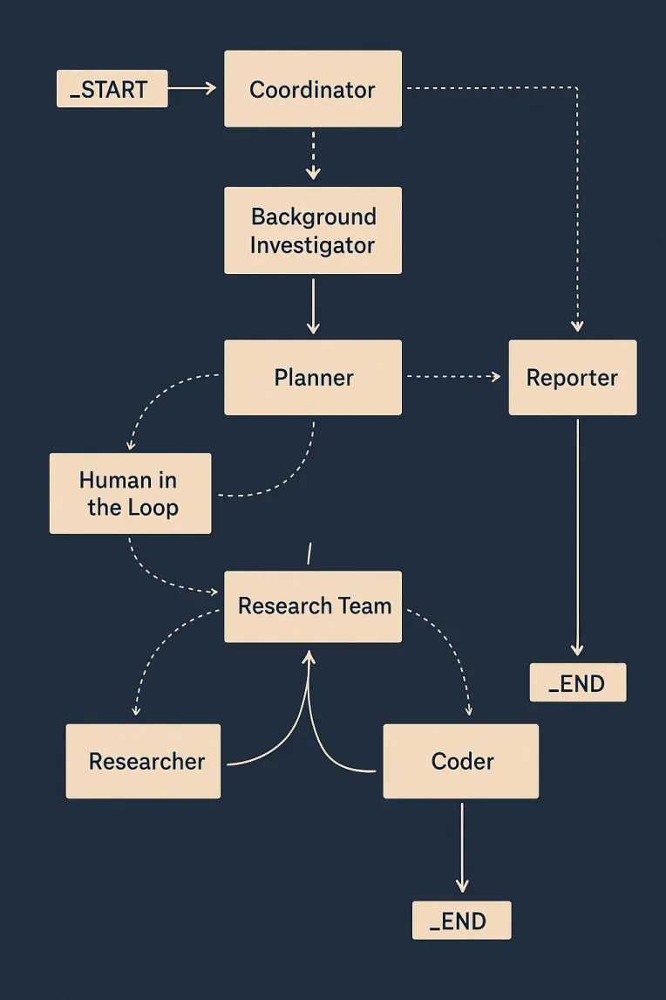

# Spring AI Alibaba

[](https://www.apache.org/licenses/LICENSE-2.0.html)
[](https://github.com/alibaba/spring-ai-alibaba/actions?query=workflow%3A%22%F0%9F%9B%A0%EF%B8%8F+Build+and+Test%22)
[](https://deepwiki.com/alibaba/spring-ai-alibaba)
[](https://maven-badges.herokuapp.com/maven-central/com.alibaba.cloud.ai/spring-ai-alibaba)


[Spring AI Alibaba](https://java2ai.com) 是一款以 Spring AI 为基础，深度集成百炼平台，支持 ChatBot、工作流、多智能体应用开发模式的 AI 框架。

[English](./README.md)

## 核心特性

<p align="center">
     
</p>


Spring AI Alibaba 提供以下核心能力，帮助开发者快速构建自己的 Agent、Workflow 或 Multi-agent 应用：

1. **Graph 多智能体框架。** 基于 Spring AI Alibaba Graph 开发者可快速构建工作流、多智能体应用，无需关心流程编排、上下文记忆管理等底层实现。支持 Dify DSL 自动生成 Graph 代码，支持 Graph 可视化调试。
2. **通过 AI 生态集成，解决企业智能体落地过程中关心的痛点问题。** Spring AI Alibaba 支持与百炼平台深度集成，提供模型接入、RAG知识库解决方案；支持 ARMS、Langfuse 等 AI 可观测产品无缝接入；支持企业级的 MCP 集成，包括 Nacos MCP Registry 分布式注册与发现、自动 Router 路由等。
3. **探索具备自主规划能力的通用智能体产品与平台。** 社区发布了基于 Spring AI Alibaba 框架实现的 JManus 智能体，除了对标 Manus 等通用智能体的产品能力外。社区在积极探索自主规划在智能体开发方向的应用，为开发者提供从低代码、高代码到零代码构建智能体的更灵活选择，加速智能体在企业垂直业务方向的快速落地。

## 快速开始

在项目中加入 `spring-ai-alibaba-starter-dashscope` 依赖，快速开始智能体应用开发

```xml
<dependencyManagement>
  <dependencies>
    <dependency>
      <groupId>com.alibaba.cloud.ai</groupId>
      <artifactId>spring-ai-alibaba-bom</artifactId>
      <version>1.0.0.2</version>
      <type>pom</type>
      <scope>import</scope>
    </dependency>
  </dependencies>
</dependencyManagement>

<dependencies>
  <dependency>
    <groupId>com.alibaba.cloud.ai</groupId>
    <artifactId>spring-ai-alibaba-starter-dashscope</artifactId>
  </dependency>
</dependencies>
```

请查看官网 [快速开始](https://java2ai.com/docs/1.0.0.2/get-started/chatbot) 了解详细示例讲解。更多 starter 包括 spring-ai-alibaba-graph-core、spring-ai-alibaba-starter-nl2sql、spring-ai-alibaba-starter-nacos-mcp-client 等用法，请参考官方文档资料。

> 注意：
> 1. 运行项目需要 JDK 17 及以上版本。
> 2. 如果出现 spring-ai 相关依赖下载问题，请参考[官网 FAQ 文档](https://java2ai.com/docs/1.0.0.2/faq)配置 spring-milestones Maven 仓库。

### 体验官方 Playground 示例

Spring AI Alibaba 官方社区开发了一个**包含完整 `前端UI+后端实现` 的智能体 Playground 示例**，示例使用 Spring AI Alibaba 开发，可以体验聊天机器人、多轮对话、图片生成、多模态、工具调用、MCP集成、RAG知识库等所有框架核心能力。

整体运行后的界面效果如下所示：

<p align="center">
     
</p>

您可以在[本地部署 Playground 示例](https://github.com/springaialibaba/spring-ai-alibaba-examples/tree/main/spring-ai-alibaba-playground)并通过浏览器访问体验，或者拷贝源码并按照自己的业务需求调整，以便能够快速基于 Spring AI Alibaba 搭建一套自己的 AI 应用。

学习更多 Spring AI Alibaba 框架用法，请参考 Spring AI Alibaba 社区的官方示例源码仓库：

[https://github.com/springaialibaba/spring-ai-alibaba-examples](https://github.com/springaialibaba/spring-ai-alibaba-examples)

## Spring AI Alibaba Graph 多智能体框架

Spring AI Alibaba Graph 使开发者能够实现工作流和多智能体应用编排。其核心设计理念参考自 Langgraph，Spring AI Alibaba 社区在此基础上增加了大量预置 Node、简化了 State 定义过程，让开发者能够更好的与低代码平台集成、编写主流多智能体应用。

Spring AI Alibaba Graph 核心能力：

+ 支持工作流，内置工作流节点，与主流低代码平台对齐；
+ 支持 Multi-agent，内置 ReAct Agent、Supervisor 等模式；
+ 支持 Streaming；
+ Human-in-the-loop，通过人类确认节点，支持修改状态、恢复执行；
+ 支持记忆与持久存储；
+ 支持流程快照；
+ 支持嵌套分支、并行分支；
+ PlantUML、Mermaid 可视化导出。

## 企业级 AI 生态集成

在 Agent 生产落地过程中，用户需要解决智能体效果评估、MCP 工具集成、Prompt 管理、Token 上下文、可视化 Tracing 等各种问题。Spring AI Alibaba 通过与 Nacos3、Higress AI 网关、阿里云 ARMS、阿里云向量检索数据库、百炼智能体平台等深度集成，提供全面的 AI 智能体企业级生产解决方案，加速智能体从 Demo 走向生产落地。

<p align="center">   
     
</p>

1. **企业级 MCP 部署与代理方案**：支持基于 Nacos MCP Registry 的分布式部署与负载均衡调用，通过 Spring AI Alibaba MCP Gateway、Higress 代理可实现零改造将 HTTP/Dubbo 服务发布为 MCP；

2. **AI 网关集成提升模型调用稳定性与灵活性**：使用 Higress 作为大模型代理，`spring-ai-starter-model-openai` 可通过 OpenAI 标准接口接入 Higress 代理服务。

3. **降低企业数据整合成本，提升 AI 数据应用效果**；

    - **百炼 RAG 知识库**：私有数据上传百炼平台清洗、切片、向量化管理，通过 Spring AI Alibaba 开发智能体应用并实现 RAG 检索；
    - **百炼析言 ChatBI，从自然语言到 SQL 自动生成**： Spring AI Alibaba Nl2sql 基于百炼析言 ChatBI 技术，可根据自然语言描述生成数据查询 SQL。

4. **可观测与效果评估，加速智能体从 Demo 走向生产落地**： SDK 默认埋点，支持 OpenTelemetry 格式的 tracing 上报，支持接入 Langfuse、阿里云 ARMS 等平台。
## 通用智能体平台

### JManus 智能体平台

Manus 的横空出世，让通用智能体自动规划、执行规划的能力给了人们无限想象空间，它非常擅长解决开放性问题，在日常生活、工作等场景都能有广泛的应用。在我们最开始发布 JManus 之时，给它的定位是一款完全以 Java 语言为核心、彻底开源的 Manus 复刻实现，基于 Spring AI Alibaba 实现的通用 AI Agent 产品，包含一个设计良好的前端 UI 交互界面。

随着对于通用智能体等方向的深度探索，开发者们逐渐开始认识到：基于当前以及未来相当长时间内的模型能力，完全依赖通用智能体的自动规划模式很难解决一些确定性极强的企业场景问题。企业级业务场景的典型特点是确定性，我们需要定制化的工具、子 agent，需要稳定而又确定性强的规划与流程。为此，我们调整了 JManus 通用智能体的终端产品定位。我们期望 JManus 能够成为一个智能体开发平台，让用户能以最直观、低成本的方式构建属于自己的垂直领域的智能体实现。

<p align="center">
     
</p>


### DeepResearch 智能体

Spring AI Alibaba DeepResearch 是一款基于 Spring AI Alibaba Graph 开发的 Deep Research 智能体, 包括完整的前端 Web UI（开发中） 和后端实现，DeepResearch 支持一系列精心设计的工具，如 Web Search（网络查询）、Crawling（爬虫）、Python 脚本引擎等。借助大模型与工具能力，帮助用户完成各类深度调研报告。

<p align="center">
    
</p>

## 贡献指南

Spring AI Alibaba 社区正在快速发展中，我们欢迎任何对 AI 感兴趣的开发者参与建设 Spring AI Alibaba。如果您有兴趣参与建设，请参考 [贡献指南](./CONTRIBUTING.md)。

## 联系我们

* 钉钉群：请通过群号 `124010006813` 搜索入群
* 微信交流群：请扫描以下二维码进群

  <p align="center">
      
  </p>

## 致谢

本项目的一些灵感和代码受到以下项目的启发或基于其重写，非常感谢创建和维护这些开源项目的开发者们。

* [Spring AI](https://github.com/spring-projects/spring-ai)，一款面向 Spring 开发者的 AI 智能体应用开发框架，提供 Spring
  友好的 API 和抽象。基于 Apache License V2 开源协议。
* [Langgraph](https://github.com/langchain-ai/langgraph)，一个用于使用LLM构建有状态、多参与者应用程序的库，用于创建代理和多代理工作流。基于
  MIT 开源协议。
* [Langgraph4J](https://github.com/bsorrentino/langgraph4j)，[LangGraph]项目的 Java 移植版本。基于 MIT 开源协议。
