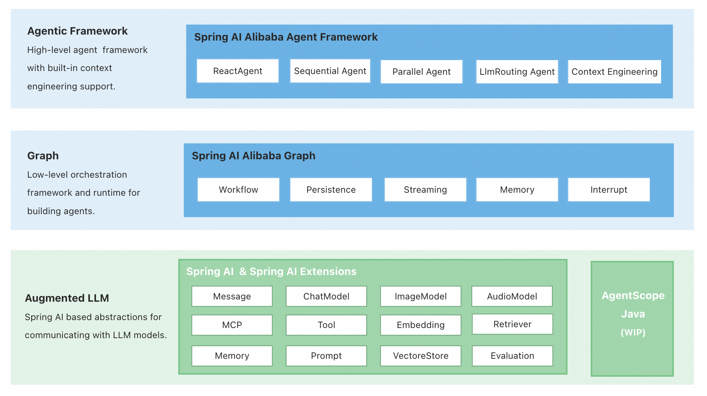

# [Spring AI Alibaba](https://java2ai.com)

[](https://www.apache.org/licenses/LICENSE-2.0.html)
[](https://github.com/alibaba/spring-ai-alibaba/actions?query=workflow%3A%22%F0%9F%9B%A0%EF%B8%8F+Build+and+Test%22)
[](https://deepwiki.com/alibaba/spring-ai-alibaba)
[](https://maven-badges.herokuapp.com/maven-central/com.alibaba.cloud.ai/spring-ai-alibaba)


<html>
    <h3 align="center">
      A production-ready framework for building Agentic, Workflow, and Multi-agent applications.
    </h3>
    <h3 align="center">
      <a href="https://java2ai.com/docs/quick-start/" target="_blank">Agent Framework Docs</a>,
      <a href="https://java2ai.com/docs/frameworks/graph-core/quick-start/" target="_blank">Graph Docs</a>,
      <a href="https://java2ai.com/ecosystem/spring-ai/reference/concepts/" target="_blank">Spring AI</a>,
      <a href="https://github.com/alibaba/spring-ai-alibaba/tree/main/examples" target="_blank">Examples</a>.
    </h3>
</html>

## What's Agent Framework

> **NOTICE!** Spring Ai Alibaba is a project designed and created for multi-agent and workflow orchestration. So the `ReactAgent` in Spring Ai Alibaba is under the hood run on Graph Runtime and is designed mainly for workflow orchestration.
> 
> If you are looking for a more advanced ReactAgent paradigm for building model-derived agents, please checkout the **<a href="https://github.com/agentscope-ai/agentscope-java">AgentScope</a>** project we have built recently. The Spring Ai Alibaba `ReactAgent` part will still be maintained and continue to receive bug fixes and critical security patches, we will be focusing more on Spring Ai integrtion and multi-agent orchestration.

<p align="center">
    
</p>

Spring AI Alibaba Agent Framework is an agent development framework centered around the design philosophy of **ReactAgent**, enabling developers to build agents with core capabilities such as automatic **Context Engineering** and **Human In The Loop** interaction.

For scenarios requiring more complex process control, Agent Framework offers built-in workflows like `SequentialAgent`, `ParallelAgent`, `RoutingAgent`, and `LoopAgent` based on its **Graph Runtime**. Developers can also flexibly orchestrate more complex workflows using the Graph API.

## Core Features

* **[ReactAgent](https://java2ai.com/docs/frameworks/agent-framework/tutorials/agents)**: Build intelligent agents with reasoning and acting capabilities, following the ReAct (Reasoning + Acting) paradigm for iterative problem-solving.

* **[Multi-Agent Orchestration](https://java2ai.com/docs/frameworks/agent-framework/advanced/multi-agent)**: Compose multiple agents with built-in patterns including `SequentialAgent`, `ParallelAgent`, `LlmRoutingAgent`, and `LoopAgent` for complex task execution.

* **[Context Engineering](https://java2ai.com/docs/frameworks/agent-framework/tutorials/hooks)**: Built-in best practices for context engineering policies to improve agent reliability and performance, including human-in-the-loop, context compaction, context editing, model & tool call limit, tool retry, planning, dynamic tool selection.

* **[Graph-based Workflow](https://java2ai.com/docs/frameworks/graph-core/quick-start)**: Graph based workflow runtime and api for conditional routing, nested graphs, parallel execution, and state management. Export workflows to PlantUML and Mermaid formats.

* **[A2A Support](https://java2ai.com/docs/frameworks/agent-framework/advanced/a2a)**: Agent-to-Agent communication support with Nacos integration, enabling distributed agent coordination and collaboration across services.

* **[Rich Model, Tool and MCP Support](https://java2ai.com/ecosystem/spring-ai/models/dashScope)**: Leveraging core concepts of Spring AI, supports multiple LLM providers (DashScope, OpenAI, etc.), tool calling, and Model Context Protocol (MCP).

## Getting Started

### Prerequisites

* Requires JDK 17+.
* Choose your LLM provider and get the API-KEY.

### Quickly Run a ChatBot

There's a ChatBot example provided by the community at [examples/chatbot](https://github.com/alibaba/spring-ai-alibaba/tree/main/examples/chatbot).

1. Download the code.

	```shell
	git clone --depth=1 https://github.com/alibaba/spring-ai-alibaba.git
	cd examples/chatbot
	```

2. Start the ChatBot.

	Before start, set API-KEY firat (visit <a href="https://bailian.console.aliyun.com/?apiKey=1&tab=api#/api" target="_blank">Aliyun Bailian</a> to get API-KEY):
	```shell
	# this example uses 'spring-ai-alibaba-starter-dashscope', visit https://java2ai.com to learn how to use OpenAI/DeepSeek.
	export AI_DASHSCOPE_API_KEY=your-api-key
	```
	
	```shell
	mvn spring-boot:run
	```

3. Chat with ChatBot.

	Open the browser and visit [http://localhost:8080/chatui/index.html](http://localhost:8080/chatui/index.html) to chat with the ChatBot.
	
<p align="center">
	
</p>

## Chatbot Code Explained

1. Add dependencies

	```xml
	<dependencies>
	  <dependency>
	    <groupId>com.alibaba.cloud.ai</groupId>
	    <artifactId>spring-ai-alibaba-agent-framework</artifactId>
	    <version>1.1.0.0-RC2</version>
	  </dependency>
	  <!-- Assume you are going to use DashScope Model. Refer to docs for how to choose model.-->
	  <dependency>
	    <groupId>com.alibaba.cloud.ai</groupId>
	    <artifactId>spring-ai-alibaba-starter-dashscope</artifactId>
	    <version>1.1.0.0-RC2</version>
	  </dependency>
	</dependencies>
	```

2. Define Chatbot
   
	For more details of how to write a Chatbot, please check the [Quick Start](https://java2ai.com/docs/quick-start) on our official website.

## 📚 Documentation
* [Overview](https://java2ai.com/docs/overview) - High level overview of the framework
* [Quick Start](https://java2ai.com/docs/quick-start) - Get started with a simple agent
* [Agent Framework Tutorials](https://java2ai.com/docs/frameworks/agent-framework/tutorials/agents) - Step by step tutorials
* [Use Graph API to Build Complex Workflows](https://java2ai.com/docs/frameworks/agent-framework/advanced/context-engineering) - In-depth user guide for building multi-agent and workflows
* [Spring AI Basics](https://java2ai.com/ecosystem/spring-ai/reference/concepts) - Ai Application basic concepts, including ChatModel, MCP, Tool, Messages, etc.

## Project Structure

This project consists of three core components:

* **Agent Framework**: A ReactAgent-based development framework designed for building intelligent agents with built-in context engineering best practices. For scenarios requiring more complex flow control, the Agent Framework leverages the underlying Graph runtime to provide orchestration capabilities, supporting SequentialAgent, ParallelAgent, LoopAgent, RoutingAgent, and more. Developers can also use the Graph API to flexibly orchestrate their own workflows.

* **Graph**: The underlying runtime for Agent Framework. We recommend developers to use Agent Framework but it's totally fine to use the Graph API directly. Graph is a low-level workflow and multi-agent orchestration framework that enables developers to implement complex application orchestration. Inspired by LangGraph, it features a rich set of prebuilt nodes and simplified Graph State definitions, making it easier to integrate with low-code platforms and implement popular multi-agent patterns.

* **Spring Boot Starters**: Starters integrating Agent Framework with Nacos to provide A2A and dynamic config features.

## Spring AI Alibaba Ecosystem
 Repository | Description | ⭐
  --- | --- | ---
| [Spring AI Alibaba Graph](https://github.com/alibaba/spring-ai-alibaba/tree/main/spring-ai-alibaba-graph-core) | A low-level orchestration framework and runtime for building, managing, and deploying long-running, stateful agents. | 
| [Spring AI Alibaba Admin](https://github.com/spring-ai-alibaba/spring-ai-alibaba-admin) |  Local visualization toolkit for the development of agent applications, supporting project management, runtime visualization, tracing, and agent evaluation. | 
| [Spring AI Extensions](https://github.com/spring-ai-alibaba/spring-ai-extensions) | Extended implementations for Spring AI core concepts, including DashScopeChatModel, MCP registry, etc. |  
| [Spring AI Alibaba Examples](https://github.com/spring-ai-alibaba/examples) | Spring AI Alibaba Examples. |  
| [JManus](https://github.com/spring-ai-alibaba/jmanus) | A Java implementation of Manus built with Spring AI Alibaba, currently used in many applications within Alibaba Group. | 
| [DataAgent](https://github.com/spring-ai-alibaba/dataagent) | A natural language to SQL project based on Spring AI Alibaba, enabling you to query databases directly with natural language without writing complex SQL. | 
| [DeepResearch](https://github.com/spring-ai-alibaba/deepresearch) |  Deep Research implemented based on spring-ai-alibaba-graph. | 

## Contact Us

* Dingtalk Group (钉钉群), search `130240015687` and join.
* WeChat Group (微信公众号), scan the QR code below and follow us.


## Resources
* [AI-Native Application Architecture White Paper](https://developer.aliyun.com/ebook/8479)：Co-authored by 40 frontline engineers and endorsed by 15 industry experts, this 200,000+ word white paper is the first comprehensive guide dedicated to the full DevOps lifecycle of AI-native applications. It systematically breaks down core concepts and key challenges, offering practical problem-solving approaches and architectural insights.


## Star History

[](https://starchart.cc/alibaba/spring-ai-alibaba)

---

<p align="center">
    Made with ❤️ by the Spring AI Alibaba Team

