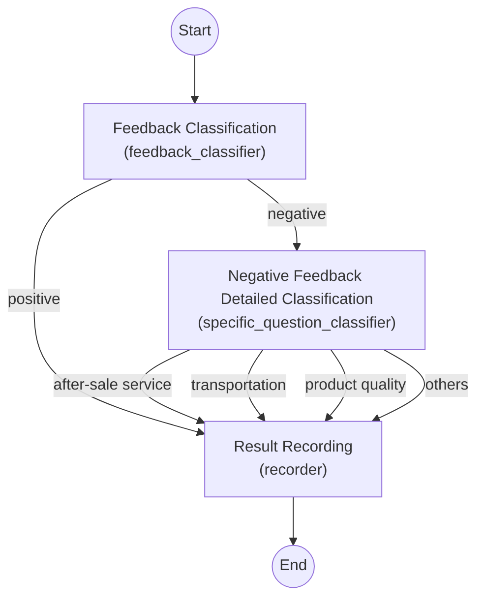

# [Spring AI Alibaba](https://java2ai.com)

[](https://www.apache.org/licenses/LICENSE-2.0.html)
[](https://github.com/alibaba/spring-ai-alibaba/actions?query=workflow%3A%22%F0%9F%9B%A0%EF%B8%8F+Build+and+Test%22)
[](https://deepwiki.com/alibaba/spring-ai-alibaba)
[](https://maven-badges.herokuapp.com/maven-central/com.alibaba.cloud.ai/spring-ai-alibaba)


[中文版本](./README-zh.md)

[Spring AI Alibaba](https://java2ai.com) is an agentic AI framework for building ChatBot, Workflow, and Multi-agent applications.

## Core Features

<p align="center">
     
</p>


Spring AI Alibaba provides the following core capabilities to help developers quickly build Chatbot, Workflow, or Multi-agent applications:

1. **Graph based multi-agent framework**, with Spring AI Alibaba Graph, developers can quickly build workflows and multi-agent applications in ease. Graph code can be generated from Dify DSL and debugged in a visual way.
2. **Enterprise-ready AI ecosystem integration, bring agents from demo to production.** Spring AI Alibaba supports integration with the Aliyun Bailian platform, providing LLM model service and RAG knowledge  solutions; Support seamless integration of AI observation products such as ARMS and Langfuse; Support enterprise level MCP integration, including Nacos MCP Registry for MCP discovery and routing, etc.
3. **Plan-Act agent products and platforms.**
* JManus, Spring AI Alibaba based Manus implementation, supports delicacy plan adjustment, plan reuse.
* DeepResearch, Spring AI Alibaba based research and report agent with powerful tools like search engines, web crawlers, Python and MCP services.

## Get Started

To quickly get started with Spring AI Alibaba, add 'spring-ai-alibaba-starter-dashscope' dependency to your java project.

```xml
<dependencyManagement>
  <dependencies>
    <dependency>
      <groupId>com.alibaba.cloud.ai</groupId>
      <artifactId>spring-ai-alibaba-bom</artifactId>
      <version>1.0.0.2</version>
      <type>pom</type>
      <scope>import</scope>
    </dependency>
  </dependencies>
</dependencyManagement>

<dependencies>
  <dependency>
    <groupId>com.alibaba.cloud.ai</groupId>
    <artifactId>spring-ai-alibaba-starter-dashscope</artifactId>
  </dependency>
</dependencies>
```

Please check Quick Start on our official website to learn more details. More starters include `spring-ai-alibaba-graph-core`, `spring-ai-alibaba-starter-nl2sql`,`spring-ai-alibaba-starter-nacos-mcp-client`, etc, please refer to the official website documentation.


> NOTE!
> 1. Requires JDK 17+.
> 2. If there are any `spring-ai` dependency issue, please lean how to configure the `spring-milestones` Maven repository,you can quickly start and check the official website.

### Playground and Example

The community has developed a [Playground](https://github.com/springaialibaba/spring-ai-alibaba-examples) agent that includes a complete front-end UI and back-end implementation. The Playground back-end is developed using Spring AI Alibaba and gives users a quick overview of all core framework capabilities such as chatbot, multi-round conversations, image generation, multi-modality, tool calling, MCP, and RAG.

<p align="center">
     
</p>


You can deploy [Playground](https://github.com/springaialibaba/spring-ai-alibaba-examples) locally and experience playground with browser. To quickly build your own AI application, the source code and adjust it according to your business needs, .

For more examples, please refer to our official example repository: [https://github.com/springaialibaba/spring-ai-alibaba-examples](https://github.com/springaialibaba/spring-ai-alibaba-examples)

### Workflow and Example

To quickly get started with Spring AI Alibaba Graph, you can build a complete workflow application based on the official WorkflowAutoconfiguration example. The following uses a “customer feedback processing system” as an example to introduce the main steps from adding project dependencies to running tests:

1. **Dependencies and Model Configuration**: In the Spring Boot project’s Maven `pom.xml`, include the Spring AI Alibaba BOM and the required Starter dependencies. For instance, include the DashScope Starter for Alibaba's Pai-Blade model (or the OpenAI Starter, depending on the model platform used). For example:

   ```xml
   <dependencyManagement>
       <dependencies>
           <dependency>
               <groupId>com.alibaba.cloud.ai</groupId>
               <artifactId>spring-ai-alibaba-bom</artifactId>
               <version>1.0.0.2</version>
               <type>pom</type>
               <scope>import</scope>
           </dependency>
       </dependencies>
   </dependencyManagement>
   <dependencies>
       <!-- Include the DashScope model adapter Starter -->
       <dependency>
           <groupId>com.alibaba.cloud.ai</groupId>
           <artifactId>spring-ai-alibaba-starter-dashscope</artifactId>
       </dependency>
       <!-- Include the Graph core dependency -->
       <dependency>
           <groupId>com.alibaba.cloud.ai</groupId>
           <artifactId>spring-ai-alibaba-graph-core</artifactId>
           <version>1.0.0.2</version>
       </dependency>
   </dependencies>
   ```

   After adding the dependencies, configure the model API key in the project’s `application.properties`. For example, when using an OpenAI model set `spring.ai.openai.api-key=<Your API Key>`, or for Alibaba’s Pai-Blade model configure the DashScope service access key (e.g., `spring.ai.dashscope.api-key=<Your API Key>`). These configurations ensure Spring AI can automatically create the necessary **ChatModel** bean to communicate with the corresponding model service.

2. **Workflow StateGraph Definition**: Create a Spring Boot configuration class (for example, `WorkflowAutoconfiguration`) and define a **StateGraph** bean in it to describe the workflow logic. In this configuration, the following steps need to be completed:

   - **ChatClient Initialization**: Retrieve the injected ChatModel from the container (produced by the previous configuration), build a ChatClient instance, and attach necessary Advisors (such as a logger) for subsequent LLM calls. For example:

     ```java
     ChatClient chatClient = ChatClient.builder(chatModel)
                                       .defaultAdvisors(new SimpleLoggerAdvisor())
                                       .build();
     ```

     Here, `ChatClient` is the client provided by Spring AI Alibaba for conversing with the large model, which can be seen as a wrapper around the underlying API.

   - **Global State (OverAllState) Setup**: Define an `OverAllStateFactory` to create an initial global state object each time the workflow executes. Register several **Keys** and their update strategies to manage context data:

     ```java
     OverAllStateFactory stateFactory = () -> {
         OverAllState state = new OverAllState();
         state.registerKeyAndStrategy("input", new ReplaceStrategy());
         state.registerKeyAndStrategy("classifier_output", new ReplaceStrategy());
         state.registerKeyAndStrategy("solution", new ReplaceStrategy());
         return state;
     };
     ```

     The above code registers three state keys: `input` (the input text), `classifier_output` (classification result), and `solution` (final processing conclusion), all using **ReplaceStrategy** (each write replaces the old value). These keys persist throughout the workflow and are used to pass data between nodes.

   - **Node Definitions**: Create the core nodes in the workflow, including two text classification nodes and one recording node. In this example, the framework provides a predefined **QuestionClassifierNode** class for text classification tasks. We use its builder to specify the classification categories and prompts, and use the ChatClient to call the large model service, achieving intelligent classification:

     ```java
     // Feedback positive/negative classification node
     QuestionClassifierNode feedbackClassifier = QuestionClassifierNode.builder()
             .chatClient(chatClient)
             .inputTextKey("input")
             .categories(List.of("positive feedback", "negative feedback"))
             .classificationInstructions(
                     List.of("Try to understand the user's feeling when he/she is giving the feedback."))
             .build();
     // Negative feedback specific question classification node
     QuestionClassifierNode specificQuestionClassifier = QuestionClassifierNode.builder()
             .chatClient(chatClient)
             .inputTextKey("input")
             .categories(List.of("after-sale service", "transportation", "product quality", "others"))
             .classificationInstructions(List.of(
                     "What kind of service or help the customer is trying to get from us? " + 
                     "Classify the question based on your understanding."))
             .build();
     ```

     In the above, two nodes are defined: `feedbackClassifier` will determine whether the feedback is **positive** or **negative**, and `specificQuestionClassifier` will further categorize negative feedback (e.g., after-sale service, transportation, product quality, or others). Both use the ChatClient to invoke the large model for classification, and will write the result to the `"classifier_output"` key in the global state (as per framework convention). In addition, you can define custom nodes as needed.

     For example, a custom `RecordingNode` is used to record and handle the final result:

     ```java
     // Node for recording results
     RecordingNode recorderNode = new RecordingNode();
     ```

     `RecordingNode` implements the NodeAction interface. It will, at the end of the flow, generate the appropriate solution based on the classification result and write the result back to OverAllState.

   - **StateGraph Construction**: Using the **StateGraph** API, add the above nodes to the graph and set up the transitions between nodes:

     ```java
     StateGraph graph = new StateGraph("Consumer Service Workflow Demo", stateFactory)
             .addNode("feedback_classifier", node_async(feedbackClassifier))
             .addNode("specific_question_classifier", node_async(specificQuestionClassifier))
             .addNode("recorder", node_async(recorderNode))
             // Define edges (workflow sequence)
             .addEdge(START, "feedback_classifier")  // Start node
             .addConditionalEdges("feedback_classifier",
                     edge_async(new CustomerServiceController.FeedbackQuestionDispatcher()),
                     Map.of("positive", "recorder", "negative", "specific_question_classifier"))
             .addConditionalEdges("specific_question_classifier",
                     edge_async(new CustomerServiceController.SpecificQuestionDispatcher()),
                     Map.of("after-sale", "recorder", "transportation", "recorder", 
                            "quality", "recorder", "others", "recorder"))
             .addEdge("recorder", END);  // End node
     ```

     This configuration completes the construction of the workflow graph: first, nodes are registered to the graph, and each NodeAction is wrapped with `node_async(...)` to execute as an asynchronous node (to increase throughput or prevent blocking; the framework handles the implementation). Then the edges (transitions) and conditional routing logic between nodes are defined:

     - `START -> feedback_classifier`: The special START state goes directly into the initial **feedback classification** node.
     - `feedback_classifier -> recorder` or `-> specific_question_classifier`: Uses a **conditional edge** to choose the next step based on the classification result. Here, `FeedbackQuestionDispatcher` (implementing **EdgeAction**) reads the classification output and returns `"positive"` or `"negative"`, which map to the subsequent nodes accordingly.
     - `specific_question_classifier -> recorder`: Similarly, via a conditional edge, regardless of which category the negative feedback is classified into (after-sale, transportation, quality, or others), it merges into the **record** node for unified processing.
     - `recorder -> END`: Finally, once the recording node has executed, it transitions to the END state, terminating the flow.

   Completing the above definitions, you can inject the `StateGraph` bean built in the configuration class into the Spring container. At runtime, the framework will automatically compile this graph definition and await execution when invoked.

3. **Running the Application**: After configuring the dependencies and workflow, start the Spring Boot application (for example, using `mvn spring-boot:run` or running the main application class in an IDE). On startup, the application will read the configured API keys, initialize the ChatModel/ChatClient, and register the defined StateGraph. Spring AI Alibaba Graph provides a simple interface to trigger workflow execution — for example, a REST controller can map HTTP requests to the graph execution. Our example application includes a controller, `CustomerServiceController`, that exposes the workflow as an HTTP endpoint (details are explained in the next section).

The business scenario of the above workflow application is to classify and process user product feedback. The collaboration of each component is as follows:

- **Feedback Classification Node (`feedback_classifier`)**: This is a `QuestionClassifierNode` used to determine whether user feedback is positive or negative. It uses an LLM to semantically understand the input text (stored under the `"input"` key) and outputs a category result (such as *positive feedback* or *negative feedback*). The classification result is written to the global state under the `"classifier_output"` key, for use by subsequent edge decision logic.

- **Negative Feedback Detailed Classification Node (`specific_question_classifier`)**: This is also a `QuestionClassifierNode`, executed when the feedback is detected as negative. Based on the content of the negative feedback, it classifies the issue into one of four types: *after-sale service*, *transportation logistics*, *product quality*, or *others*. This node reuses the input text from `"input"` and writes the more specific classification result to `"classifier_output"` (overwriting the previous value, since that key is set with a ReplaceStrategy).

- **Edge Dispatch Logic (EdgeAction)**: The transition logic between the two classification nodes is handled by `FeedbackQuestionDispatcher` and `SpecificQuestionDispatcher`. They implement the **EdgeAction** interface, which reads the global state after a node executes and decides which edge to take next:

  - `FeedbackQuestionDispatcher` (used after the feedback_classifier node) checks the `classifier_output` string. If it contains "positive", it returns `"positive"`; otherwise, it returns `"negative"`. Therefore, the StateGraph maps `"positive"` to the `recorder` node and `"negative"` to the `specific_question_classifier` node.
  - `SpecificQuestionDispatcher` (used after the specific_question_classifier node) parses the more detailed category result. It has a predefined mapping of keywords (e.g., if the result contains "after-sale" then return `"after-sale"`, etc.). It iterates through and returns the corresponding value for the first keyword found in the classification result string, or returns `"others"` if none match. Based on this, the StateGraph directs all possible values (after-sale, transportation, quality, others) to the same next node, `recorder`.

  Through the above EdgeAction implementations, the workflow achieves **dynamic path selection**: positive feedback follows a simplified path, while negative feedback enters a detailed sub-flow. This demonstrates the advantage of Spring AI Alibaba Graph in **routing and branching** scenarios.

- **Recording Node (`recorder`)**: `RecordingNode` is a custom NodeAction that handles recording and decision-making for the final result. Its `apply` method reads the `"classifier_output"` value from the global state and checks whether it contains "positive". If the feedback is positive, it only logs the event with no further action (in the example, it sets the `"solution"` field to the fixed text "Praise, no action taken." to indicate no processing is needed; in a real scenario, logic could be extended, e.g., sending the result to a branding department via an HttpNode). If the feedback is negative, it takes the detailed category result of the negative feedback as the solution (i.e., it puts the content of `"classifier_output"` directly into `"solution"`). The RecordingNode also logs the type of feedback received, so you can see the classification result in the console. This node essentially wraps up the entire workflow, determining what conclusion to provide for different types of user feedback.

In summary, all components work together to complete a two-level classification process: **first determining if feedback is positive or negative, then further categorizing negative feedback, and finally outputting a handling plan**. This decoupled design allows developers to easily adjust each step (for example, swap out the classification model, change the granularity of categories, or add additional processing steps for negative feedback such as sending alerts or storing to a database) without affecting the overall architecture.

The complete PlantUML workflow diagram is shown below:

```
powered by spring-ai-alibaba
end footer
circle start<<input>> as __START__
circle stop as __END__
usecase "feedback_classifier"<<Node>>
usecase "specific_question_classifier"<<Node>>
usecase "recorder"<<Node>>
hexagon "check state" as condition1<<Condition>>
hexagon "check state" as condition2<<Condition>>
"__START__" -down-> "feedback_classifier"
"feedback_classifier" .down.> "condition1"
"condition1" .down.> "specific_question_classifier": "negative"
'"feedback_classifier" .down.> "specific_question_classifier": "negative"
"condition1" .down.> "recorder": "positive"
'"feedback_classifier" .down.> "recorder": "positive"
"specific_question_classifier" .down.> "condition2"
"condition2" .down.> "recorder": "others"
'"specific_question_classifier" .down.> "recorder": "others"
"condition2" .down.> "recorder": "transportation"
'"specific_question_classifier" .down.> "recorder": "transportation"
"condition2" .down.> "recorder": "quality"
'"specific_question_classifier" .down.> "recorder": "quality"
"condition2" .down.> "recorder": "after-sale"
'"specific_question_classifier" .down.> "recorder": "after-sale"
"recorder" -down-> "__END__"
@enduml

```



After completing the above configuration, you can run this workflow application locally and test it through the HTTP interface:

- **Starting the Application**: Ensure the required model API keys are set in the configuration file, then launch the Spring Boot application. In the startup logs, you should see messages indicating ChatClient initialization and StateGraph compiled successfully. If using an OpenAI model, the first call may download the model’s API description; if using an Alibaba Cloud model, ensure the network can reach the DashScope service.

- **Invoking the Workflow Interface**: The example application exposes the workflow as a REST interface via `CustomerServiceController`. Trigger the process by calling the following GET request in a browser or command line:

  ```bash
  # Invoke positive feedback example
  curl "http://localhost:8080/customer/chat?query=This product is excellent, I love it!"
  ```
  

For more examples, please refer to our official example repository: [https://github.com/springaialibaba/spring-ai-alibaba-examples](https://github.com/springaialibaba/spring-ai-alibaba-examples)

## Spring AI Alibaba Graph Multi-gent Framework
Spring AI Alibaba Graph enables developers to implement workflow and multi-agent application orchestration. Its core design is mainly from Langgraph, and we have added a rich set of prebuilt Nodes and simplified the Graph State definition, allowing developers to better integrate with low-code platforms and write popular multi-agent pattern applications.

Core features:

+ Workflow, built-in workflow nodes, aligned with mainstream low-code platforms;
+ Multi-agent, built-in ReAct Agent, Supervisor and other modes;
+ Native streaming support;
+ Human-in-the-loop, waiting for human confirmation, modifying states and resuming execution;
+ Memory and persistent storage;
+ Graph state snapshot;
+ Nested and paralleled graph;
+ PlantUML and Mermaid format export.

## Enterprise-ready AI Ecosystem Integration
To bring agent from demo to production, developers and organizations face lots of challenges, from evaluation, tracing, MCP integration, prompt management, to token rate-limit, etc. Spring AI Alibaba, as am enterprise solution incubated from serving enterprise agent development, provides profound solutions by integrating with Nacos MCP Registry, Higress AI gateway, Alibaba Cloud ARMS, Alibaba Cloud Vector Stores, Alibaba Cloud Bailian platform, etc.

<p align="center">   
     
</p>


1. **Distributed MCP discovery and proxy:** Support distributed MCP Server discovery and load balancing based on Nacos MCP Registry. Zero code change to transform HTTP and Dubbo services into MCP servers with  Spring AI Alibaba MCP Gateway and Higress;
2. **Higress LLM model proxy:** Higress as a LLM proxy, `spring-ai-starter-model-openai` adapter can leverage the unified Higress OpenAI model proxy API;
3. **Better and easy data integration:**
	- a. Bailian RAG integration. Leverage Bailian platform's excellent performance on data filtering, chunking, and vectoring, while using Spring AI Alibaba to do RAG retrieval;
	- b. Bailian ChatBI integration. Spring AI Alibaba Nl2SQL, built on Bailian ChatBI, completely open-source, can generate SQL based on natural language query.
4. **Observation and evaluation platforms:** Thanks to the sdk-native instrumentation of Spring AI, observation and evaluation can be achieved by reporting to OpenTelemetry compatible platforms such as Langfuse and Alibaba Cloud ARMS.

## Agent Products and Platforms
### JManus
The emergence of Manus has given people unlimited space with the ability of general intelligent agents to automatically plan-act on various tasks. It is expected to be very good at solving open-ended issues and can have a wide range of applications in daily life, work, and other scenarios.

JManus is not just a Spring AI Alibaba version Manus replica, it's also designed as a platform that can help developers to build their own fine-tuned agents targeting specific business scenarios. The typical characteristic of enterprise level agent is determinism, that means we need customized tools and sub agents, as well as stable and deterministic planning and processes. Therefore, we hope that JManus can become an intelligent agent development platform, allowing users to build their own domain specific intelligent agent implementations in the most intuitive and low-cost way.

<p align="center">
     
</p>


### DeepResearch
Spring AI Alibaba DeepResearch is a deep research agent developed based on the Spring AI Alibaba Graph, which includes a complete front-end web UI (under development) and back-end implementation. DeepResearch can help users complete various deep research reports with the help of large models and a series of carefully designed tools such as Web Search, Crawling, Python script engine, etc.

<p align="center">
    
</p>

## Contribution Guide

Please refer to the [Contribution Guide](./CONTRIBUTING.md) to learn how to participate in the development of Spring AI
Alibaba.

## Contact Us

* Dingtalk Group (钉钉群), search `124010006813` and join.
* Wechat Group (微信公众号), scan the QR code below and follow us.

<p align="center">
    
</p>

## Credits

Some of this project's ideas and codes are inspired by or rewrote from the following projects. Great thanks to those who
have created and open-sourced these projects.

* [Spring AI](https://github.com/spring-projects/spring-ai), a Spring-friendly API and abstractions for developing AI
  applications licensed under the Apache License 2.0.
* [Langgraph](https://github.com/langchain-ai/langgraph), a library for building stateful, multi-actor applications with
  LLMs, used to create agent and multi-agent workflows licensed under the MIT license.
* [Langgraph4J](https://github.com/bsorrentino/langgraph4j), a porting of
  original [LangGraph](https://github.com/langchain-ai/langgraph) from
  the [LangChain AI project](https://github.com/langchain-ai) in Java fashion.
