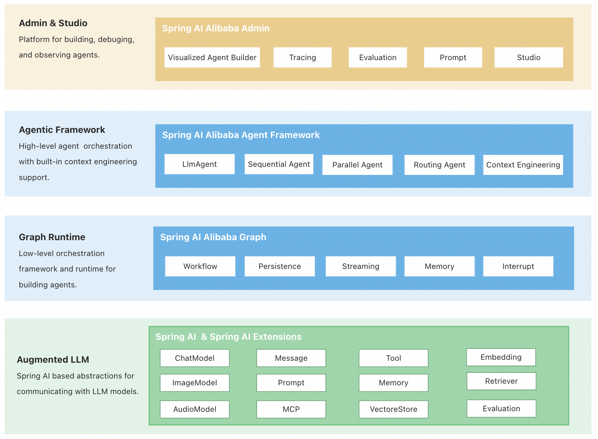
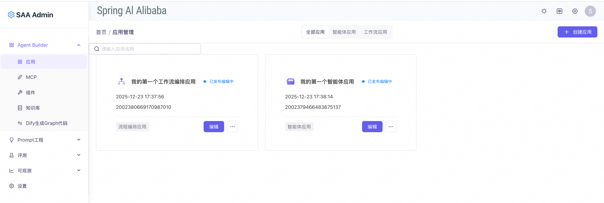
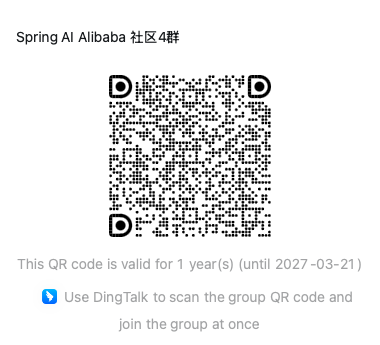

# [Spring AI Alibaba](https://java2ai.com)

[](https://www.apache.org/licenses/LICENSE-2.0.html)
[](https://github.com/alibaba/spring-ai-alibaba/actions/workflows/build-and-test.yml)
[](https://deepwiki.com/alibaba/spring-ai-alibaba)
[](https://central.sonatype.com/artifact/com.alibaba.cloud.ai/spring-ai-alibaba/1.1.2.2)
[](https://github.com/gitleaks/gitleaks)

<html>
    <h3 align="center">
      A production-ready framework for building Agentic, Workflow, and Multi-agent applications.
    </h3>
    <h3 align="center">
      <a href="https://java2ai.com/docs/quick-start/" target="_blank">Agent Framework Docs</a>,
      <a href="https://java2ai.com/docs/frameworks/graph-core/quick-start/" target="_blank">Graph Docs</a>,
      <a href="https://java2ai.com/ecosystem/spring-ai/reference/concepts/" target="_blank">Spring AI</a>,
      <a href="https://github.com/alibaba/spring-ai-alibaba/tree/main/examples" target="_blank">Examples</a>.
    </h3>
</html>

## Architecture

<p align="center">
    
</p>

**Spring AI Alibaba Admin** is a one-stop Agent platform that supports visualized Agent development, observability, evaluation, and MCP management, etc. It also integrates with open-source low-code platforms like Dify, enabling rapid migration from DSL to Spring AI Alibaba project.

**Spring AI Alibaba Agent Framework** is an agent development framework that can quickly develop agents with built-in **Context Engineering** and **Human In The Loop** support. For scenarios requiring more complex process control, Agent Framework offers built-in workflows like `SequentialAgent`, `ParallelAgent`, `RoutingAgent`, `LoopAgent`.

**Spring AI Alibaba Graph** serves as the underlying runtime of the Agent Framework, providing essential capabilities such as persistence, workflow orchestration, and streaming required for long-running stateful agents. Compared to the Agent Framework, users can build more flexible multi-agent workflows based on the Graph API.

## Core Features

* **[Multi-Agent Orchestration](https://github.com/alibaba/spring-ai-alibaba/tree/main/examples/multiagent-patterns)**: Compose multiple agents with built-in patterns including `SequentialAgent`, `ParallelAgent`, `RoutingAgent`, and `LoopAgent` for complex task execution.

* **[Multimodal Support](https://github.com/alibaba/spring-ai-alibaba/tree/main/examples/multimodal)**: ReactAgent with text and media input (image understanding). ReactAgent with tool based image or audio generation.

* **[Voice Agent](https://github.com/alibaba/spring-ai-alibaba/tree/main/examples/voice-agent)**: WebSocket-based real-time voice agent that supports streaming audio or text input and responds with generated audio.

* **[Context Engineering](https://java2ai.com/docs/frameworks/agent-framework/tutorials/hooks)**: Built-in best practices for context engineering policies to improve agent reliability and performance, including human-in-the-loop, context compaction, context editing, model & tool call limit, tool retry, planning, dynamic tool selection.

* **[Graph-based Workflow](https://java2ai.com/docs/frameworks/graph-core/quick-start)**: Graph based workflow runtime and api for conditional routing, nested graphs, parallel execution, and state management. Export workflows to PlantUML and Mermaid formats.

* **[A2A Support](https://java2ai.com/docs/frameworks/agent-framework/advanced/a2a)**: Agent-to-Agent communication support with Nacos integration, enabling distributed agent coordination and collaboration across services.

* **[Rich Model, Tool and MCP Support](https://java2ai.com/integration/chatmodels/dashScope)**: Leveraging core concepts of Spring AI, supports multiple LLM providers (DashScope, OpenAI, etc.), tool calling, and Model Context Protocol (MCP).

* **[One-stop Agent Platform](https://java2ai.com/ecosystem/admin/quick-start)**: Build agent in a visualized way, deploy agent without code or export as a standalone java project.

<p align="center">
    
</p>


## FAQ

### What is Spring AI Alibaba?

Spring AI Alibaba is a **production-ready framework for building Agentic, Workflow, and Multi-agent applications** in Java. It provides built-in context engineering, human-in-the-loop support, and integrates with Spring ecosystem.

### How is Spring AI Alibaba different from LangChain or other Python frameworks?

Spring AI Alibaba is designed specifically for **Java developers**:

| Framework | Language | Key Differentiator |
|-----------|----------|-------------------|
| **Spring AI Alibaba** | Java | Spring integration, Agent Framework, Graph-based workflow |
| **LangChain** | Python | Chain-of-thought composition, extensive tool ecosystem |
| **AutoGen** | Python | Multi-agent conversation patterns |

Key Java-specific features:
- Spring Boot starters with auto-configuration
- JDK 17+ with modern Java patterns
- Maven/Gradle integration
- Spring AI ecosystem compatibility

### What are the core components?

- **Agent Framework**: High-level API for building agents with context engineering
- **Graph**: Low-level workflow runtime for complex multi-agent orchestration
- **Admin**: Visual platform for agent development, observability, evaluation
- **Studio**: Embedded UI for debugging agents visually
- **Spring Boot Starters**: Auto-configuration for Nacos A2A and dynamic config

### What agent patterns are supported?

Built-in patterns for multi-agent orchestration:

- **SequentialAgent**: Execute tasks in sequence
- **ParallelAgent**: Execute tasks concurrently
- **RoutingAgent**: Route tasks to different agents based on conditions
- **LoopAgent**: Iterate until goal is achieved

### Which LLM providers are supported?

Multiple providers via Spring AI integration:

- **DashScope (Alibaba Cloud)**: Qwen models (recommended for Chinese users)
- **OpenAI**: GPT-4, GPT-3.5
- **DeepSeek**: Cost-effective Chinese LLM
- **Any OpenAI-compatible endpoint**

### How do I get started?

**Prerequisites:**
- JDK 17+
- API-KEY from your LLM provider

**Quick Start:**
```bash
git clone --depth=1 https://github.com/alibaba/spring-ai-alibaba.git
export AI_DASHSCOPE_API_KEY=your-api-key
./mvnw -pl examples/chatbot spring-boot:run
```

Visit [http://localhost:8080/chatui](http://localhost:8080/chatui) to chat.

### What is Context Engineering?

Context Engineering is built-in best practices for improving agent reliability:

- **Human-in-the-loop**: Approval workflows for critical actions
- **Context compaction**: Manage token limits efficiently
- **Tool call limits**: Prevent runaway tool usage
- **Dynamic tool selection**: Choose tools based on context

### How do I use MCP (Model Context Protocol)?

Spring AI Alibaba supports MCP for tool integration:

```java
@Tool
public String getCurrentWeather(String city) {
    // Your tool implementation
}
```

MCP tools are auto-discovered and can be used across agents.

### Can I use Spring AI Alibaba with Dify?

Yes! Spring AI Alibaba Admin integrates with Dify, enabling:
- Import DSL workflows from Dify
- Export to standalone Java projects
- Visual development without code

### Where can I get help?

- **Documentation**: [java2ai.com/docs](https://java2ai.com/docs)
- **Examples**: [github.com/alibaba/spring-ai-alibaba/tree/main/examples](https://github.com/alibaba/spring-ai-alibaba/tree/main/examples)
- **DingTalk Group**: Search `94405033092`
- **GitHub Issues**: [github.com/alibaba/spring-ai-alibaba/issues](https://github.com/alibaba/spring-ai-alibaba/issues)

## Getting Started

### Prerequisites

* Requires JDK 17+.
* Choose your LLM provider and get the API-KEY.

### Quickly Run a ChatBot

There's a ChatBot example provided by the community at [examples/chatbot](https://github.com/alibaba/spring-ai-alibaba/tree/main/examples/chatbot).

1. Download the code.

	```shell
	git clone --depth=1 https://github.com/alibaba/spring-ai-alibaba.git
	cd spring-ai-alibaba
	```

2. Start the ChatBot.

	Before starting, set API-KEY first (visit <a href="https://bailian.console.aliyun.com/?apiKey=1&tab=api#/api" target="_blank">Aliyun Bailian</a> to get API-KEY):
	```shell
	# this example uses 'spring-ai-alibaba-starter-dashscope', visit https://java2ai.com to learn how to use OpenAI/DeepSeek.
	export AI_DASHSCOPE_API_KEY=your-api-key
	```
	
	```shell
	# Maven installation is optional when using mvnw.
	./mvnw -pl examples/chatbot spring-boot:run
	```

3. Chat with ChatBot.

	Open the browser and visit [http://localhost:8080/chatui/index.html](http://localhost:8080/chatui/index.html) to chat with the ChatBot.
	
<p align="center">
	
</p>

## Chatbot Code Explained

1. Add dependencies

	```xml
	<dependencies>
	  <dependency>
	    <groupId>com.alibaba.cloud.ai</groupId>
	    <artifactId>spring-ai-alibaba-agent-framework</artifactId>
	    <version>1.1.2.0</version>
	  </dependency>
	  <!-- Assume you are going to use DashScope Model. Refer to docs for how to choose model.-->
	  <dependency>
	    <groupId>com.alibaba.cloud.ai</groupId>
	    <artifactId>spring-ai-alibaba-starter-dashscope</artifactId>
	    <version>1.1.2.1</version>
	  </dependency>
	</dependencies>
	```

2. Define Chatbot
   
	For more details of how to write a Chatbot, please check the [Quick Start](https://java2ai.com/docs/quick-start) on our official website.

## 📚 Documentation
* [Overview](https://java2ai.com/docs/overview) - High level overview of the framework
* [Quick Start](https://java2ai.com/docs/quick-start) - Get started with a simple agent
* [Agent Framework Tutorials](https://java2ai.com/docs/frameworks/agent-framework/tutorials/agents) - Step by step tutorials
* [Use Graph API to Build Complex Workflows](https://java2ai.com/docs/frameworks/agent-framework/advanced/context-engineering) - In-depth user guide for building multi-agent and workflows
* [Spring AI Basics](https://java2ai.com/ecosystem/spring-ai/reference/concepts) - Ai Application basic concepts, including ChatModel, MCP, Tool, Messages, etc.
* [Chat Memory](https://docs.spring.io/spring-ai/reference/api/chatclient.html#chat-memory) - Spring AI reference for chat memory repositories and usage

## Project Structure

This project consists of several core components:

* spring-ai-alibaba-agent-framework: A multi-agent framework designed for building intelligent agents with built-in context engineering best practices.
* spring-ai-alibaba-graph: The underlying runtime for Agent Framework. We recommend developers to use Agent Framework but it's totally fine to use the Graph API directly.
* spring-ai-alibaba-admin: A one-stop Agent platform that supports visualized Agent development, observability, evaluation, and MCP management, etc.
* spring-ai-alibaba-studio: The embedded ui for quickly debugging agent in a visualized way.
* spring-boot-starters: Starters integrating Agent Framework with Nacos to provide A2A and dynamic config features.

## Spring AI Alibaba Ecosystem
 Repository | Description | ⭐
  --- | --- | ---
| [Spring AI Alibaba Graph](https://github.com/alibaba/spring-ai-alibaba/tree/main/spring-ai-alibaba-graph-core) | A low-level orchestration framework and runtime for building, managing, and deploying long-running, stateful agents. | 
| [Spring AI Alibaba Admin](https://github.com/spring-ai-alibaba/spring-ai-alibaba-admin) |  Local visualization toolkit for the development of agent applications, supporting project management, runtime visualization, tracing, and agent evaluation. | 
| [Spring AI Extensions](https://github.com/spring-ai-alibaba/spring-ai-extensions) | Extended implementations for Spring AI core concepts, including DashScopeChatModel, MCP registry, etc. |  
| [Spring AI Alibaba Examples](https://github.com/spring-ai-alibaba/examples) | Spring AI Alibaba Examples. |  
| [JManus](https://github.com/spring-ai-alibaba/jmanus) | A Java implementation of Manus built with Spring AI Alibaba, currently used in many applications within Alibaba Group. | 
| [DataAgent](https://github.com/spring-ai-alibaba/dataagent) | A natural language to SQL project based on Spring AI Alibaba, enabling you to query databases directly with natural language without writing complex SQL. | 
| [DeepResearch](https://github.com/spring-ai-alibaba/deepresearch) |  Deep Research implemented based on spring-ai-alibaba-graph. | 

## Contact Us

* Dingtalk Group (钉钉群), search `94405033092` and join.



* WeChat Group (微信公众号), scan the QR code below and follow us.


## Resources
* [AI-Native Application Architecture White Paper](https://developer.aliyun.com/ebook/8479)：Co-authored by 40 frontline engineers and endorsed by 15 industry experts, this 200,000+ word white paper is the first comprehensive guide dedicated to the full DevOps lifecycle of AI-native applications. It systematically breaks down core concepts and key challenges, offering practical problem-solving approaches and architectural insights.


## Star History

[](https://starchart.cc/alibaba/spring-ai-alibaba)

---

<p align="center">
    Made with ❤️ by the Spring AI Alibaba Team
