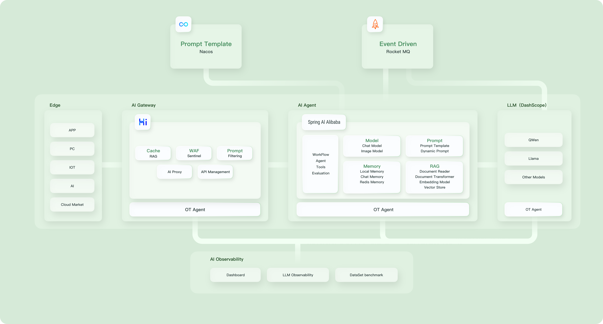

# [Spring AI Alibaba](https://java2ai.com)

[中文版本](./README-zh.md)

An AI application framework for Java developers built on top of Spring AI that provides seamless integration with Alibaba Cloud QWen LLM services and cloud-native infrastructures.

## Get Started

Please refer to [quick start](https://java2ai.com/docs/dev/get-started/) for how to quickly add generative AI to your Spring Boot applications.

Overall, it takes only two steps to turn your Spring Boot application into an intelligent agent:

> Because Spring AI Alibaba is developed based on Spring Boot 3.x, it requires JDK version 17 and above.

1. Add `spring-ai-alibaba-starter` dependency to your project.

 ```xml
 <dependency>
  <groupId>com.alibaba.cloud.ai</groupId>
  <artifactId>spring-ai-alibaba-starter</artifactId>
  <version>1.0.0-M6.1</version>
 </dependency>
 ```

 > NOTICE: Since spring-ai related packages haven't been published to the central repo yet, it's needed to add the following maven repository to your project in order to successfully resolve artifacts like  spring-ai-core.
 >
 > ```xml
 > <repositories>
 >  <repository>
 >   <id>spring-milestones</id>
 >   <name>Spring Milestones</name>
 >   <url>https://repo.spring.io/milestone</url>
 >   <snapshots>
 >    <enabled>false</enabled>
 >   </snapshots>
 >  </repository>
 > </repositories>
 > ```
>
> Addendum: If the mirrorOf tag in your local Maven settings. xml is configured with the wildcard *, please modify it according to the following example.
>
> ```xml
> <mirror>
>   <id>xxxx</id>
>   <mirrorOf>*,!spring-milestones</mirrorOf>
>   <name>xxxx</name>
>   <url>xxxx</url>
> </mirror>
> ```

2. Inject `ChatClient`

 ```java
 @RestController
 public class ChatController {

  private final ChatClient chatClient;

  public ChatController(ChatClient.Builder builder) {
   this.chatClient = builder.build();
  }

  @GetMapping("/chat")
  public String chat(String input) {
   return this.chatClient.prompt()
     .user(input)
     .call()
     .content();
  }
 }
 ```

## Examples

[Spring AI Alibaba and Spring AI usage examples](https://github.com/springaialibaba/spring-ai-alibaba-examples)

## Core Features

Spring AI Alibaba provides the following features, read the [documentation](https://java2ai.com/) on our website for more details of how to use these features.

* Support for Alibaba Cloud QWen Model and Dashscope Model service.
* Support high-level AI agent abstraction -- ChatClient.
* Support various Model types like Chat, Text to Image, Audio Transcription, Text to Speech.
* Both synchronous and stream API options are supported.
* Mapping of AI Model output to POJOs.
* Portable API across Vector Store providers.
* Function calling.
* Spring Boot Auto Configuration and Starters.
* RAG (Retrieval-Augmented Generation) support: DocumentReader, Splitter, Embedding, VectorStore, and Retriever.
* Support conversation with ChatMemory

## Roadmap

Spring AI Alibaba aims to reduce the complexity of building ai native java applications, from development, evaluation to deployment and observability. In order to achieve that, we provide both open-source framework and ecosystem integrations around it, below are the features that we plan to support in the near future:

* Prompt Template Management
* Event Driven AI Application
* Support of more Vector Databases
* Function Deployment
* Observability
* AI proxy support: prompt filtering, rate limit, multiple Model, etc.
* Development Tools



## Contribution Guide

Please refer to the [Contribution Guide](./CONTRIBUTING.md) to learn how to participate in the development of Spring AI Alibaba.

## References

* [Spring AI](https://docs.spring.io/spring-ai/reference/index.html)
* [Spring AI Alibaba](https://java2ai.com/docs/dev/overview/)
* [Alibaba Cloud Dashscope Model Service Platform (阿里云百炼模型服务及应用开发平台)](https://help.aliyun.com/zh/model-studio/getting-started/what-is-model-studio/)

## Contact Us

* Dingtalk Group (钉钉群), search `61290041831` and join.
* Wechat Group (微信公众号), scan the QR code below and follow us.


## Credit

Some of this project's ideas and codes are inspired by or rewrote from the following projects. Great thanks to those who have created and open-sourced these projects.

* [Spring AI](https://github.com/spring-projects/spring-ai), a Spring-friendly API and abstractions for developing AI applications licensed under the Apache License 2.0.
* [Langgraph](https://github.com/langchain-ai/langgraph), a library for building stateful, multi-actor applications with LLMs, used to create agent and multi-agent workflows licensed under the MIT license.
* [Langgraph4J](https://github.com/bsorrentino/langgraph4j), a porting of original [LangGraph](https://github.com/langchain-ai/langgraph) from the [LangChain AI project](https://github.com/langchain-ai) in Java fashion.
