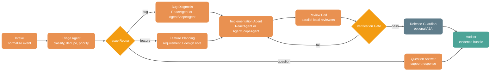
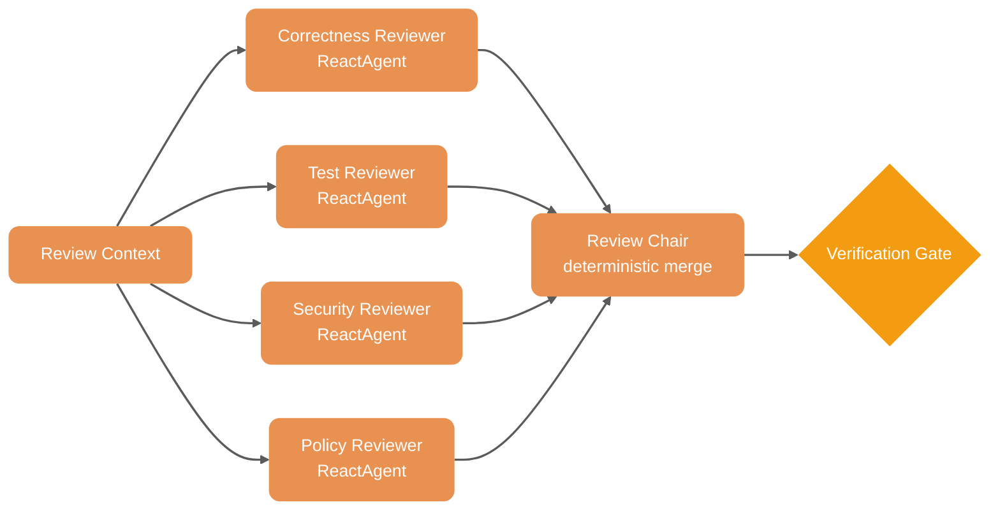

# Lightweight RepoOps Graph Engineering

This document is the lightweight version of the RepoOps Graph Engineering
design. It keeps the same software-engineering lifecycle use case, but removes
the managed worker/team control plane from the architecture.

Use this version when the target deployment is a single Spring Boot application
or a small set of Spring services, and when the team does not need a separate
worker/team control plane.

## Positioning

The lightweight design uses Spring AI Alibaba as the full orchestration layer:

- `StateGraph` owns workflow topology, routing, state, loop-back, and audit.
- `ReactAgent` owns local agent reasoning loops.
- `AgentScopeAgent` owns AgentScope Java implementations that should participate
  in the same graph.
- Deterministic `NodeAction` nodes own rule-based normalization, gating, and
  evidence writing.
- `ParallelAgent` or graph fan-out owns concurrent review and analysis branches.
- `A2aRemoteAgent` is optional for remote service-owned agents.

The rule is simple: start with local graph nodes and local agents. Add A2A only
when a capability already belongs to another service. Do not introduce a worker
control plane until worker lifecycle, room collaboration, permissions, and
fleet-level governance become real requirements.

This does not mean removing Worker, Team, or Capability definitions. In the
lightweight design they are local application contracts, not runtime resources
managed by a separate controller.

## Responsibility Boundary

| Layer | Owns | Example |
| --- | --- | --- |
| Spring AI Alibaba Graph | Lifecycle state machine, explicit routing, fan-out/fan-in, verifier loops, evidence bundle | Issue intake, route, review, verify, release guard, audit |
| `ReactAgent` | Local specialist behavior inside one node | Triage agent, diagnosis agent, writer agent, reviewer agent |
| `AgentScopeAgent` | AgentScope Java specialist behavior adapted as a graph node | AgentScope diagnosis worker, review worker, writer worker |
| Deterministic node | Stable business rules and non-LLM checks | Required fields, severity mapping, branch policy, verification result merge |
| Tool / MCP node | External system actions | GitHub/GitLab lookup, CI status, test command, issue comment draft |
| A2A node, optional | Remote capability that is owned by another service | Release agent, security scanner, docs agent |
| Local capability registry | Binding from graph node name to local bean, agent, tool, AgentScope agent, or A2A agent | `repoops.review_security_risk -> securityReviewAgent` |

## Recommended Layout

```text
repoops-app/
  graph/
    graphs/
      repoops-lifecycle.graph.yaml
      pr-review.graph.yaml
    workers/
      triage-worker.yaml
      implementation-worker.yaml
      correctness-review-worker.yaml
      security-review-worker.yaml
      release-guardian-worker.yaml
    teams/
      repoops-review-team.yaml
    capabilities/
      repoops-capabilities.yaml
    schemas/
      lifecycle-context.schema.json
      review-finding.schema.json
      verification-result.schema.json

  src/main/java/com/example/repoops/
    RepoOpsGraphConfiguration.java
    RepoOpsStateKeys.java
    RepoOpsRoutes.java
    RepoOpsCapabilityRegistry.java
    nodes/
      IntakeNode.java
      TriageAgentNode.java
      IssueRouterNode.java
      BugDiagnosisAgentNode.java
      FeaturePlannerAgentNode.java
      QuestionAnswerAgentNode.java
      ImplementationAgentNode.java
      CorrectnessReviewAgentNode.java
      TestReviewAgentNode.java
      SecurityReviewAgentNode.java
      PolicyReviewAgentNode.java
      ReviewChairNode.java
      VerificationGateNode.java
      ReleaseGuardianNode.java
      KnowledgeStewardNode.java
      AuditorNode.java
    tools/
      RepositoryTools.java
      CiTools.java
      IssueTrackerTools.java
      EvidenceTools.java
```

For a demo or documentation example, the same shape can live in one Java class.
For production, split state keys, routes, node implementations, and tool
adapters so the graph stays readable.

## Local Worker and Team Definitions

In this design, a worker definition describes a local executable capability. It
does not create a worker process, open a team room, or manage runtime lifecycle.
It is metadata that helps the graph remain declarative.

Example local worker:

```yaml
kind: LocalWorker
metadata:
  name: repoops-security-review
spec:
  role: security-reviewer
  provider: agentscope
  bean: securityReviewAgentScopeAgent
  input_schema: SecurityReviewRequest
  output_schema: SecurityFinding
  timeout: 2m
```

Example local team:

```yaml
kind: LocalTeam
metadata:
  name: repoops-review-team
spec:
  description: Local reviewers used by the RepoOps PR review pod
  workers:
    - repoops-correctness-review
    - repoops-test-review
    - repoops-security-review
    - repoops-policy-review
```

The team definition is a logical grouping. The graph still owns the fan-out,
fan-in, route policy, and verification loop.

## Capability Registry

The capability registry maps graph node names to concrete implementations. It
supports Spring AI Alibaba agents, AgentScope Java agents, deterministic tools,
and optional A2A remote agents.

```yaml
capabilities:
  repoops.triage_issue:
    provider: spring-ai-alibaba
    target:
      bean: triageReactAgent
    input_schema: IssueEvent
    output_schema: TriageResult
    timeout: 2m

  repoops.review_security_risk:
    provider: agentscope
    target:
      bean: securityReviewAgentScopeAgent
    input_schema: SecurityReviewRequest
    output_schema: SecurityFinding
    timeout: 2m

  repoops.run_targeted_verification:
    provider: spring-bean
    target:
      bean: ciTools
      method: runTargetedTests
    input_schema: VerificationRequest
    output_schema: VerificationResult
    timeout: 10m

  repoops.release_guardian:
    provider: a2a
    target:
      agent_name: release-guardian
      registry: nacos
    input_schema: ReleaseCandidate
    output_schema: ReleaseDeployAudit
    timeout: 5m
```

The important part is that `provider: agentscope` still runs inside the
application through `AgentScopeAgent`. It is not a remote worker team.

## Lightweight Runtime Flow

```mermaid
flowchart LR
    event["Issue / PR / CI Event"]
    graph["Spring AI Alibaba<br/>StateGraph"]
    state["Graph State<br/>RepoOpsContext"]
    agents["Local Workers<br/>ReactAgent + AgentScopeAgent"]
    tools["Tools / MCP<br/>SCM, CI, Docs"]
    remote["A2A Remote Agent<br/>optional"]
    gate{"Verifier Gate"}
    evidence["Evidence Bundle"]

    event --> graph
    graph --> state
    graph --> agents
    graph --> tools
    graph -.-> remote
    agents --> graph
    tools --> graph
    remote -.-> graph
    graph --> gate
    gate -->|revision required| graph
    gate -->|pass| evidence

    classDef primary fill:#7B68EE,color:#FFFFFF,stroke:none,rx:10,ry:10
    classDef business fill:#E99151,color:#FFFFFF,stroke:none,rx:10,ry:10
    classDef infra fill:#607D8B,color:#FFFFFF,stroke:none,rx:10,ry:10
    classDef warning fill:#F39C12,color:#FFFFFF,stroke:none,rx:10,ry:10
    classDef success fill:#4CA497,color:#FFFFFF,stroke:none,rx:10,ry:10

    class graph,state primary
    class event,agents business
    class tools,remote infra
    class gate warning
    class evidence success

    linkStyle default stroke-width:2px,stroke:#333333,opacity:0.8
```

## Lifecycle Graph

The lightweight graph should still preserve the important business edges. The
main simplification is that every node is a local Spring bean unless it is
explicitly marked as A2A.



## Review Pod

The review pod can be implemented with separate graph nodes or a
`ParallelAgent`. Use separate nodes when each reviewer writes a distinct state
key and the route must be audited. Use `ParallelAgent` when the branches are a
common reusable pattern and the merge policy is simple.



## State Contract

Keep the state contract small and explicit:

| State key | Strategy | Purpose |
| --- | --- | --- |
| `graph_id` | replace | Stable graph identity for trace correlation |
| `run_id` | replace | Unique graph run identity |
| `current_node` | replace | Last completed graph node |
| `issue_event` | replace | Original issue, PR, CI, or release event |
| `lifecycle_context` | replace | Normalized repository, branch, owner, priority, and risk context |
| `triage_result` | replace | Classification and priority output |
| `route_decision` | replace | `bug`, `feature`, or `question` selected from triage output by a router node |
| `work_plan` | replace | Bug diagnosis or feature implementation plan |
| `implementation_result` | replace | Patch suggestion, commands, or files changed |
| `review_findings` | append | Findings from parallel reviewers |
| `review_summary` | replace | Fan-in summary and blocking decision |
| `review_gate_result` | replace | Pass/fail result and reason |
| `release_deploy_audit` | replace | Release or deploy readiness result |
| `knowledge_entry` | replace | FAQ, postmortem, or docs update candidate |
| `node_trace` | append | Per-node execution metadata with node id, type, inputs, outputs, and timestamp |
| `route_history` | append | Auditable route decisions and reasons |
| `evidence_bundle` | append | Append-only operational audit evidence |

Use `AppendStrategy` only for evidence-like data. Use `ReplaceStrategy` for
current stage outputs so stale results do not accidentally drive a later route.

## API Mapping

| Requirement | Lightweight implementation |
| --- | --- |
| Lifecycle workflow | `StateGraph` |
| Local specialist agent | `ReactAgent.asNode()` or `AsyncNodeAction` wrapping `ReactAgent.call(...)` |
| AgentScope specialist agent | `AgentScopeAgent.fromBuilder(...).build()` and `agentScopeAgent.asNode()` |
| Rule-based stage | `NodeAction` / `AsyncNodeAction` |
| Auditable route decision | Deterministic router node plus `StateGraph.addConditionalEdges(...)` |
| Parallel review | Multiple graph edges or `ParallelAgent` |
| Fan-in review summary | Join node using `AppendStrategy` inputs |
| Failed verification loop | Verifier agent plus deterministic gate node, then conditional edge back to `implementation` |
| Optional distributed capability | `A2aRemoteAgent` |
| Audit trail | State snapshots, checkpoint saver, `node_trace`, `route_history`, evidence bundle node |

## Minimal Java Shape

```java
AgentScopeAgent securityReviewer = AgentScopeAgent.fromBuilder(scopeReActBuilder)
        .name("repoops_security_review")
        .instruction("Review security risk from the RepoOps review context.")
        .outputKey("review_findings")
        .build();

StateGraph graph = new StateGraph(keyStrategyFactory)
        .addNode("intake", intakeNode)
        .addNode("triage", triageAgent.asNode())
        .addNode("route_issue", routeIssueNode)
        .addNode("bug_diagnosis", bugDiagnosisAgent.asNode())
        .addNode("feature_planning", featurePlannerAgent.asNode())
        .addNode("question_answer", questionAnswerAgent.asNode())
        .addNode("implementation", implementationAgent.asNode())
        .addNode("correctness_review", correctnessReviewer.asNode())
        .addNode("test_review", testReviewer.asNode())
        .addNode("security_review", securityReviewer.asNode())
        .addNode("policy_review", policyReviewer.asNode())
        .addNode("review_chair", reviewChairNode)
        .addNode("verification_gate", verificationGateNode)
        .addNode("release_guardian", releaseGuardianNode)
        .addNode("auditor", auditorNode)
        .addEdge(StateGraph.START, "intake")
        .addEdge("intake", "triage")
        .addEdge("triage", "route_issue")
        .addConditionalEdges("route_issue", issueRoute,
                Map.of("bug", "bug_diagnosis",
                        "feature", "feature_planning",
                        "question", "question_answer"))
        .addEdge("bug_diagnosis", "implementation")
        .addEdge("feature_planning", "implementation")
        .addEdge("implementation", "correctness_review")
        .addEdge("implementation", "test_review")
        .addEdge("implementation", "security_review")
        .addEdge("implementation", "policy_review")
        .addEdge("correctness_review", "review_chair")
        .addEdge("test_review", "review_chair")
        .addEdge("security_review", "review_chair")
        .addEdge("policy_review", "review_chair")
        .addEdge("review_chair", "verification_gate")
        .addConditionalEdges("verification_gate", verificationRoute,
                Map.of("fail", "implementation", "pass", "release_guardian"))
        .addEdge("release_guardian", "auditor")
        .addEdge("question_answer", "auditor")
        .addEdge("auditor", StateGraph.END);
```

## Runnable Issue Example

The AgentScope issue example is the API-backed version of this lightweight
design:

- `examples/graphengineering/src/main/java/com/alibaba/cloud/ai/examples/graphengineering/AgentScopeRepoOpsIssueGraphExample.java`
- `examples/graphengineering/src/main/resources/repoops-graph-topology.yaml`

It reads a RepoOps issue JSON payload or a GitHub issue URL first, then routes
the graph:

```text
initialize_run
  -> read_issue
read_issue
  -> agentscope_triager
  -> route_issue
  -> bug: agentscope_bug_diagnoser -> agentscope_implementer -> agentscope_reviewer -> review_gate
  -> feature: agentscope_feature_planner -> agentscope_implementer -> agentscope_reviewer -> review_gate
  -> question: agentscope_question_responder -> record_question_evidence

 review_gate
   -> pass: agentscope_auditor
   -> fail: agentscope_implementer

 record_question_evidence
   -> agentscope_auditor

 agentscope_auditor
  -> END
```

The implemented graph is:

```mermaid
flowchart LR
    start["START"]
    init["initialize_run<br/>graph_id + run_id"]
    read["read_issue<br/>file or GitHub URL"]
    triage["agentscope_triager<br/>classify and normalize"]
    route["route_issue<br/>route_decision"]
    bug["agentscope_bug_diagnoser"]
    feature["agentscope_feature_planner"]
    question["agentscope_question_responder"]
    evidence["record_question_evidence"]
    implement["agentscope_implementer"]
    review["agentscope_reviewer<br/>review_decision"]
    gate{"review_gate"}
    audit["agentscope_auditor<br/>audit_report"]
    end["END"]

    start --> init
    init --> read
    read --> triage
    triage --> route
    route -->|bug| bug
    route -->|feature| feature
    route -->|question| question
    bug --> implement
    feature --> implement
    question --> evidence
    evidence --> audit
    implement --> review
    review --> gate
    gate -->|PASS| audit
    gate -->|FAIL| implement
    audit --> end

    classDef business fill:#E99151,color:#FFFFFF,stroke:none,rx:10,ry:10
    classDef gateway fill:#7B68EE,color:#FFFFFF,stroke:none,rx:10,ry:10
    classDef warning fill:#F39C12,color:#FFFFFF,stroke:none,rx:10,ry:10
    classDef success fill:#4CA497,color:#FFFFFF,stroke:none,rx:10,ry:10

    class init,read,triage,bug,feature,question,evidence,implement,review business
    class route,gate warning
    class audit success
    class start,end gateway

    linkStyle default stroke-width:2px,stroke:#333333,opacity:0.8
```

The default local input is:

```text
classpath:issues/bug_issue.json
```

You can pass a different issue file or a public GitHub issue URL as the first
argument:

```text
https://github.com/alibaba/spring-ai-alibaba/issues/4830
```

For GitHub URLs, the `read_issue` node fetches the issue through the public
GitHub API and normalizes title, body, labels, repository, state, author, and
timestamps into graph state. The issue payload is kept as `issue_payload`, and
normalized fields such as `issue_type`, `issue_repository`, `requires_review`,
and `requires_deploy` drive routing and audit. The runnable example also writes
`node_trace`, `route_history`, and `evidence_bundle` so the runtime work graph is
available as state, not only as logs.

## When This Version Is Enough

Use the lightweight version when:

- One Spring Boot service can own the workflow.
- Node implementations can be normal Spring beans.
- Operators do not need to create, pause, scale, or govern workers separately.
- Review, verification, and audit are more important than dynamic workforce
  management.
- A2A is enough for the few capabilities that are already remote.

Move to a heavier architecture only when the system needs managed worker
resources, team rooms, runtime selection, cross-agent collaboration surfaces,
gateway-managed permissions, or fleet-level lifecycle management.
