# Graph Engineering with Spring AI Alibaba

Graph Engineering is the practice of composing specialized agents or deterministic
steps into an explicit graph: nodes do the work, edges route the work, and shared
state carries context between them. It is useful when one agent loop is no longer
the right shape for the task.

Spring AI Alibaba already treats this as a first-class application architecture:

- `spring-ai-alibaba-graph-core` provides the stateful graph runtime.
- `spring-ai-alibaba-agent-framework` turns agents into graph nodes and provides
  higher-level multi-agent patterns.
- A2A and Nacos integrations let a graph call agents owned by other services.
- AgentScope integration shows that Spring AI Alibaba can orchestrate agents
  implemented by other frameworks through `spring-ai-alibaba-starter-agentscope`,
  not only Spring AI `ReactAgent`.

The positioning is simple: use `ReactAgent` for a single well-scoped loop, use
FlowAgent patterns for common multi-agent topologies, and use `StateGraph` when
the handoffs, state, and routing must be explicit.

## Concept Mapping

| Graph Engineering concept | Spring AI Alibaba API | Where it fits |
| --- | --- | --- |
| Node | `StateGraph.addNode(...)`, `Node`, `NodeAction`, `AsyncNodeAction`, `agent.asNode()` | A unit of work: model call, tool call, deterministic function, local agent, remote A2A agent, or external-framework agent adapter. |
| Edge | `StateGraph.addEdge(...)`, `StateGraph.addConditionalEdges(...)`, `AsyncEdgeAction.edge_async(...)` | Explicit routing between nodes, including straight-line, branch, and loop-back transitions. |
| State | `OverAllState`, `KeyStrategyFactory`, `ReplaceStrategy`, `AppendStrategy`, `MergeStrategy` | Shared execution memory flowing across nodes, with per-key merge policies. |
| Loop | `ReactAgent`, `LoopAgent`, conditional edge back to a previous node | Use a single loop for one job with a clear verifier; use graph loop-back when a different node should verify and route the work. |
| Fan-out | Multiple edges from one node or from `START`; `ParallelAgent` | Run independent branches concurrently, such as several researchers using different tools or models. |
| Fan-in | Multiple branches route into a join node; `ParallelAgent.MergeStrategy` | Merge branch outputs before synthesis, writing, or review. |
| Verifier Node | Dedicated `ReactAgent`, deterministic `NodeAction`, hook, or reviewer node | Separates production from review so the writer does not grade its own work. |
| A2A | `A2aRemoteAgent`, `AgentCardProvider`, Nacos A2A starter | Treat remote agents as graph nodes and route work across service boundaries. |

## Why Spring AI Alibaba

Graph Engineering is not just drawing boxes around agents. A production graph
needs state, persistence, observability, routing, streaming, model/tool support,
and a way to bring external agents into the same control plane. Spring AI Alibaba
supports those layers together:

1. **Graph Core as the runtime.** `StateGraph` defines nodes and edges, compiles
   into `CompiledGraph`, and runs long-lived stateful workflows with checkpointing
   and streaming.
2. **Agent Framework as the agent layer.** `ReactAgent` handles the single-agent
   loop. `SequentialAgent`, `ParallelAgent`, `RoutingAgent`, and `LoopAgent`
   cover common graph shapes without forcing every user into low-level graph APIs.
3. **Context Engineering as reliability policy.** Hooks and interceptors handle
   context editing, summarization, human-in-the-loop, tool retry, model-call
   limits, and dynamic tool selection inside graph nodes.
4. **A2A and Nacos as distributed edges.** A graph can route to agents discovered
   through a registry rather than only local Java beans.
5. **External-agent orchestration.** `spring-ai-alibaba-starter-agentscope`
   provides `AgentScopeAgent`, which adapts AgentScope `ReActAgent` into the
   same Spring AI Alibaba graph node model, so Graph Engineering can coordinate
   agents from multiple frameworks.

## Use a Loop First

The default should still be `ReactAgent`.

Use a single agent loop when:

- The task is one job with a clear finish line.
- One toolset and one model are enough.
- A retry or self-check is acceptable.
- The routing does not need to be audited as a business workflow.

Move to a graph only when the work forces it:

- Distinct specialties need separate prompts, models, tools, or ownership.
- Branches can run in parallel and then join.
- A dedicated reviewer should check another node's output.
- Routing must be explicit and inspectable.
- One failed node should retry without corrupting downstream state.
- The workflow must call local agents, remote A2A agents, or agents implemented
  by another framework.

## RepoOps Issue Graph

The primary example is RepoOps: a graph-driven software engineering workflow
around repository issues, PR/MR review, CI, release readiness, deployment
signals, and audit evidence.

The core graph reads an issue, normalizes it into state, lets the triage worker
propose a route, records auditable route and verifier decisions, invokes
specialized workers, and writes a final audit report:

```mermaid
flowchart LR
    issue["Issue URL / JSON"]
    init["Initialize Run<br/>graph_id + run_id"]
    read["Read Issue<br/>normalize state"]
    triage["Triage<br/>type, priority, owner"]
    route["Route Issue<br/>route_decision"]
    bug["Bug Diagnosis"]
    feature["Feature Planning"]
    question["Question Response"]
    implement["Implementation Proposal"]
    reviewer["Reviewer<br/>review_decision"]
    gate{"Review Gate<br/>pass / fail"}
    audit["Audit Report"]

    issue --> init
    init --> read
    read --> triage
    triage --> route
    route -->|bug| bug
    route -->|feature| feature
    route -->|question| question
    bug --> implement
    feature --> implement
    implement --> reviewer
    reviewer --> gate
    gate -->|fail| implement
    gate -->|pass| audit
    question --> audit

    classDef business fill:#E99151,color:#FFFFFF,stroke:none,rx:10,ry:10
    classDef warning fill:#F39C12,color:#FFFFFF,stroke:none,rx:10,ry:10
    classDef success fill:#4CA497,color:#FFFFFF,stroke:none,rx:10,ry:10
    classDef input fill:#607D8B,color:#FFFFFF,stroke:none,rx:10,ry:10

    class issue input
    class init,read,triage,bug,feature,question,implement,reviewer business
    class route,gate warning
    class audit success

    linkStyle default stroke-width:2px,stroke:#333333,opacity:0.8
```



This is the kind of workflow where the graph is justified: the route itself is
part of the business record. A question should not enter the implementation
path. A bug and a feature should produce different work plans. A failed review
should loop back to implementation without corrupting the original issue state.
The example stores `graph_id`, `run_id`, `node_trace`, `route_history`, and
`evidence_bundle` so the runtime work graph is inspectable after execution.

The runnable examples live in:

- `examples/graphengineering`
- `examples/graphengineering/src/main/java/com/alibaba/cloud/ai/examples/graphengineering/AgentScopeRepoOpsIssueGraphExample.java`

`AgentScopeRepoOpsIssueGraphExample` can read a local issue JSON file or a
public GitHub issue URL, then invoke AgentScope Java workers through
`AgentScopeAgent` while Spring AI Alibaba Graph owns state and routing.

The topology contract lives in
`examples/graphengineering/src/main/resources/repoops-graph-topology.yaml`.
It lists each node's type, mandate, inputs, outputs, and allowed outgoing
routes, making the graph topology a versioned engineering artifact rather than
only Java control flow.

## Example Module

The runnable code for this topic is collected under `examples/graphengineering`.
That module is intentionally separate from `examples/agentscope/handoffs`:

- `examples/agentscope/handoffs` demonstrates agent handoff mechanics.
- `examples/graphengineering` demonstrates a business graph where Spring AI
  Alibaba owns the workflow and AgentScope Java implements every specialist
  business node.

## RepoOps Lightweight Example

Graph Engineering also fits software engineering lifecycle automation. The
lightweight RepoOps example in this repository uses Spring AI Alibaba Graph as
the lifecycle control plane for issue triage, role-specific handling, review
loop-back, audit, and Evidence Bundle generation.

- `examples/graphengineering` contains the runnable RepoOps startup class.
- [Lightweight RepoOps Graph Engineering](./graph-engineering-repoops-lightweight.md)
- `examples/graphengineering/src/main/java/com/alibaba/cloud/ai/examples/graphengineering/AgentScopeRepoOpsIssueGraphExample.java`

In a real application each graph node can be implemented by:

- a Spring AI Alibaba `ReactAgent` via `reactAgent.asNode()`;
- a `ParallelAgent` for common fan-out/fan-in cases;
- an `A2aRemoteAgent` for a remote team-owned agent;
- an `AgentScopeAgent` for an AgentScope implementation.

## AgentScope as an External Agent Example

Spring AI Alibaba is not limited to orchestrating its own `ReactAgent`
implementation. `spring-ai-alibaba-starter-agentscope` provides
`AgentScopeAgent`, and the AgentScope handoff example shows the intended
integration model:

```java
graph.addNode("sales_agent", salesAgent.asNode());
graph.addNode("support_agent", supportAgent.asNode());
```

In that example:

- `salesAgent` is a Spring AI Alibaba `ReactAgent`.
- `supportAgent` is an AgentScope `ReActAgent` wrapped as `AgentScopeAgent`.
- Both are normal graph nodes once adapted with `asNode()`.
- Handoff tools update `active_agent` in shared state.
- `addConditionalEdges(...)` routes to the next agent based on that state.

This is the key positioning: Spring AI Alibaba Graph is the orchestration layer
that can coordinate Spring AI agents, AgentScope agents, A2A remote agents, and
plain deterministic nodes in one stateful graph.

Reference example:

- `examples/agentscope/handoffs`
- `examples/graphengineering/src/main/java/com/alibaba/cloud/ai/examples/graphengineering/AgentScopeRepoOpsIssueGraphExample.java`

The RepoOps issue example goes further than a single handoff: issue triage,
planning, review, and audit are AgentScope Java nodes, while Spring AI Alibaba
remains the graph engineering runtime around those nodes.

## API Shape

Low-level graph:

```java
StateGraph graph = new StateGraph(keyStrategyFactory)
        .addNode("triage", triageNode)
        .addNode("implementation", implementationNode)
        .addNode("reviewer", reviewerNode)
        .addNode("auditor", auditorNode)
        .addEdge(StateGraph.START, "triage")
        .addEdge("triage", "implementation")
        .addEdge("implementation", "reviewer")
        .addConditionalEdges("reviewer", reviewRoute,
                Map.of("pass", "auditor", "fail", "implementation"))
        .addEdge("auditor", StateGraph.END);
```

Agent as node:

```java
ReactAgent triageAgent = ReactAgent.builder()
        .name("triage_agent")
        .model(chatModel)
        .systemPrompt("Classify and prioritize repository issues.")
        .instruction("Use the normalized issue payload from state: {issue_payload}")
        .outputKey("triage_result")
        .build();

graph.addNode("triage", triageAgent.asNode());
```

AgentScope as node:

```java
AgentScopeAgent reviewer = AgentScopeAgent.fromBuilder(scopeReActBuilder)
        .name("repoops_reviewer")
        .instruction("Review the RepoOps implementation proposal: {implementation_proposal}.")
        .build();

graph.addNode("reviewer", reviewer.asNode());
```

Remote A2A agent as node:

```java
A2aRemoteAgent remoteAgent = A2aRemoteAgent.builder()
        .agentCardProvider(agentCardProvider)
        .name("remote_release_guardian")
        .instruction("Check release readiness for the current RepoOps issue.")
        .build();

graph.addNode("release_guardian", remoteAgent.asNode());
```

## Design Checklist

Before turning a loop into a graph:

1. Can one `ReactAgent` with a strong verifier finish the task? If yes, keep it a loop.
2. Can every proposed node name a real specialty, toolset, model, or ownership boundary?
3. Are the edges explicit enough to draw before coding?
4. Is shared state intentionally designed, with `KeyStrategy` chosen per key?
5. Is there a verifier node with authority to fail and route back?
6. Can a failed node retry without damaging downstream state?
7. Are external agents, such as AgentScope or A2A agents, adapted as nodes rather
   than hidden inside one large prompt?

Graph Engineering is valuable when the graph is doing work that a loop cannot
hold cleanly. Spring AI Alibaba provides the runtime and integration surface for
that escalation while keeping simple tasks simple.
