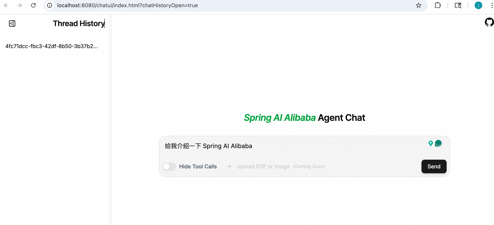

# DeepResearch Agent

A DeepResearch agent built with Spring AI Alibaba that conducts thorough research and writes polished reports. Using an LLM to call tools in a loop is the simplest form of an agent, but this can yield agents that are "shallow". DeepResearch implements **task planning**, **sub agents**, **file system access**, and a **detailed prompt** to solve complex, multi-step research tasks.

## Quick Start

### Prerequisites

* JDK 17+
* AI_DASHSCOPE_API_KEY - Get from [Alibaba Cloud Bailian](https://bailian.console.aliyun.com/)
* JINA_API_KEY (Optional) - Get from [Jina AI](https://jina.ai/) for MCP tool support

```bash
export AI_DASHSCOPE_API_KEY=your_dashscope_api_key
export JINA_API_KEY=your_jina_api_key  # Optional
```

### Run the Agent

1. **Run with Maven**
```bash
mvn spring-boot:run
```

2. **Run in IDE**
Import as maven project and run `Application.java`.

### Chat With Your Agent

After the agent starts, open in your browser: **http://localhost:8080/chatui/index.html**


<div style="border: 2px solid #999; display: inline-block;">
  
</div>


Now you can ask the agent complex research questions like:
- "Research the core architecture design of Spring AI Alibaba"
- "Compare the technical implementations of Claude Code and GitHub Copilot"

## Architecture

DeepResearch implements an agentic architecture that goes beyond simple tool-calling loops. It combines planning, context management, and subagent collaboration to tackle complex research tasks that require multiple steps and deep investigation.

### Core Capabilities

**🎯 Planning & Task Decomposition**
- Uses `TodoListInterceptor` to break down complex tasks into discrete steps
- Dynamically tracks progress and adapts plans as new information emerges
- Supports parallel execution of independent research subtasks

**📁 File System & Context Management**
- Provides `ls`, `read_file`, `write_file`, `edit_file`, `glob`, `grep` tools for file operations
- Automatically offloads large tool results to filesystem to prevent context window overflow
- Enables persistence of research process and results across the conversation

**🤝 Subagent Collaboration**
- **research-agent**: Specialized for in-depth research, handles parallel sub-questions
- **critique-agent**: Reviews and improves report quality with detailed feedback
- Main agent coordinates subagents while keeping context clean and isolated

**🔧 MCP Tool Integration**
- Integrates external tools via Spring AI MCP Client
- Supports third-party services like Jina AI search
- Extensible to any MCP-compatible tools

### Features provided by Spring AI Alibaba

**Agent Framework**
- `ReactAgent`: ReAct pattern implementation with reasoning-action loops
- `Interceptor`: Middleware mechanism for planning, file management, context editing
- `Hook`: Event hooks for human approval, summarization, tool call limits
- `MemorySaver`: In-memory state management with conversation history

**Builtin Interceptors**
- `TodoListInterceptor`: Task list management and tracking
- `FilesystemInterceptor`: File system access control with sandboxing
- `SubAgentInterceptor`: Subagent spawning and coordination
- `ContextEditingInterceptor`: Auto-compress context (triggers at 10K tokens)
- `LargeResultEvictionInterceptor`: Auto-dump large results to files
- `ToolRetryInterceptor`: Retry logic for failed tool calls

**Builtin Hooks**
- `SummarizationHook`: Conversation history summarization (triggers at 120K tokens)
- `HumanInTheLoopHook`: Human approval for critical operations
- `ToolCallLimitHook`: Limit tool calls per run (default: 25)

**Integration Capabilities**
- DashScope Chat Model support
- MCP Client for tool integration
- Agent Studio UI for visualization


