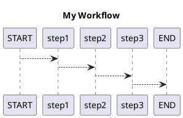

# PlantUML 图表可视化

Spring AI Alibaba Graph 支持将工作流导出为 PlantUML 格式，方便可视化和文档化。

## PlantUML 工具函数

<Code
  language="java"
  title="PlantUML 工具函数" sourceUrl="https://github.com/alibaba/spring-ai-alibaba/tree/main/examples/documentation/src/main/java/com/alibaba/cloud/ai/examples/documentation/graph/examples/PlantUmlExample.java"
>
{`import net.sourceforge.plantuml.SourceStringReader;
import net.sourceforge.plantuml.FileFormatOption;
import net.sourceforge.plantuml.FileFormat;
import com.alibaba.cloud.ai.graph.GraphRepresentation;
import java.io.IOException;

static java.awt.Image plantUML2PNG(String code) throws IOException {
    var reader = new SourceStringReader(code);

    try (var imageOutStream = new java.io.ByteArrayOutputStream()) {
        var description = reader.outputImage(imageOutStream, 0, new FileFormatOption(FileFormat.PNG));
        var imageInStream = new java.io.ByteArrayInputStream(imageOutStream.toByteArray());
        return javax.imageio.ImageIO.read(imageInStream);
    }
}

// 从 GraphRepresentation 生成图像
static void displayDiagram(GraphRepresentation representation) throws IOException {
    var image = plantUML2PNG(representation.getContent());
    display(image);
}`}
</Code>

## 简单示例

<Code
  language="java"
  title="简单示例" sourceUrl="https://github.com/alibaba/spring-ai-alibaba/tree/main/examples/documentation/src/main/java/com/alibaba/cloud/ai/examples/documentation/graph/examples/PlantUmlExample.java"
>
{`var code = """
    @startuml
    title Spring AI Alibaba Graph
    START --> NodeA
    NodeA --> NodeB
    NodeB --> END
    @enduml
    """;

display(plantUML2PNG(code));`}
</Code>

## 从 Graph 生成 PlantUML

<Code
  language="java"
  title="从 Graph 生成 PlantUML" sourceUrl="https://github.com/alibaba/spring-ai-alibaba/tree/main/examples/documentation/src/main/java/com/alibaba/cloud/ai/examples/documentation/graph/examples/PlantUmlExample.java"
>
{`import com.alibaba.cloud.ai.graph.CompiledGraph;
import com.alibaba.cloud.ai.graph.GraphRepresentation;
import com.alibaba.cloud.ai.graph.KeyStrategy;
import com.alibaba.cloud.ai.graph.KeyStrategyFactory;
import com.alibaba.cloud.ai.graph.StateGraph;
import com.alibaba.cloud.ai.graph.exception.GraphStateException;
import com.alibaba.cloud.ai.graph.state.strategy.ReplaceStrategy;

import java.util.HashMap;
import java.util.Map;

import static com.alibaba.cloud.ai.graph.StateGraph.END;
import static com.alibaba.cloud.ai.graph.StateGraph.START;
import static com.alibaba.cloud.ai.graph.action.AsyncNodeAction.node_async;

/**
 * 从 Graph 生成 PlantUML
 */
public static void generatePlantUmlFromGraph() throws GraphStateException {
    KeyStrategyFactory keyStrategyFactory = () -> {
        HashMap<String, KeyStrategy> strategies = new HashMap<>();
        strategies.put("result", new ReplaceStrategy());
        return strategies;
    };

// 构建一个简单的 Graph
StateGraph graph = new StateGraph(keyStrategyFactory)
            .addNode("step1", node_async(state -> Map.of("result", "Step 1")))
            .addNode("step2", node_async(state -> Map.of("result", "Step 2")))
            .addNode("step3", node_async(state -> Map.of("result", "Step 3")))
            .addEdge(START, "step1")
    .addEdge("step1", "step2")
    .addEdge("step2", "step3")
            .addEdge("step3", END);

CompiledGraph compiledGraph = graph.compile();

// 生成 PlantUML 表示
GraphRepresentation representation = compiledGraph.getGraph(
    GraphRepresentation.Type.PLANTUML,
            "My Workflow"
);

    // 显示 PlantUML 代码
    System.out.println("PlantUML representation:");
    System.out.println(representation.content());
}`}
</Code>

## PlantUML 输出示例

## 应用场景

- **文档生成**: 自动生成工作流文档
- **调试分析**: 可视化理解 Graph 结构
- **团队协作**: 分享工作流设计
- **版本对比**: 比较不同版本的 Graph 结构

## 相关文档

- [快速入门](../quick-start) - Graph 基础使用
- [PlantUML 官方文档](https://plantuml.com/) - PlantUML 语法参考

