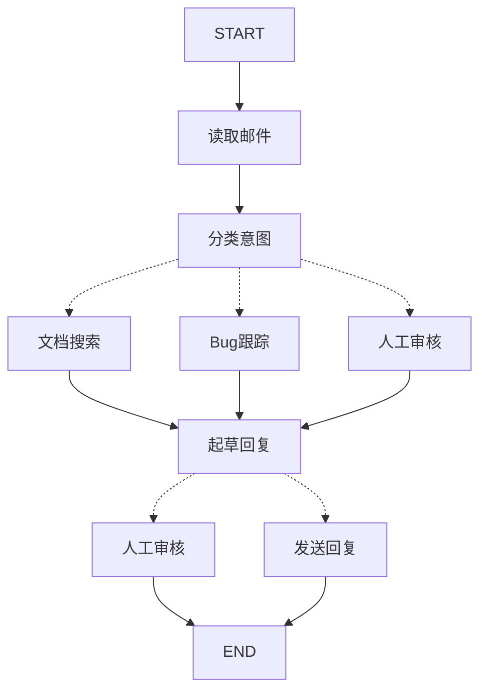

# Graph 工作流编排指南

学习如何通过将客服邮件处理流程分解为离散步骤来使用 Spring AI Alibaba Graph 构建智能工作流。

Spring AI Alibaba Graph 可以改变您构建智能代理的思维方式。使用 Graph 构建代理时，您将首先把它分解为称为**节点（nodes）**的离散步骤。然后，描述每个节点的不同决策和转换。最后，通过一个共享的**状态（state）**将节点连接起来，每个节点都可以读取和写入该状态。在本教程中，我们将指导您完成使用 Spring AI Alibaba Graph 构建客服邮件处理代理的思维过程。

## 从需要自动化的流程开始

假设您需要构建一个处理客服邮件的 AI 代理。产品团队给出了以下需求：

代理应该：

* 读取客户邮件
* 按紧急程度和主题分类
* 搜索相关文档以回答问题
* 起草适当的回复
* 将复杂问题上报给人工客服
* 在需要时安排后续跟进

需要处理的示例场景：

1. 简单产品问题："如何重置我的密码？"
2. Bug 报告："导出功能在选择 PDF 格式时崩溃"
3. 紧急账单问题："我的订阅被重复扣费了！"
4. 功能请求："能在移动应用中添加暗黑模式吗？"
5. 复杂技术问题："我们的 API 集成间歇性失败，返回 504 错误"

要在 Spring AI Alibaba Graph 中实现代理，通常遵循以下五个步骤。

## 步骤 1：将工作流映射为离散步骤

首先识别流程中的不同步骤。每个步骤将成为一个**节点**（执行特定任务的函数）。然后勾画这些步骤如何相互连接。

箭头显示可能的路径，但具体选择哪条路径的决策发生在每个节点内部。

现在您已经识别了工作流中的组件，让我们了解每个节点需要做什么：

* **读取邮件**：提取和解析邮件内容
* **分类意图**：使用 LLM 对紧急程度和主题进行分类，然后路由到适当的操作
* **文档搜索**：查询知识库以获取相关信息
* **Bug跟踪**：在跟踪系统中创建或更新问题
* **起草回复**：生成适当的响应
* **人工审核**：上报给人工客服进行审批或处理
* **发送回复**：发送邮件响应

**提示**：注意有些节点会决定接下来去哪里（分类意图、起草回复、人工审核），而其他节点总是进入相同的下一步（读取邮件总是进入分类意图，文档搜索总是进入起草回复）。

## 步骤 2：确定每个步骤需要做什么

对于图中的每个节点，确定它代表什么类型的操作以及它需要什么上下文才能正常工作。

### LLM 步骤

当步骤需要理解、分析、生成文本或做出推理决策时：

#### 分类意图节点
* **静态上下文**（提示）：分类类别、紧急程度定义、响应格式
* **动态上下文**（来自状态）：邮件内容、发件人信息
* **期望结果**：确定路由的结构化分类

#### 起草回复节点
* **静态上下文**（提示）：语气指南、公司政策、响应模板
* **动态上下文**（来自状态）：分类结果、搜索结果、客户历史
* **期望结果**：准备好审核的专业邮件响应

### 数据步骤

当步骤需要从外部源检索信息时：

#### 文档搜索节点
* **参数**：从意图和主题构建的查询
* **错误处理**：捕获异常并存储错误信息，继续执行流程
* **缓存**：可以缓存常见查询以减少 API 调用（本示例中未实现）

#### 客户历史查询
* **参数**：来自状态的客户邮箱或 ID
* **错误处理**：如果不可用则回退到基本信息（本示例中未实现）
* **缓存**：是，使用生存时间来平衡新鲜度和性能（本示例中未实现）

### 操作步骤

当步骤需要执行外部操作时：

#### 发送回复节点
* **何时执行**：批准后（人工或自动）
* **错误处理**：让异常冒泡以进行调试（本示例中未实现重试逻辑）
* **不应缓存**：每次发送都是唯一操作

#### Bug跟踪节点
* **何时执行**：当意图是"bug"时总是执行
* **错误处理**：直接执行，不丢失 bug 报告至关重要（本示例中未实现重试逻辑）
* **返回**：要包含在响应中的票据 ID

### 用户输入步骤

当步骤需要人工干预时：

#### 人工审核节点
* **决策上下文**：原始邮件、草稿响应、紧急程度、分类
* **预期输入格式**：批准布尔值加上可选的编辑响应
* **何时触发**：高紧急程度、复杂问题或质量问题

## 步骤 3：设计您的状态

状态是图中所有节点可访问的共享记忆。可以把它想象成代理用来跟踪在工作过程中学到和决定的一切的笔记本。

### 什么应该放在状态中？

对每条数据问自己这些问题：

#### 包含在状态中
**是否需要跨步骤持久化？** 如果是，它就应该放在状态中。

#### 不要存储
**能从其他数据派生吗？** 如果是，在需要时计算它，而不是存储在状态中。

对于我们的邮件代理，我们需要跟踪：

* 原始邮件和发件人信息（无法重建这些）
* 分类结果（多个下游节点需要）
* 搜索结果和客户数据（重新获取成本高）
* 草稿响应（需要在审核过程中持久化）
* 执行元数据（用于调试和恢复）

### 保持状态原始，按需格式化提示

**重要原则**：您的状态应该存储原始数据，而不是格式化的文本。在需要时在节点内格式化提示。

这种分离意味着：

* 不同节点可以根据需要以不同方式格式化相同数据
* 您可以更改提示模板而无需修改状态模式
* 调试更清晰 - 您可以确切看到每个节点收到了什么数据
* 您的代理可以演进而不会破坏现有状态

让我们定义状态：

<Code
  language="java"
  title="定义状态和状态键策略" sourceUrl="https://github.com/alibaba/spring-ai-alibaba/tree/main/examples/documentation/src/main/java/com/alibaba/cloud/ai/examples/documentation/graph/core/QuickStartExample.java"
>
{`import com.alibaba.cloud.ai.graph.KeyStrategy;
import com.alibaba.cloud.ai.graph.KeyStrategyFactory;
import com.alibaba.cloud.ai.graph.state.strategy.ReplaceStrategy;
import com.alibaba.cloud.ai.graph.state.strategy.AppendStrategy;
import java.util.Map;
import java.util.HashMap;

// 邮件分类结构
public static class EmailClassification {
    private String intent;      // "question", "bug", "billing", "feature", "complex"
    private String urgency;     // "low", "medium", "high", "critical"
    private String topic;
    private String summary;

    public EmailClassification() {
    }

    public EmailClassification(String intent, String urgency, String topic, String summary) {
        this.intent = intent;
        this.urgency = urgency;
        this.topic = topic;
        this.summary = summary;
    }

    public String getIntent() {
        return intent;
    }

    public void setIntent(String intent) {
        this.intent = intent;
    }

    public String getUrgency() {
        return urgency;
    }

    public void setUrgency(String urgency) {
        this.urgency = urgency;
    }

    public String getTopic() {
        return topic;
    }

    public void setTopic(String topic) {
        this.topic = topic;
    }

    public String getSummary() {
        return summary;
    }

    public void setSummary(String summary) {
        this.summary = summary;
    }

    @Override
    public String toString() {
        return String.format("EmailClassification{intent='%s', urgency='%s', topic='%s', summary='%s'}", 
                intent, urgency, topic, summary);
    }
}

// 配置状态键策略
public static KeyStrategyFactory createKeyStrategyFactory() {
    return () -> {
        HashMap<String, KeyStrategy> strategies = new HashMap<>();
        strategies.put("email_content", new ReplaceStrategy());
        strategies.put("sender_email", new ReplaceStrategy());
        strategies.put("email_id", new ReplaceStrategy());
        strategies.put("classification", new ReplaceStrategy());
        strategies.put("search_results", new ReplaceStrategy());
        strategies.put("customer_history", new ReplaceStrategy());
        strategies.put("draft_response", new ReplaceStrategy());
        strategies.put("messages", new AppendStrategy());
        strategies.put("next_node", new ReplaceStrategy());
        strategies.put("status", new ReplaceStrategy());
        strategies.put("review_data", new ReplaceStrategy());
        return strategies;
    };
}`}
</Code>

注意状态只包含原始数据 - 没有提示模板、没有格式化字符串、没有指令。分类输出直接从 LLM 存储为单个对象。

## 步骤 4：构建您的节点

现在我们将每个步骤实现为一个函数。Spring AI Alibaba Graph 中的节点就是一个接受当前状态并返回更新的 Java 函数。

### 适当处理错误

不同的错误需要不同的处理策略：

| 错误类型 | 谁来修复 | 策略 | 何时使用 |
|---------|---------|------|---------|
| 瞬时错误（网络问题、速率限制） | 系统（自动） | 重试策略 | 通常会在重试时解决的临时故障 |
| LLM可恢复错误（工具失败、解析问题） | LLM | 将错误存储在状态中并循环回去 | LLM可以看到错误并调整其方法 |
| 用户可修复错误（缺少信息、不清楚的指令） | 人工 | 使用 `interruptBefore` 暂停 | 需要用户输入才能继续 |
| 意外错误 | 开发者 | 让它们冒泡 | 需要调试的未知问题 |

**注意**：本示例代码中主要展示了基本的错误处理模式。在实际应用中，您可以根据需要添加重试策略、错误恢复机制等。本示例中的 `SearchDocumentationNode` 展示了基本的错误处理：捕获异常并存储错误信息，然后继续执行流程。

#### LLM可恢复错误
将错误存储在状态中并循环回去，以便 LLM 可以看到出错的地方并重试：

**注意**：以下是一个示例，展示如何处理 LLM 可恢复的错误。本示例代码不在 `QuickStartExample.java` 中，仅用于说明错误处理模式：

<Code
  language="java"
  title="LLM可恢复错误处理示例"
>
{`import com.alibaba.cloud.ai.graph.action.NodeAction;
import com.alibaba.cloud.ai.graph.OverAllState;
import java.util.Map;

// 示例：处理工具调用错误，让 LLM 可以重试
public class ExecuteToolNode implements NodeAction {

    @Override
    public Map<String, Object> apply(OverAllState state) throws Exception {
        try {
            String toolCall = state.value("tool_call")
                    .map(v -> (String) v)
                    .orElse("");
            String result = runTool(toolCall);
            return Map.of(
                "tool_result", result,
                "next_node", "agent"
            );
        } catch (ToolException e) {
            // 让 LLM 看到出错的地方并重试
            return Map.of(
                "tool_result", "Tool error: " + e.getMessage(),
                "next_node", "agent"
            );
        }
    }
}`}
</Code>

#### 用户可修复错误
在需要时暂停并从用户那里收集信息（如账户 ID、订单号或澄清）：

**注意**：以下是一个示例，展示如何处理需要用户输入的情况。本示例代码不在 `QuickStartExample.java` 中，仅用于说明错误处理模式。在实际应用中，使用 `interruptBefore` 配置来暂停执行：

<Code
  language="java"
  title="用户可修复错误处理示例"
>
{`import com.alibaba.cloud.ai.graph.action.NodeAction;
import com.alibaba.cloud.ai.graph.OverAllState;
import java.util.Map;

// 示例：处理缺少用户输入的情况
public class LookupCustomerHistory implements NodeAction {

    @Override
    public Map<String, Object> apply(OverAllState state) throws Exception {
        String customerId = state.value("customer_id")
                .map(v -> (String) v)
                .orElse(null);

        if (customerId == null) {
            // 暂停执行，等待用户输入
            // 注意：在 Spring AI Alibaba 中，使用 interruptBefore 配置
            return Map.of(
                "status", "需要客户ID",
                "message", "请提供客户的账户ID以查找其订阅历史"
            );
        }

        // 现在继续查找
        Map<String, Object> customerData = fetchCustomerHistory(customerId);
        return Map.of(
            "customer_history", customerData,
            "next_node", "draft_response"
        );
    }

    private Map<String, Object> fetchCustomerHistory(String customerId) {
        // 实际的客户历史查询逻辑
        return Map.of("tier", "premium", "since", "2020-01-01");
    }
}`}
</Code>

#### 意外错误
让它们冒泡以进行调试。不要捕获您无法处理的内容：

**注意**：以下是一个示例，展示如何处理意外错误。实际的 `SendReplyNode` 实现更简单，直接让异常冒泡：

<Code
  language="java"
  title="意外错误处理示例"
>
{`import com.alibaba.cloud.ai.graph.action.NodeAction;
import com.alibaba.cloud.ai.graph.OverAllState;
import java.util.Map;

// 示例：如果需要在发送前验证数据，可以这样做
public class SendReplyNodeExample implements NodeAction {

    @Override
    public Map<String, Object> apply(OverAllState state) throws Exception {
        // 直接获取值，如果缺少必要数据，让异常自然冒泡
        String response = state.value("draft_response")
                .map(v -> (String) v)
                .orElseThrow(() -> new IllegalStateException("No draft response"));

        // 执行发送操作，任何异常都会冒泡
        emailService.send(response);
        return Map.of("status", "sent");
    }
}`}
</Code>

### 实现我们的邮件代理节点

我们将每个节点实现为一个简单的函数。记住：节点接受状态，执行工作，并返回更新。

#### 读取和分类节点

<Code
  language="java"
  title="读取和分类节点实现" sourceUrl="https://github.com/alibaba/spring-ai-alibaba/tree/main/examples/documentation/src/main/java/com/alibaba/cloud/ai/examples/documentation/graph/core/QuickStartExample.java"
>
{`import com.alibaba.cloud.ai.graph.action.NodeAction;
import com.alibaba.cloud.ai.graph.OverAllState;
import org.springframework.ai.chat.client.ChatClient;
import org.slf4j.Logger;
import org.slf4j.LoggerFactory;
import java.util.Map;
import java.util.List;
import java.util.ArrayList;
import java.util.regex.Matcher;
import java.util.regex.Pattern;

private static final Logger log = LoggerFactory.getLogger(QuickStartExample.class);

// 读取邮件节点
public static class ReadEmailNode implements NodeAction {

    @Override
    public Map<String, Object> apply(OverAllState state) throws Exception {
        // 在生产环境中，这将连接到您的邮件服务
        String emailContent = state.value("email_content")
                .map(v -> (String) v)
                .orElse("");

        log.info("Processing email: {}", emailContent);

        List<String> messages = new ArrayList<>();
        messages.add("Processing email: " + emailContent);

        return Map.of("messages", messages);
    }
}

// 分类意图节点
public static class ClassifyIntentNode implements NodeAction {

    private final ChatClient chatClient;

    public ClassifyIntentNode(ChatClient.Builder chatClientBuilder) {
        this.chatClient = chatClientBuilder.build();
    }

    @Override
    public Map<String, Object> apply(OverAllState state) throws Exception {
        String emailContent = state.value("email_content")
                .map(v -> (String) v)
                .orElseThrow(() -> new IllegalStateException("No email content"));
        String senderEmail = state.value("sender_email")
                .map(v -> (String) v)
                .orElse("unknown");

        // 按需格式化提示，不存储在状态中
        String classificationPrompt = String.format("""
                分析这封客户邮件并进行分类：

                邮件: %s
                发件人: %s

                提供分类，包括意图、紧急程度、主题和摘要。

                意图应该是以下之一: question, bug, billing, feature, complex
                紧急程度应该是以下之一: low, medium, high, critical

                以JSON格式返回: {"intent": "...", "urgency": "...", "topic": "...", "summary": "..."}
                """, emailContent, senderEmail);

        // 获取结构化响应
        String response = chatClient.prompt()
                .user(classificationPrompt)
                .call()
                .content();

        // 解析为 EmailClassification 对象
        EmailClassification classification = parseClassification(response);

        // 根据分类确定下一个节点
        String nextNode;
        if ("billing".equals(classification.getIntent()) ||
                "critical".equals(classification.getUrgency())) {
            nextNode = "human_review";
        } else if (List.of("question", "feature").contains(classification.getIntent())) {
            nextNode = "search_documentation";
        } else if ("bug".equals(classification.getIntent())) {
            nextNode = "bug_tracking";
        } else {
            nextNode = "draft_response";
        }

        // 将分类作为单个对象存储在状态中
        return Map.of(
                "classification", classification,
                "next_node", nextNode
        );
    }

    /**
     * 简化的JSON解析（实际应用中使用Jackson或Gson）
     */
    private EmailClassification parseClassification(String jsonResponse) {
        EmailClassification classification = new EmailClassification();

        // 简单的正则表达式解析
        Pattern intentPattern = Pattern.compile("\"intent\"\\s*:\\s*\"([^\"]+)\"");
        Pattern urgencyPattern = Pattern.compile("\"urgency\"\\s*:\\s*\"([^\"]+)\"");
        Pattern topicPattern = Pattern.compile("\"topic\"\\s*:\\s*\"([^\"]+)\"");
        Pattern summaryPattern = Pattern.compile("\"summary\"\\s*:\\s*\"([^\"]+)\"");

        Matcher matcher = intentPattern.matcher(jsonResponse);
        if (matcher.find()) {
            classification.setIntent(matcher.group(1));
        }

        matcher = urgencyPattern.matcher(jsonResponse);
        if (matcher.find()) {
            classification.setUrgency(matcher.group(1));
        }

        matcher = topicPattern.matcher(jsonResponse);
        if (matcher.find()) {
            classification.setTopic(matcher.group(1));
        }

        matcher = summaryPattern.matcher(jsonResponse);
        if (matcher.find()) {
            classification.setSummary(matcher.group(1));
        }

        // 如果解析失败，设置默认值
        if (classification.getIntent() == null) {
            classification.setIntent("question");
        }
        if (classification.getUrgency() == null) {
            classification.setUrgency("medium");
        }
        if (classification.getTopic() == null) {
            classification.setTopic("general");
        }
        if (classification.getSummary() == null) {
            classification.setSummary("需要处理的客户邮件");
        }

        return classification;
    }
}`}
</Code>

#### 搜索和跟踪节点

<Code
  language="java"
  title="搜索和跟踪节点实现" sourceUrl="https://github.com/alibaba/spring-ai-alibaba/tree/main/examples/documentation/src/main/java/com/alibaba/cloud/ai/examples/documentation/graph/core/QuickStartExample.java"
>
{`import com.alibaba.cloud.ai.graph.action.NodeAction;
import com.alibaba.cloud.ai.graph.OverAllState;
import java.util.Map;
import java.util.List;

// 文档搜索节点
public static class SearchDocumentationNode implements NodeAction {

    @Override
    public Map<String, Object> apply(OverAllState state) throws Exception {
        // 从分类构建搜索查询
        EmailClassification classification = state.value("classification")
                .map(v -> (EmailClassification) v)
                .orElse(new EmailClassification());
        String query = classification.getIntent() + " " + classification.getTopic();

        try {
            // 实现您的搜索逻辑
            // 存储原始搜索结果，而不是格式化的文本
            List<String> searchResults = List.of(
                    "通过设置 > 安全 > 更改密码重置密码",
                    "密码必须至少12个字符",
                    "包含大写字母、小写字母、数字和符号"
            );

            log.info("Searching documentation for: {}", query);

            return Map.of(
                    "search_results", searchResults,
                    "next_node", "draft_response"
            );
        } catch (Exception e) {
            // 对于可恢复的搜索错误，存储错误并继续
            log.warn("Search error: {}", e.getMessage());
            List<String> errorResult = List.of("搜索暂时不可用: " + e.getMessage());
            return Map.of(
                    "search_results", errorResult,
                    "next_node", "draft_response"
            );
        }
    }
}

// Bug跟踪节点
public static class BugTrackingNode implements NodeAction {

    @Override
    public Map<String, Object> apply(OverAllState state) throws Exception {
        // 在您的bug跟踪系统中创建票据
        String ticketId = "BUG-12345";  // 将通过API创建

        log.info("Created bug ticket: {}", ticketId);

        return Map.of(
                "search_results", List.of("已创建Bug票据 " + ticketId),
                "current_step", "bug_tracked",
                "next_node", "draft_response"
        );
    }
}`}
</Code>

#### 响应节点

<Code
  language="java"
  title="响应节点实现" sourceUrl="https://github.com/alibaba/spring-ai-alibaba/tree/main/examples/documentation/src/main/java/com/alibaba/cloud/ai/examples/documentation/graph/core/QuickStartExample.java"
>
{`import com.alibaba.cloud.ai.graph.action.NodeAction;
import com.alibaba.cloud.ai.graph.OverAllState;
import org.springframework.ai.chat.client.ChatClient;
import java.util.Map;
import java.util.List;
import java.util.ArrayList;
import java.util.Optional;
import java.util.stream.Collectors;

// 起草回复节点
public static class DraftResponseNode implements NodeAction {

    private final ChatClient chatClient;

    public DraftResponseNode(ChatClient.Builder chatClientBuilder) {
        this.chatClient = chatClientBuilder.build();
    }

    @Override
    public Map<String, Object> apply(OverAllState state) throws Exception {
        EmailClassification classification = state.value("classification")
                .map(v -> (EmailClassification) v)
                .orElse(new EmailClassification());
        String emailContent = state.value("email_content")
                .map(v -> (String) v)
                .orElse("");

        // 从原始状态数据按需格式化上下文
        List<String> contextSections = new ArrayList<>();

        Optional<List<String>> searchResults = state.value("search_results")
                .map(v -> (List<String>) v);
        if (searchResults.isPresent()) {
            // 为提示格式化搜索结果
            List<String> docs = searchResults.get();
            String formattedDocs = docs.stream()
                    .map(doc -> "- " + doc)
                    .collect(Collectors.joining("\n"));
            contextSections.add("相关文档:\n" + formattedDocs);
        }

        Optional<Map<String, Object>> customerHistory = state.value("customer_history")
                .map(v -> (Map<String, Object>) v);
        if (customerHistory.isPresent()) {
            // 为提示格式化客户数据
            Map<String, Object> history = customerHistory.get();
            contextSections.add("客户等级: " + history.getOrDefault("tier", "standard"));
        }

        // 使用格式化的上下文构建提示
        String draftPrompt = String.format("""
                为这封客户邮件起草回复:
                %s

                邮件意图: %s
                紧急程度: %s

                %s

                指南:
                - 专业且有帮助
                - 解决他们的具体问题
                - 在相关时使用提供的文档
                """,
                emailContent,
                classification.getIntent(),
                classification.getUrgency(),
                String.join("\n", contextSections)
        );

        String response = chatClient.prompt()
                .user(draftPrompt)
                .call()
                .content();

        // 根据紧急程度和意图确定是否需要人工审核
        boolean needsReview =
                List.of("high", "critical").contains(classification.getUrgency()) ||
                        "complex".equals(classification.getIntent());

        // 路由到适当的下一个节点
        String nextNode = needsReview ? "human_review" : "send_reply";

        return Map.of(
                "draft_response", response,  // 仅存储原始响应
                "next_node", nextNode
        );
    }
}

// 人工审核节点
// 注意：在 interruptBefore 模式下，中断是在编译配置中设置的（见 createEmailAgentGraph 方法）。
// 节点本身不需要做任何特殊处理，只需要正常返回状态即可。
// 当执行到此节点前时，Graph 会自动中断，等待人工输入。
public static class HumanReviewNode implements NodeAction {

    @Override
    public Map<String, Object> apply(OverAllState state) throws Exception {
        EmailClassification classification = state.value("classification")
                .map(v -> (EmailClassification) v)
                .orElse(new EmailClassification());

        // 准备审核数据
        Map<String, Object> reviewData = Map.of(
                "email_id", state.value("email_id").map(v -> (String) v).orElse(""),
                "original_email", state.value("email_content").map(v -> (String) v).orElse(""),
                "draft_response", state.value("draft_response").map(v -> (String) v).orElse(""),
                "urgency", classification.getUrgency(),
                "intent", classification.getIntent(),
                "action", "请审核并批准/编辑此响应"
        );

        log.info("Waiting for human review: {}", reviewData);

        // 返回审核数据和下一个节点
        // 注意：在 interruptBefore 模式下，此节点在人工输入后才会执行
        return Map.of(
                "review_data", reviewData,
                "status", "waiting_for_review",
                "next_node", "send_reply"
        );
    }
}

// 发送回复节点
public static class SendReplyNode implements NodeAction {

    @Override
    public Map<String, Object> apply(OverAllState state) throws Exception {
        String draftResponse = state.value("draft_response")
                .map(v -> (String) v)
                .orElse("");

        // 与邮件服务集成
        log.info("Sending reply: {}...", 
                draftResponse.length() > 100 
                        ? draftResponse.substring(0, 100) 
                        : draftResponse);

        return Map.of("status", "sent");
    }
}`}
</Code>

## 步骤 5：组装Graph

现在我们将节点连接成一个可工作的图。由于我们的节点处理自己的路由决策，我们只需要一些基本的边。

要启用人工介入（human-in-the-loop）功能，我们需要使用 checkpointer 编译以在运行之间保存状态：

<Code
  language="java"
  title="创建邮件处理 Graph" sourceUrl="https://github.com/alibaba/spring-ai-alibaba/tree/main/examples/documentation/src/main/java/com/alibaba/cloud/ai/examples/documentation/graph/core/QuickStartExample.java"
>
{`import com.alibaba.cloud.ai.graph.StateGraph;
import com.alibaba.cloud.ai.graph.CompiledGraph;
import com.alibaba.cloud.ai.graph.checkpoint.config.SaverConfig;
import com.alibaba.cloud.ai.graph.checkpoint.savers.MemorySaver;
import com.alibaba.cloud.ai.graph.CompileConfig;
import com.alibaba.cloud.ai.graph.exception.GraphStateException;
import org.springframework.ai.chat.model.ChatModel;
import org.springframework.ai.chat.client.ChatClient;
import static com.alibaba.cloud.ai.graph.StateGraph.END;
import static com.alibaba.cloud.ai.graph.StateGraph.START;
import static com.alibaba.cloud.ai.graph.action.AsyncEdgeAction.edge_async;
import static com.alibaba.cloud.ai.graph.action.AsyncNodeAction.node_async;
import java.util.Map;

/**
 * 创建邮件处理 Graph
 */
public static CompiledGraph createEmailAgentGraph(ChatModel chatModel) throws GraphStateException {
    // 配置 ChatClient
    ChatClient.Builder chatClientBuilder = ChatClient.builder(chatModel);

    // 创建节点
    var readEmail = node_async(new ReadEmailNode());
    var classifyIntent = node_async(new ClassifyIntentNode(chatClientBuilder));
    var searchDocumentation = node_async(new SearchDocumentationNode());
    var bugTracking = node_async(new BugTrackingNode());
    var draftResponse = node_async(new DraftResponseNode(chatClientBuilder));
    var humanReview = node_async(new HumanReviewNode());
    var sendReply = node_async(new SendReplyNode());

    // 创建图
    StateGraph workflow = new StateGraph(createKeyStrategyFactory())
            .addNode("read_email", readEmail)
            .addNode("classify_intent", classifyIntent)
            .addNode("search_documentation", searchDocumentation)
            .addNode("bug_tracking", bugTracking)
            .addNode("draft_response", draftResponse)
            .addNode("human_review", humanReview)
            .addNode("send_reply", sendReply);

    // 添加基本边
    workflow.addEdge(START, "read_email");
    workflow.addEdge("read_email", "classify_intent");
    workflow.addEdge("send_reply", END);

    // 添加条件边（基于节点返回的 next_node）
    workflow.addConditionalEdges("classify_intent",
            edge_async(state -> {
                return (String) state.value("next_node").orElse("draft_response");
            }),
            Map.of(
                    "search_documentation", "search_documentation",
                    "bug_tracking", "bug_tracking",
                    "human_review", "human_review",
                    "draft_response", "draft_response"
            ));

    workflow.addConditionalEdges("draft_response",
            edge_async(state -> {
                return (String) state.value("next_node").orElse("send_reply");
            }),
            Map.of(
                    "human_review", "human_review",
                    "send_reply", "send_reply"
            ));

    workflow.addConditionalEdges("human_review",
            edge_async(state -> {
                return (String) state.value("next_node").orElse("send_reply");
            }),
            Map.of(
                    "send_reply", "send_reply"
            ));

    workflow.addEdge("search_documentation", "draft_response");
    workflow.addEdge("bug_tracking", "draft_response");

    // 配置持久化
    var memory = new MemorySaver();
    var compileConfig = CompileConfig.builder()
            .saverConfig(SaverConfig.builder()
                    .register(memory)
                    .build())
            .interruptBefore("human_review")  // 在人工审核前中断
            .build();

    return workflow.compile(compileConfig);
}`}
</Code>

图结构是最小的，因为路由通过节点内部的返回值发生。每个节点通过返回 `next_node` 键来声明它可以去哪里，使流程显式和可追溯。

### 测试您的代理

让我们用一个需要人工审核的紧急账单问题来运行我们的代理：

<Code
  language="java"
  title="测试邮件代理" sourceUrl="https://github.com/alibaba/spring-ai-alibaba/tree/main/examples/documentation/src/main/java/com/alibaba/cloud/ai/examples/documentation/graph/core/QuickStartExample.java"
>
{`import com.alibaba.cloud.ai.graph.CompiledGraph;
import com.alibaba.cloud.ai.graph.RunnableConfig;
import com.alibaba.cloud.ai.graph.NodeOutput;
import reactor.core.publisher.Flux;
import java.util.ArrayList;
import java.util.Map;

/**
 * 测试紧急账单问题
 */
public static void testBillingIssue(CompiledGraph app) throws Exception {
    log.info("=== 测试紧急账单问题 ===");

    // 测试紧急账单问题
    Map<String, Object> initialState = Map.of(
            "email_content", "我的订阅被收费两次了！这很紧急！",
            "sender_email", "customer@example.com",
            "email_id", "email_123",
            "messages", new ArrayList<String>()
    );

    // 使用 thread_id 运行以实现持久化
    var config = RunnableConfig.builder()
            .threadId("customer_123")
            .build();

    // 使用 stream 执行，直到中断点（human_review）
    // 图将在 human_review 处暂停（因为配置了 interruptBefore）
    Flux<NodeOutput> stream = app.stream(initialState, config);
    stream
            .doOnNext(output -> log.info("节点输出: {}", output))
            .doOnError(error -> log.error("执行错误: {}", error.getMessage()))
            .doOnComplete(() -> log.info("流完成"))
            .blockLast();

    // 获取当前状态，检查是否有草稿回复
    var currentState = app.getState(config);
    Map<String, Object> stateData = currentState.state().data();
    String draftResponse = (String) stateData.get("draft_response");
    if (draftResponse != null) {
        log.info("Draft ready for review: {}...", 
                draftResponse.length() > 100 
                        ? draftResponse.substring(0, 100) 
                        : draftResponse);
    }

    // 准备好后，提供人工输入以恢复
    // 使用 updateState 更新状态（interruptBefore 模式下，传入 null 作为节点 ID）
    var updatedConfig = app.updateState(config, Map.of(
            "approved", true,
            "edited_response", "我们对重复收费深表歉意。我已经立即启动了退款..."
    ), null);

    // 继续执行（input 为 null，使用之前的状态）
    app.stream(null, updatedConfig)
            .doOnNext(output -> log.info("节点输出: {}", output))
            .doOnError(error -> log.error("执行错误: {}", error.getMessage()))
            .doOnComplete(() -> log.info("流完成"))
            .blockLast();

    // 获取最终状态
    var finalState = app.getState(updatedConfig);
    String status = (String) finalState.state().data().get("status");
    log.info("Email sent successfully! Status: {}", status);
}`}
</Code>

图在遇到 `interruptBefore` 时暂停，将所有内容保存到 checkpointer，然后等待。它可以在几天后恢复，准确地从它停止的地方继续。`thread_id` 确保这个对话的所有状态都保存在一起。

**注意**：在 `interruptBefore` 模式下，使用 `app.stream()` 方法执行图，它会流式返回每个节点的输出。当执行到配置的中断点（`human_review`）时，图会自动暂停。使用 `app.getState()` 可以获取当前状态，使用 `app.updateState()` 可以更新状态并提供人工输入，然后再次调用 `app.stream()` 继续执行。

## 总结和下一步

### 关键见解

构建这个邮件代理向我们展示了 Spring AI Alibaba Graph 的思维方式：

#### 1. 分解为离散步骤
每个节点做好一件事。这种分解使得可以：
- 流式进度更新
- 可以暂停和恢复的持久执行
- 清晰的调试，因为您可以检查步骤之间的状态

#### 2. 状态是共享记忆
存储原始数据，而不是格式化的文本。这让不同节点可以以不同方式使用相同信息。

#### 3. 节点是函数
它们接受状态，执行工作，并返回更新。当需要做出路由决策时，它们既指定状态更新又指定下一个目的地。

#### 4. 错误是流程的一部分
- 瞬时故障获得重试
- LLM可恢复错误循环回去并带上上下文
- 用户可修复问题暂停等待输入
- 意外错误冒泡以进行调试

#### 5. 人工输入是一等公民
`interruptBefore` 配置暂停执行，保存所有状态，并在您提供输入时准确从停止的地方恢复。

#### 6. 图结构自然涌现
您定义基本连接，节点处理自己的路由逻辑。这使控制流保持显式和可追溯 - 您总是可以通过查看当前节点来理解代理接下来会做什么。

### 高级考虑

**节点粒度权衡**

本节探讨节点粒度设计中的权衡。大多数应用程序可以跳过这一节，使用上面显示的模式。

您可能想知道：为什么不将"读取邮件"和"分类意图"合并为一个节点？或者为什么要将文档搜索与起草回复分开？

答案涉及韧性和可观察性之间的权衡。

**韧性考虑**：

Spring AI Alibaba Graph 的持久执行在节点边界创建检查点。当工作流在中断或失败后恢复时，它从执行停止的节点开始处重新开始。较小的节点意味着更频繁的检查点，这意味着如果出问题则重新执行的工作更少。如果您将多个操作合并到一个大节点中，接近结尾的失败意味着从该节点的开始重新执行所有内容。

我们为邮件代理选择这种分解的原因：

* **隔离外部服务**：文档搜索和Bug跟踪是独立的节点，因为它们调用外部API。如果搜索服务慢或失败，我们希望将其与LLM调用隔离。独立的节点让您可以独立处理错误和配置重试策略。

* **中间可见性**：将"分类意图"作为自己的节点让我们可以在采取行动之前检查LLM决定了什么。这对调试和监控很有价值 - 您可以准确看到代理何时以及为什么路由到人工审核。

* **不同的故障模式**：LLM调用、数据库查找和邮件发送具有不同的错误处理需求。独立的节点让您可以独立处理这些不同的故障模式。

* **可重用性和测试**：较小的节点更容易单独测试并在其他工作流中重用。

一种不同的有效方法：您可以将"读取邮件"和"分类意图"合并为单个节点。您将失去在分类之前检查原始邮件的能力，并会在该节点中的任何故障时重复这两个操作。对于大多数应用程序，独立节点的可观察性和调试优势值得权衡。

**应用程序级关注点**：

步骤2中的缓存讨论（是否缓存搜索结果）是应用程序级决策，而不是Spring AI Alibaba Graph框架功能。您根据具体需求在节点函数中实现缓存 - Spring AI Alibaba Graph不规定这一点。

**性能考虑**：

更多节点并不意味着更慢的执行。Spring AI Alibaba Graph默认在后台写入检查点（异步持久性模式），因此您的图继续运行而无需等待检查点完成。这意味着您可以获得频繁的检查点而性能影响最小。

### 下一步

这是使用 Spring AI Alibaba Graph 构建代理的入门介绍。您可以使用以下内容扩展此基础：

#### 1. 人工介入模式
了解如何在执行前添加工具批准、批量批准和其他模式。参考：
- [等待用户输入](./examples/human-in-the-loop)

#### 2. 子图
为复杂的多步骤操作创建子图。参考：
- [子图作为 NodeAction](./examples/subgraph-as-nodeaction)
- [子图作为 StateGraph](./examples/subgraph-as-stategraph)
- [子图作为 CompiledGraph](./examples/subgraph-as-compiledgraph)

#### 3. 流式输出
添加流式输出以向用户显示实时进度。参考：
- [LLM 流式输出](./examples/llm-streaming-springai)

#### 4. 工具集成
集成更多工具进行网络搜索、数据库查询和API调用。参考：
- [Spring AI Function Calling](https://docs.spring.io/spring-ai/reference/api/functions.html)

#### 5. 错误处理和重试逻辑
为失败的操作实现错误处理和重试逻辑。在实际应用中，您可以根据需要在节点中实现重试机制，或使用框架提供的重试策略配置。

#### 6. 持久化和时光旅行
深入了解状态持久化和历史回溯。参考：
- [持久化](./examples/persistence)
- [时光旅行](./examples/time-travel)

#### 7. 并行执行
学习如何并行执行多个节点。参考：
- [并行分支](./examples/parallel-branch)
