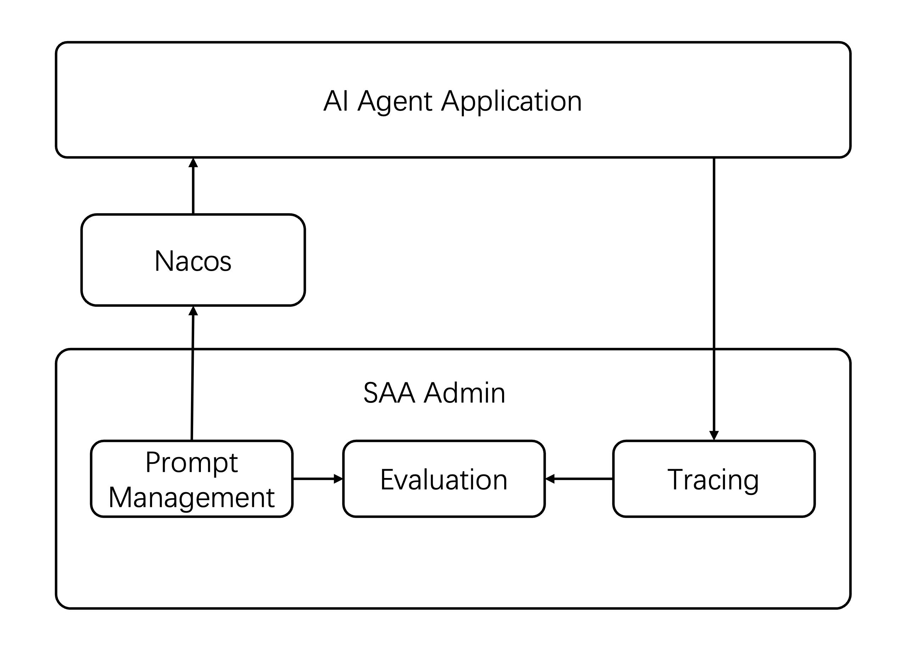

# Spring AI Alibaba Admin

> Spring AI Alibaba Repo: https://github.com/alibaba/spring-ai-alibaba
>
> Spring AI Alibaba Website: https://java2ai.com
>
> Spring AI Alibaba Website Repo: https://github.com/springaialibaba/spring-ai-alibaba-website

[English](./README.md) | 中文


## 项目背景

Spring AI Alibaba Admin 是一个基于 Spring AI Alibaba 的 AI Agent 开发与评估平台，旨在为开发者和企业提供完整的 AI Agent 生命周期管理解决方案。平台支持从 Prompt 工程、数据集管理、评估器配置到实验执行和结果分析的完整工作流，帮助用户快速构建、测试和优化 AI Agent 应用。


## 核心功能

### 🤖 Prompt 管理
- **Prompt 模板管理**: 创建、更新、删除 Prompt 模板
- **版本控制**: 支持 Prompt 版本管理和历史追踪
- **实时调试**: 提供 Prompt 在线调试和流式响应
- **会话管理**: 支持多轮对话会话管理

### 📊 数据集管理
- **数据集创建**: 支持多种格式的数据集导入和创建
- **版本管理**: 数据集版本控制和历史管理
- **数据项管理**: 细粒度的数据项增删改查
- **从链路追踪创建**: 支持从 OpenTelemetry 链路数据创建数据集

### ⚖️ 评估器管理
- **评估器配置**: 支持多种评估器的创建和配置
- **模板系统**: 提供评估器模板和自定义评估逻辑
- **调试功能**: 支持评估器在线调试和测试
- **版本管理**: 评估器版本控制和发布管理

### 🧪 实验管理
- **实验执行**: 自动化执行评估实验
- **结果分析**: 详细的实验结果分析和统计
- **实验控制**: 支持实验的启动、停止、重启和删除
- **批量处理**: 支持批量实验执行和结果对比

### 📈 可观测性
- **链路追踪**: 集成 OpenTelemetry 提供完整的链路追踪
- **服务监控**: 支持服务列表和概览统计
- **Trace 分析**: 提供详细的 Trace 详情和 Span 分析

### 🔧 模型配置
- **多模型支持**: 支持 OpenAI、DashScope、DeepSeek 主流 AI 模型
- **配置管理**: 模型参数的统一配置和管理
- **动态切换**: 支持运行时模型配置的动态更新

## 系统架构

### 整体架构



## 🚀 快速开始

### 环境要求
- 🐳 **Docker** (用于容器化部署) + **Docker Compose**: 2.0+
- ☕ **Java 17+** (用于源码运行) + **Maven**: 3.8+
- 🌐 **AI 模型提供商 API 密钥**，支持OpenAI、DashScope、DeepSeek


### 从源码运行

#### 1. 克隆项目 

```bash
git clone https://github.com/spring-ai-alibaba/spring-ai-alibaba-admin.git
cd spring-ai-alibaba-admin
```

#### 2. 配置您的 API 密钥
根据您的模型供应商，修改 `spring-ai-alibaba-admin-server-start/model-config.yaml` 的模型配置。
- 如果您使用DashScope，请参照model-config-dashscope.yaml模版进行配置
- 如果您使用DeepSeek，请参照model-config-deepseek.yaml模版进行配置
- 如果您使用OpenAI，请参照model-config-openai.yaml模版进行配置
> 💡 **获取您的 DashScope API 密钥**: 访问 [阿里云百炼控制台](https://bailian.console.aliyun.com/?tab=model#/api-key) 获取免费 API 密钥。

#### 3. nacos配置（可选）
如果您需要修改nacos地址，请更新spring-ai-alibaba-admin-server-start/src/main/resources/application.yml文件中的配置
```yaml
nacos:
  server-addr: ${nacos地址}
```

### 4. 启动SAA Admin
在根目录下，执行启动脚本。该脚本会帮助您启动好数据库相关的服务

```bash
sh start.sh
```
spring-ai-alibaba-admin-server-start 目录下启动应用程序
```bash
mvn spring-boot:run
```
### 5. 访问应用

打开浏览器访问 http://localhost:8080/admin 即可使用 SAA Admin 平台。

至此，您已经可以在平台中对prompt进行管理、调试、评估、可观测。如果您期望Spring AI Alibaba Agent应用能够集成Nacos以实现prompt加载以及动态更新，并且观测线上的运行情况，可以参照第六步配置您的 AI Agent 应用。

### 6. 连接您的 AI Agent 应用
在您的 Spring AI Alibaba Agent应用中，引入如下依赖
```xml
<dependencies>
    <!-- 引入spring ai alibaba agent nacos代理模块 -->
    <dependency>
        <groupId>com.alibaba.cloud.ai</groupId>
        <artifactId>spring-ai-alibaba-agent-nacos</artifactId>
        <version>{spring.ai.alibaba.version}</version>
    </dependency>

    <!-- 引入可观测模块 -->

    <dependency>
        <groupId>com.alibaba.cloud.ai</groupId>
        <artifactId>spring-ai-alibaba-autoconfigure-arms-observation</artifactId>
        <version>{spring.ai.alibaba.version}</version>
    </dependency>
    
    
    <!-- 用于实现各种 OTel 相关组件，如 Tracer、Exporter 的自动装载 -->
    <dependency>
        <groupId>org.springframework.boot</groupId>
        <artifactId>spring-boot-starter-actuator</artifactId>
    </dependency>
    
    <!-- 用于将 micrometer 产生的指标数据对接到 otlp 格式 -->
    <dependency>
        <groupId>io.micrometer</groupId>
        <artifactId>micrometer-registry-otlp</artifactId>
    </dependency>
    
    <!-- 用于将 micrometer 底层的链路追踪 tracer 替换为 OTel tracer -->
    <dependency>
        <groupId>io.micrometer</groupId>
        <artifactId>micrometer-tracing-bridge-otel</artifactId>
    </dependency>
    
    <!-- 用于将 OTel tracer 产生的 span 按照 otlp 协议进行上报 -->
    <dependency>
        <groupId>io.opentelemetry</groupId>
        <artifactId>opentelemetry-exporter-otlp</artifactId>
    </dependency>

    <dependency>
        <groupId>org.springframework.ai</groupId>
        <artifactId>spring-ai-autoconfigure-model-tool</artifactId>
        <version>1.0.0</version>
    </dependency>
</dependencies>
``` 

指定nacos地址及prompKey
```yaml
    spring.ai.alibaba.agent.proxy.nacos.serverAddr={ 替换 nacos address, 示例：127.0.0.1:8848}
    spring.ai.alibaba.agent.proxy.nacos.username={ 替换 nacos 用户名, 示例：nacos}
    spring.ai.alibaba.agent.proxy.nacos.password={ 替换 nacos 密码, 示例：nacos}
    spring.ai.alibaba.agent.proxy.nacos.promptKey={ 替换为promptKey，示例：mse-nacos-helper } 
```

设置可观测参数

```yaml
    management.otlp.tracing.export.enabled=true
    management.tracing.sampling.probability=1.0
    management.otlp.tracing.endpoint=http://{admin address}:4318/v1/traces
    management.otlp.metrics.export.enabled=false
    management.otlp.logging.export.enabled=false
    management.opentelemetry.resource-attributes.service.name=agent-nacos-prompt-test
    management.opentelemetry.resource-attributes.service.version=1.0
    spring.ai.chat.client.observations.log-prompt=true
    spring.ai.chat.observations.log-prompt=true
    spring.ai.chat.observations.log-completion=true
    spring.ai.image.observations.log-prompt=true
    spring.ai.vectorstore.observations.log-query-response=true
    spring.ai.alibaba.arms.enabled=true
    spring.ai.alibaba.arms.tool.enabled=true
    spring.ai.alibaba.arms.model.capture-input=true
    spring.ai.alibaba.arms.model.capture-output=true
```

## 许可证

本项目基于 Apache License 2.0 许可证开源。

## 贡献指南

欢迎提交Issue和Pull Request来帮助改进项目。

 
 