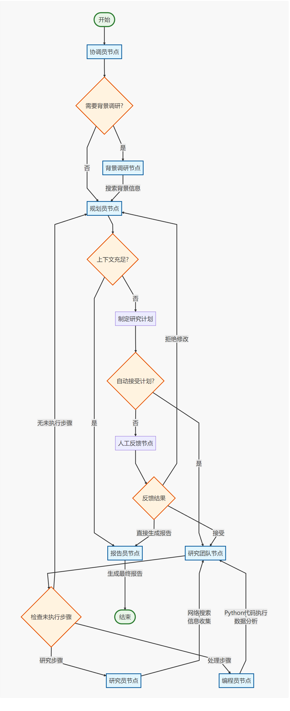
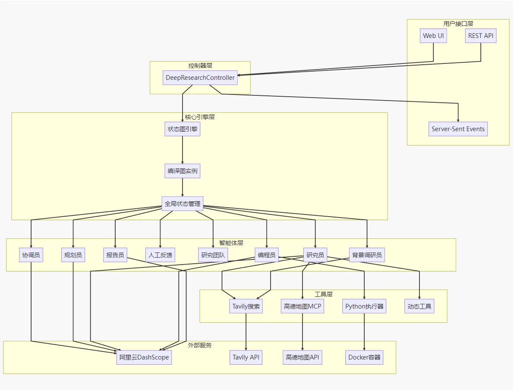

本项目利用 spring-ai-alibaba-graph 实现深度研究

<video width="640" height="360" controls>
  <source src="../docs/video/deepresearh-display.mp4" type="video/mp4">
</video>

## 流程大纲

<p align="center">
     
</p>

### 整体架构图：

<p align="center">
     
</p>

### 配置

#### 必配
- DashScope API: `${AI_DASHSCOPE_API_KEY}`
- TavilySearch API: `${TAVILY_API_KEY}`
- 报告导出路径: `${AI_DEEPRESEARCH_EXPORT_PATH}`

#### 选配
- Jina API: `${JINA_API_KEY}`
- Coder节点的Python执行器跑在Docker容器中，需要额外为其配置Docker信息
  - 在配置文件的`spring.ai.alibaba.deepreserch.python-coder.docker-host`字段中设置DockerHost，默认为`unix:///var/run/docker.sock`。
  本项目需要使用`python:3-slim`镜像创建临时容器，也可以自己定制包含一些常用的第三方库的镜像，第三方库需要安装在镜像的`/app/dependency`文件夹里，在配置文件中设置`spring.ai.alibaba.deepreserch.python-coder.image-name`的值指定镜像名称。
- 高德地图MCP
- 
#### 相关API、工具、MCP接入文档
- tavily API文档：https://docs.tavily.com/documentation/api-reference/endpoint/search
- Jina API文档：https://jina.ai/reader
- 高德地图MCP：https://lbs.amap.com/api/mcp-server/gettingstarted#t1
  - macos:mcp-servers.json
```json
{
  "mcpServers": {
    "amap-maps": {
      "command": "npx",
      "args": ["-y", "@amap/amap-maps-mcp-server"],
      "env": {
        "AMAP_MAPS_API_KEY": "AMAP_MAPS_API_KEY"
      }
    }
  }
}
```
  - windows: mcp-servers-windows.json
```json
{
  "mcpServers": {
    "amap-maps": {
      "command": "cmd",
      "args": ["/c","npx","-y","@amap/amap-maps-mcp-server"],
      "env": {
        "AMAP_MAPS_API_KEY": "AMAP_MAPS_API_KEY"
      }
    }
  }
}
```

### 项目启动
#### 快速启动
右键点击DeepResearchApplication类的Run命令启动

#### maven启动
在spring-ai-alibaba-deepresearch项目根目录下，使用maven启动项目
```angular2html
mvn spring-boot:run
```


#### Docker版启动
- 在deepresearch项目工程目录下执行构建命令，构建docker镜像大约要花费5分钟左右，具体时间取决于网络速度
```shell
docker build -t alibaba-deepresearch:v1.0 . 
```
- 构建完成后，执行docker run命令启动镜像，设置环境变量
```shell
docker run -d \
  --name alibaba-deepresearch \
  -e AI_DASHSCOPE_API_KEY="your_key_here" \
  -e TAVILY_API_KEY="your_key_here" \
#  -e JINA_API_KEY="your_key_here" \ 选填
  -p 8080:8080 \
  alibaba-deepresearch:v1.0
```

##### 测试用例
```curl
curl --location 'http://localhost:8080/deep-research/chat/stream' \
--header 'Content-Type: application/json' \
--data '{
    "thread_id": "__default_",
    "enable_background_investigation": false,
    "query": "请为我分析泡泡玛特现象级爆火的原因",
    "max_step_num": 2,
    "auto_accepted_plan": true
}'
```


### Contributors

GitHub:
- [yingzi](https://github.com/GTyingzi)
- [zhouyou](https://github.com/zhouyou9505)
- [NOBODY](https://github.com/SCMRCORE)
- [xiaohai-78](https://github.com/xiaohai-78)
- [VLSMB](https://github.com/VLSMB)
- [disaster1-tesk](https://github.com/disaster1-tesk)
- [Allen Hu](https://github.com/big-mouth-cn)
- [Makoto](https://github.com/zxuexingzhijie)
- [sixiyida](https://github.com/sixiyida)
- [Gfangxin](https://github.com/Gfangxin)
