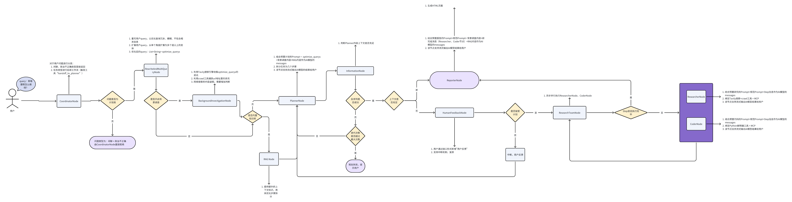
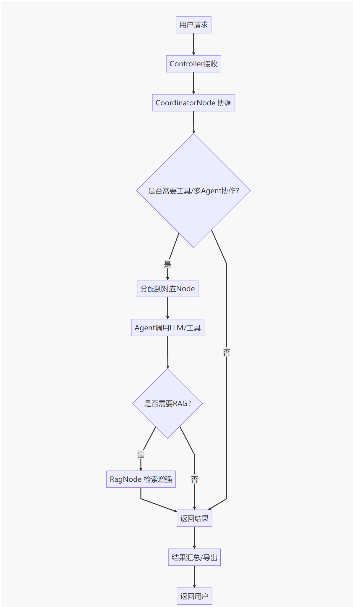

# Spring AI Alibaba DeepResearch Web UI Startup Guide

[English](#english) | [中文](#中文)

---

### Overview

This is a Spring AI Alibaba DeepResearch management interface built with Vue 3 + Vite, providing AI-powered task automation and research capabilities. The project includes both backend services and a modern web UI for deep research tasks.

**Key Features:**
- 🤖 **AI-Powered Research**: Automated research with intelligent task planning
- 💬 **Interactive Chat Interface**: Real-time conversation with AI agents
- 📊 **Task Management**: Step-by-step execution with progress tracking
- 🔍 **Multi-Source Search**: Integration with Tavily, Jina, and other search APIs
- 📝 **Report Generation**: Automated research report creation and export
- 🌐 **Internationalization**: Support for multiple languages

### Architecture



> The diagram above shows the core module layering and main calling relationships of deepresearch.

### Main Workflow



> The diagram above shows the main flow of user requests in the deepresearch system.

### Project Structure

```
spring-ai-alibaba-deepresearch/
├── src/                          # Backend source code
├── ui-vue3/                      # Frontend Vue 3 application
│   ├── src/
│   │   ├── components/           # Reusable components
│   │   ├── views/               # Page components
│   │   ├── router/              # Vue Router configuration
│   │   ├── base/                # Base utilities
│   │   └── utils/               # Utility functions
│   ├── public/
│   ├── package.json
│   └── vite.config.js
```

### Environment Requirements

- **Frontend**: Node.js >= 16.0.0, npm >= 8.0.0 or yarn >= 1.22.0
- **Optional**: Docker, Redis, Elasticsearch

### Quick Start

#### Frontend Setup

```bash
# Navigate to UI directory
cd ui-vue3

# Install dependencies
pnpm install

# Start development server
npm run dev

```

The frontend will be available at http://localhost:5173/ui

#### Build for Production

```bash
# Build frontend
cd ui-vue3
npm run build

# Copy built files to backend resources
cp -r dist/* ../src/main/resources/static/
```


### Technology Stack

**Frontend:**
- Vue 3 (Composition API)
- Vite
- Ant Design Vue
- TypeScript
- Monaco Editor
- Vue Router 4
- Ant Design X Vue


### License

This project is licensed under the Apache License 2.0.
