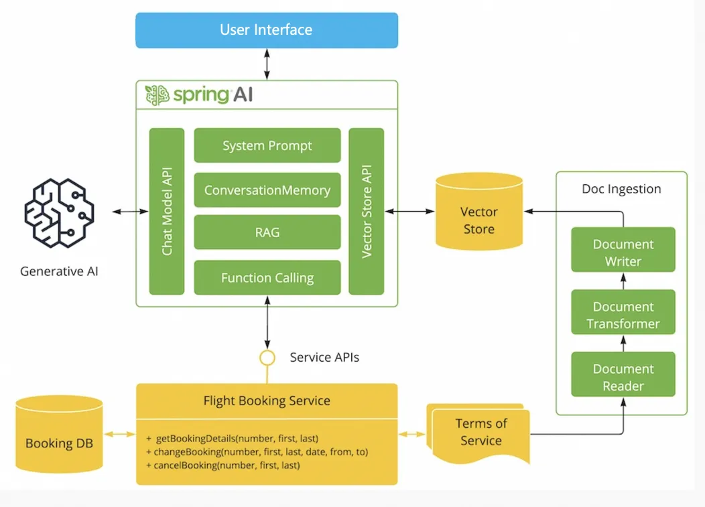

# AI powered expert system demo

This app shows how you can use Spring AI Alibaba to build an AI-powered system that:

- Has access to terms and conditions (retrieval augmented generation, RAG)
- Can access tools (Java methods) to perform actions (Function Calling)
- Uses an LLM to interact with the user



## Requirements

- Java 17+
- Dashscope API key in `AI_DASHSCOPE_API_KEY` environment variable

## Running

Run the app by running `Application.java` in your IDE or `mvn spring-boot:run` in the command line.


Add to the POM the Spring AI Alibaba boot starter:

```xml
<dependency>
    <groupId>org.springframework.ai</groupId>
    <artifactId>spring-ai-alibaba-starter</artifactId>
    <version>1.0.0-M3.2</version>
</dependency>
```

Add the DashScope configuration to the `application.properties`:

```
spring.ai.dashscope.api-key=${AI_DASHSCOPE_API_KEY}
spring.ai.dashscope.chat.options.model=qwen-max
```

## Build Jar

```shell
./mvnw clean package
```

```shell
java -jar ./target/playground-flight-booking-example-0.0.1-SNAPSHOT.jar
```


## Build Frontend (as needed)

Run the following command to build frontend, this is only necessary when you made changes to frontend.

```shell
mvn clean compile -Pbuild-frontend
```
