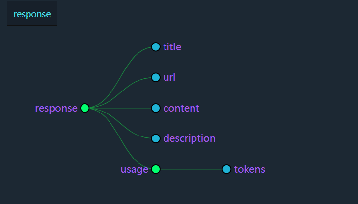
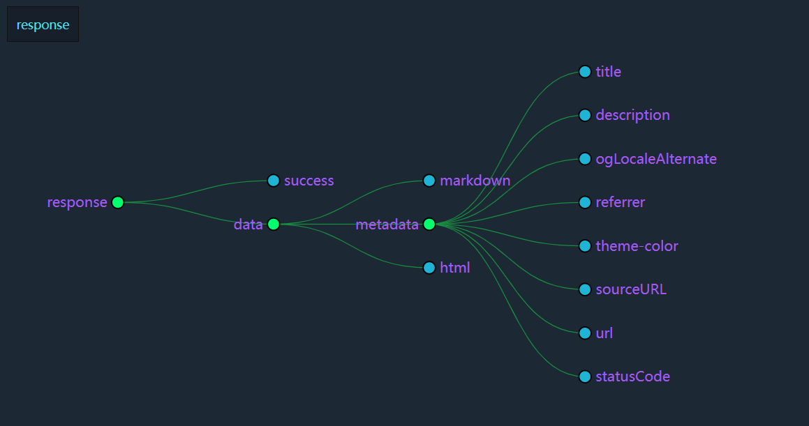

# Spring AI Alibaba Stater Crawler Plugin

本示例文档将介绍如何使用 Spring AI Alibaba Starter Crawler Plugin 来为您的 LLMs 项目提供爬虫插件功能。

> 本文档中的示例代码均为 `spring-ai-alibaba-examples/plugin-example/crawler-plugin-example`
> 项目中的示例代码，您可以在导入该项目后直接运行并体验插件功能。
> 目前支持的爬虫插件有：Jina Reader 和 Firecrawl。

此项目为标准的 Spring Boot 项目，可以使用 IDEA 直接创建 Spring Boot Template Application。

在阅读文档之前，请访问：

- https://www.firecrawl.dev/
- https://jina.ai/reader/

获取 apikey，两者有其一即可。。

## 1. 引入依赖

```xml

<dependencies>

	<dependency>
		<groupId>com.alibaba.cloud.ai</groupId>
		<artifactId>spring-ai-alibaba-starter-plugin-crawler</artifactId>
		<version>${spring-ai-alibaba.version}</version>
	</dependency>

	<dependency>
		<groupId>org.springframework.boot</groupId>
		<artifactId>spring-boot-starter-web</artifactId>
	</dependency>

</dependencies>
```

## 2. 编写项目主类

```java

@SpringBootApplication
public class CrawlerPluginApplication {

	public static void main(String[] args) {

		SpringApplication.run(CrawlerPluginApplication.class, args);
	}

}
```

## 3. 创建 crawler controller

> 以 Jina Reader 为例演示，Firecrawl 使用方式类似。

```java

@RestController
@RequestMapping("/ai/crawler")
public class CrawlerJinaController {

	private final CrawlerService jinaService;

	private final ObjectMapper objectMapper;

	private CrawlerJinaController(CrawlerJinaServiceImpl jinaService, ObjectMapper objectMapper) {
		this.jinaService = jinaService;
		this.objectMapper = objectMapper;
	}

	@GetMapping("/jina")
	public JinaResponse jinaCrawler() throws JsonProcessingException {

		return this.objectMapper.readValue(jinaService.run("https://www.baidu.com"), JinaResponse.class);
	}

}
```

## 4. 加入项目配置

```yml
spring:
  application:
    name: crawler-plugin-example

  ai:
    dashscope:
      api-key: ${AI_DASHSCOPE_API_KEY}

    alibaba:
      plugin:
        crawler:
          jina:
            enabled: true
            token: ${JINA_TOKEN}
          firecrawl:
            enabled: true
            token: ${FIRECRAWL_TOKEN}
            formats: markdown, html

logging:
  level:
    com.alibaba.cloud.ai.plugin.crawler: DEBUG
```

配置项说明：

> 配置项参考：
> - [Jina Reader](https://jina.ai/reader/)
> - [Firecrawl](https://docs.firecrawl.dev/api-reference/)

1. `crawler.jina.enabled`：是否启用 Jina Reader 插件，必须设置，因为 crawler-plugin 包含多个爬虫实现。
2. `crawler.jina/firecrawl.token`：Jina Reader/Firecrawl 的 apikey。
3. `crawler.firecrawl.formats`：Firecrawl 支持的格式，目前支持 `markdown`， `html`， `rawHtml` 和 `links`。分别以不同数据格式返回。
4. `logging.level.com.alibaba.cloud.ai.plugin.crawler`：设置日志级别为 `DEBUG` 查看日志输出信息。

更多配置项参考 `CrawlerFirecrawlProperties` 和 `CrawlerJinaProperties`。

## 5. 运行项目

启动 CrawlerPluginApplication，

### 5.1 Jina Reader 请求示例

访问 `http://localhost:8080/ai/crawler/jina` 即可看到爬取的内容。

返回的 json 数据结构如下：



数据为：（数据太多，有删除，下同）

```json
{
  "title": "百度一下，你就知道",
  "url": "https://www.baidu.com/",
  "content": "百度一下，你就知道....",
  "description": "全球领先的中文搜索引擎、致力于让网民更便捷地获取信息，找到所求。百度超过千亿的中文网页数据库，可以瞬间找到相关的搜索结果。",
  "usage": {
    "tokens": 3472
  }
}
```

### 5.2 Firecrawl 请求示例

返回的 json 数据结构如下：

数据为：

```json
{
  "success": true,
  "data": {
    "markdown": "[百度首页](/) [设置](javascript:;) [登录](https://passport.baidu.com/v2/?login&tpl=mn&u=http%3A%2F%2Fwww.baidu.com%2F&sms=5) [新闻].....",
    "metadata": {
      "title": "百度一下，你就知道",
      "description": "全球领先的中文搜索引擎、致力于让网民更便捷地获取信息，找到所求。百度超过千亿的中文网页数据库，可以瞬间找到相关的搜索结果。",
      "ogLocaleAlternate": [],
      "referrer": "always",
      "theme-color": "#ffffff",
      "sourceURL": "https://www.baidu.com",
      "url": "https://www.baidu.com/",
      "statusCode": 200
    },
    "html": "...."
  }
}
```
