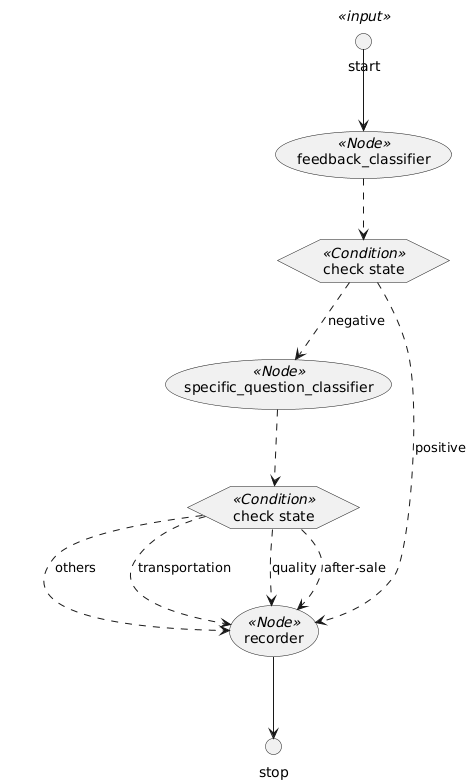

# Spring AI Alibaba Graph Workflow快速开始

## 项目简介

Spring AI Alibaba Graph 是一款面向 Java 开发者的**工作流、多智能体框架**，用于构建由多个 AI 模型或步骤组成的复杂应用。它基于 Spring Boot 生态进行深度集成，提供声明式的 API 来编排工作流，让开发者能将 AI 应用的各个步骤抽象为节点（Node），并通过有向图（Graph）的形式连接这些节点，形成可定制的执行流程。与传统单 Agent（一问一答式）方案相比，Spring AI Alibaba Graph 支持更复杂的多步骤任务流程，有助于解决**单一大模型对复杂任务力不从心**的问题。框架核心包括：**StateGraph**（状态图，用于定义节点和边）、**Node**（节点，封装具体操作或模型调用）、**Edge**（边，表示节点间的跳转关系）以及 **OverAllState**（全局状态，贯穿流程共享数据）。这些设计使开发者能够方便地管理工作流中的状态和逻辑流转。

## 核心概念与类

1. StateGraph（状态图/工作流图）
   定义整个工作流的主类。
   支持添加节点（addNode）、边（addEdge、addConditionalEdges）、条件分支、子图等。
   可校验图结构，最终编译为 CompiledGraph 以供执行。

2. Node（节点）
   表示工作流中的单个步骤（如模型调用、数据处理等）。
   支持异步节点，可封装大模型调用或自定义逻辑。

3. Edge（边）
   表示节点之间的转移关系。
   支持条件分支（根据状态决定下一个节点）。

4. OverAllState（全局状态）
   可序列化的全局状态对象，贯穿整个工作流。
   支持按 key 注册不同的合并/更新策略（如替换、合并等）。
   用于数据传递、断点续跑、人工干预等。

5. CompiledGraph（已编译图）
   StateGraph 的可执行版本。
   负责实际的节点执行、状态流转、结果流式输出。
   支持中断、并行节点、检查点等高级特性。

## 典型使用流程

- 定义 StateGraph：在 Spring 配置类中定义 StateGraph bean，添加各节点（如模型调用、业务逻辑），用边连接。

- 配置全局状态：通过 OverAllStateFactory 定义初始状态及 key 策略。

- 执行：编译为 CompiledGraph，驱动状态在节点和边之间流转，条件逻辑决定路径。

- 集成：通常通过 REST Controller 或 Service 暴露为接口。

## 简单示例

要快速体验 Spring AI Alibaba Graph，可以基于官方提供的 WorkflowAutoconfiguration 示例搭建一个完整的工作流应用。下面将以“客户评价处理系统”为例，介绍从项目依赖到运行测试的主要步骤：

1. **添加依赖与配置模型**：在 Spring Boot 项目的 Maven `pom.xml` 中引入 Spring AI Alibaba 的 BOM 以及所需的 Starter 依赖。如引入阿里百炼大模型 DashScope 的 Starter（或选择 OpenAI Starter，具体取决于所用模型平台）。例如：

   ```xml
   <dependencyManagement>
       <dependencies>
           <dependency>
               <groupId>com.alibaba.cloud.ai</groupId>
               <artifactId>spring-ai-alibaba-bom</artifactId>
               <version>1.0.0.2</version>
               <type>pom</type>
               <scope>import</scope>
           </dependency>
       </dependencies>
   </dependencyManagement>
   <dependencies>
       <!-- 引入 DashScope 模型适配的 Starter -->
       <dependency>
           <groupId>com.alibaba.cloud.ai</groupId>
           <artifactId>spring-ai-alibaba-starter-dashscope</artifactId>
       </dependency>
     	<!-- 引入 Graph 核心依赖 -->
     	<dependency>
           <groupId>com.alibaba.cloud.ai</groupId>
           <artifactId>spring-ai-alibaba-graph-core</artifactId>
           <version>1.0.0.2</version>
        </dependency>
   </dependencies>
   
   ```

   添加依赖后，在项目的 `application.properties` 中配置模型 API 密钥。例如使用 OpenAI 模型时设置 `spring.ai.openai.api-key=<您的API密钥>`，或使用阿里 Qwen 模型时配置 DashScope 服务的访问密钥（如 `spring.ai.dashscope.api-key=<您的API密钥>` 。这些配置确保 Spring AI 能自动创建所需的 **ChatModel** Bean，用于与对应的模型服务通信。

2. **定义工作流 StateGraph**：创建一个 Spring Boot 配置类（例如 `WorkflowAutoconfiguration`），在其中定义一个 **StateGraph** Bean 来描述工作流逻辑。在该配置中，需要完成以下几个步骤：

    - **初始化 ChatClient**：从容器中获取注入的 ChatModel（由上一步配置产生），构建一个 ChatClient 实例并附加必要的 Advisor（如日志记录器），用于后续 LLM 调用。例如：

      ```java
      ChatClient chatClient = ChatClient.builder(chatModel)
                                        .defaultAdvisors(new SimpleLoggerAdvisor())
                                        .build();
      ```

      这里 `ChatClient` 是 Spring AI Alibaba 提供的与大模型对话的客户端，可看作对底层 API 的封装。

    - **设置全局状态 OverAllState**：定义一个 OverAllStateFactory，用于在每次执行工作流时创建初始的全局状态对象。通过注册若干 **Key** 及其更新策略来管理上下文数据：

      ```java
      OverAllStateFactory stateFactory = () -> {
          OverAllState state = new OverAllState();
          state.registerKeyAndStrategy("input", new ReplaceStrategy());
          state.registerKeyAndStrategy("classifier_output", new ReplaceStrategy());
          state.registerKeyAndStrategy("solution", new ReplaceStrategy());
          return state;
      };
      ```

      上述代码注册了三个状态键：`input`（输入文本）、`classifier_output`（分类结果）和 `solution`（最终处理结论），均采用 **ReplaceStrategy**（每次写入替换旧值）。这些键将贯穿整个工作流，用于在节点之间传递数据。

    - **定义节点 (Node)**：创建工作流中的核心节点，包括两个文本分类节点和一个记录节点。在本示例中，框架提供了预定义的 **QuestionClassifierNode** 类用于文本分类任务，通过 builder 构建节点并传入分类相关的 prompt 实现智能分类：

      ```java
      // 评价正负分类节点
      QuestionClassifierNode feedbackClassifier = QuestionClassifierNode.builder()
              .chatClient(chatClient)
              .inputTextKey("input")
              .categories(List.of("positive feedback", "negative feedback"))
              .classificationInstructions(
                      List.of("Try to understand the user's feeling when he/she is giving the feedback."))
              .build();
      // 负面评价具体问题分类节点
      QuestionClassifierNode specificQuestionClassifier = QuestionClassifierNode.builder()
              .chatClient(chatClient)
              .inputTextKey("input")
              .categories(List.of("after-sale service", "transportation", "product quality", "others"))
              .classificationInstructions(List.of(
                      "What kind of service or help the customer is trying to get from us? " + 
                      "Classify the question based on your understanding."))
              .build();
      ```

      上面定义了两个节点：`feedbackClassifier` 将判断反馈是**正面**还是**负面**；`specificQuestionClassifier` 则对负面反馈进一步归类（如售后服务、运输、产品质量或其他）。两者都使用 ChatClient 调用大模型对语义进行分析从而完成分类，并把结果写入全局状态的 `"classifier_output"` 中（框架内部约定）。此外，也可以按需定义自定义节点。

      例如自定义的 `RecordingNode` 节点用于记录和处理最终结果：

      ```java
      // 记录结果的节点
      RecordingNode recorderNode = new RecordingNode();
      ```

      `RecordingNode` 实现了 NodeAction 接口，会在流程末尾根据分类结果生成相应的解决方案，并将结果写回OverAllState。

    - **添加节点到 StateGraph**：使用 **StateGraph** 的 API，将上述节点加入图中，并设置节点间的状态流转关系：

      ```java
      StateGraph graph = new StateGraph("Consumer Service Workflow Demo", stateFactory)
              .addNode("feedback_classifier", node_async(feedbackClassifier))
              .addNode("specific_question_classifier", node_async(specificQuestionClassifier))
              .addNode("recorder", node_async(recorderNode))
              // 定义边（流程顺序）
              .addEdge(START, "feedback_classifier")  // 起始节点
              .addConditionalEdges("feedback_classifier",
                      edge_async(new CustomerServiceController.FeedbackQuestionDispatcher()),
                      Map.of("positive", "recorder", "negative", "specific_question_classifier"))
              .addConditionalEdges("specific_question_classifier",
                      edge_async(new CustomerServiceController.SpecificQuestionDispatcher()),
                      Map.of("after-sale", "recorder", "transportation", "recorder", 
                             "quality", "recorder", "others", "recorder"))
              .addEdge("recorder", END);  // 结束节点
      ```

      上述配置完成了工作流图的搭建：首先将节点注册到图，并使用 `node_async(...)` 将每个 NodeAction 包装为异步节点执行（提高吞吐或防止阻塞，具体实现框架已封装）。然后定义了节点间的边（Edges）和条件跳转逻辑：

        - `START -> feedback_classifier`：特殊的 START 状态直接进入初始 **反馈分类** 节点；
        - `feedback_classifier -> recorder` 或 `-> specific_question_classifier`：通过 **条件边**根据分类结果选择下一步。这里使用 `FeedbackQuestionDispatcher` 实现 **EdgeAction** 来读取分类输出并返回 `"positive"` 或 `"negative"` 字符串，分别映射到后续节点；
        - `specific_question_classifier -> recorder`：同样通过条件边，无论负面反馈被细分为何种类别（售后、运输、质量或其它），都汇流到 **记录** 节点进行统一处理；
        - `recorder -> END`：最后记录节点执行完毕，进入终止状态 END，结束整个流程。

   完成上述定义后，将配置类中构建的 `StateGraph` Bean 注入 Spring 容器即可。框架会在运行时根据此定义自动编译图并等待被调用执行。

3. **运行应用**：在配置好依赖和工作流后，启动 Spring Boot 应用（例如使用 `mvn spring-boot:run` 或在 IDE 中运行主应用类）。应用启动时会读取配置的 API 密钥，初始化 ChatModel/ChatClient，并注册定义好的 StateGraph。Spring AI Alibaba Graph 提供了简单的调用接口来触发工作流执行，例如可以通过 REST 控制器映射 HTTP 请求到图的执行。示例应用就包含了一个控制器 `CustomerServiceController` 将工作流暴露为 HTTP 接口，下一节将详细说明。

## 节点和组件协作

上述工作流应用的业务场景是对用户产品评价进行分类和处理。各个组件的协作如下：

- **评价分类节点（feedback_classifier）**：这是一个 `QuestionClassifierNode`，用于判断用户反馈是正面还是负面。它利用 LLM 对输入文本（存储在 `"input"` 键）进行语义理解，并输出类别结果（如 *positive feedback* 或 *negative feedback*）。分类结果会写入全局状态的 `"classifier_output"` 键，供后续边的判断逻辑使用。

- **负面评价细分节点（specific_question_classifier）**：同样是 `QuestionClassifierNode`，在检测到反馈为负面时被执行。它会根据负面反馈的内容，将问题归类为 *售后服务*、*运输物流*、*产品质量* 或 *其他* 四种类型之一。这个节点复用了输入文本 `"input"`，并将更具体的分类结果写入 `"classifier_output"`（会覆盖之前的值，因为该键设置了 ReplaceStrategy 策略）。

- **边的调度逻辑（EdgeAction）**：两个分类节点之间的转接逻辑由 `FeedbackQuestionDispatcher` 和 `SpecificQuestionDispatcher` 来完成。它们实现了 **EdgeAction** 接口，作用是在节点执行完后读取全局状态，决定下一步该走哪条边：

    - `FeedbackQuestionDispatcher`（用于 feedback_classifier 节点之后）会检查 `classifier_output` 字符串，包含“positive”则返回 `"positive"`，否则一律返回 `"negative"。因此，StateGraph 将 `"positive"` 映射到 `recorder` 节点，`"negative"` 映射到 `specific_question_classifier` 节点。
    - `SpecificQuestionDispatcher`（用于 specific_question_classifier 节点之后）则解析更细的类别结果。它预先定义了若干关键词映射（如包含“after-sale”则返回 `"after-sale"` 等）。遍历发现分类结果字符串中含有某个关键词就返回对应值，否则返回 `"others"。StateGraph 据此将所有可能值（after-sale、transportation、quality、others）都指向同一个后续节点 `recorder`。

  通过以上节点以及边的调度逻辑，工作流实现了**动态路径选择**：正面反馈走简化路径，负面反馈则进入细分流程，充分体现了 Spring AI Alibaba Graph 在**路由分支**场景下的优势。

- **记录节点（recorder）**：`RecordingNode` 是按需自定义的 NodeAction，实现对最终结果的记录和决策。它的 `apply` 方法读取全局状态中的 `"classifier_output"` 字段值，判断其中是否包含“positive”。如果是正面反馈，则仅记录日志无需进一步动作（在示例中将 `"solution"` 字段设为固定文本“Praise, no action taken.”表示无需处理，真实业务场景中可扩展逻辑，例如通过HttpNode将结果发送到品牌宣传部门)；否则将负面反馈的细分类结果作为解决方案（即把 `"classifier_output"` 的内容原样填入 `"solution"`）。同时，RecordingNode 也通过日志打印了收到的反馈类型，方便在控制台查看分类结果。这一节点相当于整个工作流的收尾，决定了对于不同类型的用户评价给出怎样的处理结论。

综上，各组件协同完成了一个两级分类流程：**首先判断评价正负，其次细分负面问题，最后输出处理方案**。这种解耦的设计使开发者可以轻松地调整每个环节，例如替换分类模型、更改分类粒度，或在负面反馈流程中增加其他处理步骤（发送告警、存储数据库等），而无需影响整体架构。

完整的 PlantUML 工作流图如下：

<div style="text-align: center;">
  
</div>


## 运行与测试

完成上述配置后，就可以在本地运行这个工作流应用，并通过 HTTP 接口进行测试：

- **启动应用**：确保已在配置文件中设置模型所需的密钥，然后启动 Spring Boot 应用。应用启动日志中应能看到 ChatClient 初始化和 StateGraph 编译成功的信息。如果使用的是 OpenAI 模型，在首次调用时可能下载模型的 API 描述；使用阿里云模型则需要确保网络能访问 DashScope 服务。

- **调用工作流接口**：示例应用通过 `CustomerServiceController` 将工作流暴露为 REST 接口。在浏览器或命令行中调用以下 GET 请求即可触发流程：

  ```bash
  # 调用正面评价案例
  curl "http://localhost:8080/customer/chat?query=This product is excellent, I love it!"
  ```

  上述请求中的 `query` 参数就是用户反馈文本。对于一个正面反馈示例，工作流会判定为正面评价，直接记录结论。预计返回的结果是固定的鼓励回应，例如：

  ```
  Praise, no action taken.
  ```

  这表示系统记录了正面评价，无需进一步处理。

  再测试一个负面反馈例子：

   ```bash
   # 调用负面评价案例
   curl "http://localhost:8080/customer/chat?query=The product broke after one day, very disappointed."
   ```

  由于这是负面评价，工作流首先会分类为 *negative*，然后在具体分类节点可能将其归类为“产品质量”问题，最后记录这一结论。接口返回的字符串将包含具体问题类别，例如：

  ```
  product quality
  ```

  该返回结果对应在 RecordingNode 中的设计：对于负面反馈，直接返回分类器给出的细分问题作为解决方案。

- **观察日志输出**：在应用控制台日志中，可以看到每一步执行的记录信息。例如，当反馈为正面时，RecordingNode 会输出日志“Received positive feedback: ...”，负面反馈则输出“Received negative feedback: ...”，这有助于开发调试了解流程走向。同时，由于给 ChatClient 配置了 SimpleLoggerAdvisor，与模型交互的提示词和回复也会简要记录，方便查看大模型决策过程。

通过以上测试，验证了工作流应用的正确性。新接触 Spring AI Alibaba Graph 的开发者可以在此基础上修改扩展，例如更改分类类别、调整提示词，或为不同类别的反馈接入后续处理逻辑（如自动回复、工单创建等），可以在自定义的工作流中使用框架的预定义节点，也可以按照框架定义，自定义节点和边，搭建适合自身业务的工作流。凭借 Spring AI Alibaba Graph **声明式工作流**和**多智能体**的强大能力，开发者能够以最小的代价快速搭建起灵活可控的 AI 驱动业务流程，在 Java 应用中高效地利用大模型的智能。
