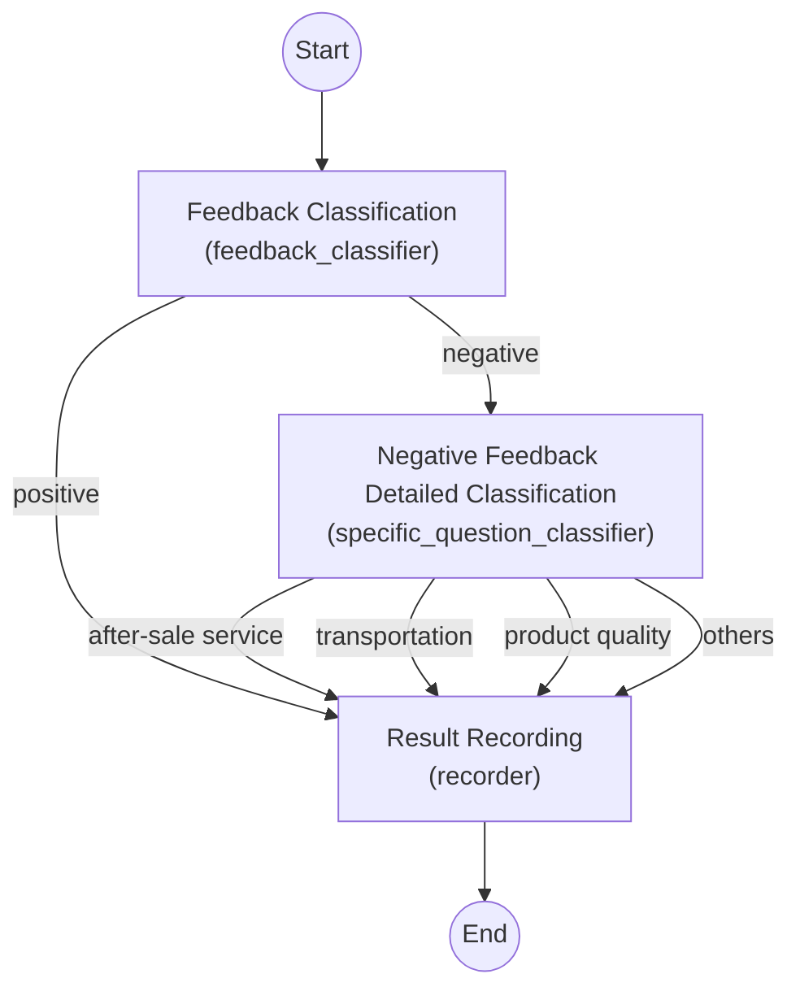

# Spring AI Alibaba Graph Workflow Quick Start

## Project Overview

Spring AI Alibaba Graph is a **workflow and multi-agent framework** for Java developers to build complex applications composed of multiple AI models or steps. It is deeply integrated with the Spring Boot ecosystem, providing a declarative API to orchestrate workflows. This allows developers to abstract each step of an AI application as a node (Node) and connect these nodes in the form of a directed graph (Graph) to create a customizable execution flow. Compared to traditional single-agent (one-turn Q&A) solutions, Spring AI Alibaba Graph supports more complex multi-step task flows, helping to address the issue of a **single large model being insufficient for complex tasks**.

The core of the framework includes: **StateGraph** (the state graph for defining nodes and edges), **Node** (node, encapsulating a specific operation or model call), **Edge** (edge, representing transitions between nodes), and **OverAllState** (global state, carrying shared data throughout the flow). These designs make it convenient to manage state and control flow in the workflow.

## Core Concepts & Classes
1. StateGraph
   The main class for defining a workflow.
   Lets you add nodes (addNode) and edges (addEdge, addConditionalEdges).
   Supports conditional routing, subgraphs, and validation.
   Can be compiled into a CompiledGraph for execution.
2. Node
   Represents a single step in the workflow (e.g., a model call, a data transformation).
   Nodes can be asynchronous and can encapsulate LLM calls or custom logic.
3. Edge
   Represents transitions between nodes.
   Can be conditional, with logic to determine the next node based on the current state.
4. OverAllState
   A serializable, central state object that holds all workflow data.
   Supports key-based strategies for merging/updating state.
   Used for checkpointing, resuming, and passing data between nodes.
5. CompiledGraph
   The executable form of a StateGraph.
   Handles the actual execution, state transitions, and streaming of results.
   Supports interruption, parallel nodes, and checkpointing.

## How It's Used (Typical Flow)
- Define StateGraph: In a Spring configuration, you define a StateGraph bean, add nodes (each encapsulating a model call or logic), and connect them with edges.
- Configure State: Use an OverAllStateFactory to define the initial state and key strategies.
- Execution: The graph is compiled and executed, with state flowing through nodes and edges, and conditional logic determining the path.
- Integration: Typically exposed via a REST controller or service in a Spring Boot app.

## Simple Example

To quickly get started with Spring AI Alibaba Graph, you can build a complete workflow application based on the official WorkflowAutoconfiguration example. The following uses a “customer feedback processing system” as an example to introduce the main steps from adding project dependencies to running tests:

1. **Dependencies and Model Configuration**: In the Spring Boot project’s Maven `pom.xml`, include the Spring AI Alibaba BOM and the required Starter dependencies. For instance, include the DashScope Starter for Alibaba's Pai-Blade model (or the OpenAI Starter, depending on the model platform used). For example:

   ```xml
   <dependencyManagement>
       <dependencies>
           <dependency>
               <groupId>com.alibaba.cloud.ai</groupId>
               <artifactId>spring-ai-alibaba-bom</artifactId>
               <version>1.0.0.2</version>
               <type>pom</type>
               <scope>import</scope>
           </dependency>
       </dependencies>
   </dependencyManagement>
   <dependencies>
       <!-- Include the DashScope model adapter Starter -->
       <dependency>
           <groupId>com.alibaba.cloud.ai</groupId>
           <artifactId>spring-ai-alibaba-starter-dashscope</artifactId>
       </dependency>
       <!-- Include the Graph core dependency -->
       <dependency>
           <groupId>com.alibaba.cloud.ai</groupId>
           <artifactId>spring-ai-alibaba-graph-core</artifactId>
           <version>1.0.0.2</version>
       </dependency>
   </dependencies>
   ```

   After adding the dependencies, configure the model API key in the project’s `application.properties`. For example, when using an OpenAI model set `spring.ai.openai.api-key=<Your API Key>`, or for Alibaba’s Pai-Blade model configure the DashScope service access key (e.g., `spring.ai.dashscope.api-key=<Your API Key>`). These configurations ensure Spring AI can automatically create the necessary **ChatModel** bean to communicate with the corresponding model service.

2. **Workflow StateGraph Definition**: Create a Spring Boot configuration class (for example, `WorkflowAutoconfiguration`) and define a **StateGraph** bean in it to describe the workflow logic. In this configuration, the following steps need to be completed:

   - **ChatClient Initialization**: Retrieve the injected ChatModel from the container (produced by the previous configuration), build a ChatClient instance, and attach necessary Advisors (such as a logger) for subsequent LLM calls. For example:

     ```java
     ChatClient chatClient = ChatClient.builder(chatModel)
                                       .defaultAdvisors(new SimpleLoggerAdvisor())
                                       .build();
     ```

     Here, `ChatClient` is the client provided by Spring AI Alibaba for conversing with the large model, which can be seen as a wrapper around the underlying API.

   - **Global State (OverAllState) Setup**: Define an `OverAllStateFactory` to create an initial global state object each time the workflow executes. Register several **Keys** and their update strategies to manage context data:

     ```java
     OverAllStateFactory stateFactory = () -> {
         OverAllState state = new OverAllState();
         state.registerKeyAndStrategy("input", new ReplaceStrategy());
         state.registerKeyAndStrategy("classifier_output", new ReplaceStrategy());
         state.registerKeyAndStrategy("solution", new ReplaceStrategy());
         return state;
     };
     ```

     The above code registers three state keys: `input` (the input text), `classifier_output` (classification result), and `solution` (final processing conclusion), all using **ReplaceStrategy** (each write replaces the old value). These keys persist throughout the workflow and are used to pass data between nodes.

   - **Node Definitions**: Create the core nodes in the workflow, including two text classification nodes and one recording node. In this example, the framework provides a predefined **QuestionClassifierNode** class for text classification tasks. We use its builder to specify the classification categories and prompts, and use the ChatClient to call the large model service, achieving intelligent classification:

     ```java
     // Feedback positive/negative classification node
     QuestionClassifierNode feedbackClassifier = QuestionClassifierNode.builder()
             .chatClient(chatClient)
             .inputTextKey("input")
             .categories(List.of("positive feedback", "negative feedback"))
             .classificationInstructions(
                     List.of("Try to understand the user's feeling when he/she is giving the feedback."))
             .build();
     // Negative feedback specific question classification node
     QuestionClassifierNode specificQuestionClassifier = QuestionClassifierNode.builder()
             .chatClient(chatClient)
             .inputTextKey("input")
             .categories(List.of("after-sale service", "transportation", "product quality", "others"))
             .classificationInstructions(List.of(
                     "What kind of service or help the customer is trying to get from us? " + 
                     "Classify the question based on your understanding."))
             .build();
     ```

     In the above, two nodes are defined: `feedbackClassifier` will determine whether the feedback is **positive** or **negative**, and `specificQuestionClassifier` will further categorize negative feedback (e.g., after-sale service, transportation, product quality, or others). Both use the ChatClient to invoke the large model for classification, and will write the result to the `"classifier_output"` key in the global state (as per framework convention). In addition, you can define custom nodes as needed.

     For example, a custom `RecordingNode` is used to record and handle the final result:

     ```java
     // Node for recording results
     RecordingNode recorderNode = new RecordingNode();
     ```

     `RecordingNode` implements the NodeAction interface. It will, at the end of the flow, generate the appropriate solution based on the classification result and write the result back to OverAllState.

   - **StateGraph Construction**: Using the **StateGraph** API, add the above nodes to the graph and set up the transitions between nodes:

     ```java
     StateGraph graph = new StateGraph("Consumer Service Workflow Demo", stateFactory)
             .addNode("feedback_classifier", node_async(feedbackClassifier))
             .addNode("specific_question_classifier", node_async(specificQuestionClassifier))
             .addNode("recorder", node_async(recorderNode))
             // Define edges (workflow sequence)
             .addEdge(START, "feedback_classifier")  // Start node
             .addConditionalEdges("feedback_classifier",
                     edge_async(new CustomerServiceController.FeedbackQuestionDispatcher()),
                     Map.of("positive", "recorder", "negative", "specific_question_classifier"))
             .addConditionalEdges("specific_question_classifier",
                     edge_async(new CustomerServiceController.SpecificQuestionDispatcher()),
                     Map.of("after-sale", "recorder", "transportation", "recorder", 
                            "quality", "recorder", "others", "recorder"))
             .addEdge("recorder", END);  // End node
     ```

     This configuration completes the construction of the workflow graph: first, nodes are registered to the graph, and each NodeAction is wrapped with `node_async(...)` to execute as an asynchronous node (to increase throughput or prevent blocking; the framework handles the implementation). Then the edges (transitions) and conditional routing logic between nodes are defined:

     - `START -> feedback_classifier`: The special START state goes directly into the initial **feedback classification** node.
     - `feedback_classifier -> recorder` or `-> specific_question_classifier`: Uses a **conditional edge** to choose the next step based on the classification result. Here, `FeedbackQuestionDispatcher` (implementing **EdgeAction**) reads the classification output and returns `"positive"` or `"negative"`, which map to the subsequent nodes accordingly.
     - `specific_question_classifier -> recorder`: Similarly, via a conditional edge, regardless of which category the negative feedback is classified into (after-sale, transportation, quality, or others), it merges into the **record** node for unified processing.
     - `recorder -> END`: Finally, once the recording node has executed, it transitions to the END state, terminating the flow.

   Completing the above definitions, you can inject the `StateGraph` bean built in the configuration class into the Spring container. At runtime, the framework will automatically compile this graph definition and await execution when invoked.

3. **Running the Application**: After configuring the dependencies and workflow, start the Spring Boot application (for example, using `mvn spring-boot:run` or running the main application class in an IDE). On startup, the application will read the configured API keys, initialize the ChatModel/ChatClient, and register the defined StateGraph. Spring AI Alibaba Graph provides a simple interface to trigger workflow execution — for example, a REST controller can map HTTP requests to the graph execution. Our example application includes a controller, `CustomerServiceController`, that exposes the workflow as an HTTP endpoint (details are explained in the next section).

## Nodes and Component Collaboration

The business scenario of the above workflow application is to classify and process user product feedback. The collaboration of each component is as follows:

- **Feedback Classification Node (`feedback_classifier`)**: This is a `QuestionClassifierNode` used to determine whether user feedback is positive or negative. It uses an LLM to semantically understand the input text (stored under the `"input"` key) and outputs a category result (such as *positive feedback* or *negative feedback*). The classification result is written to the global state under the `"classifier_output"` key, for use by subsequent edge decision logic.

- **Negative Feedback Detailed Classification Node (`specific_question_classifier`)**: This is also a `QuestionClassifierNode`, executed when the feedback is detected as negative. Based on the content of the negative feedback, it classifies the issue into one of four types: *after-sale service*, *transportation logistics*, *product quality*, or *others*. This node reuses the input text from `"input"` and writes the more specific classification result to `"classifier_output"` (overwriting the previous value, since that key is set with a ReplaceStrategy).

- **Edge Dispatch Logic (EdgeAction)**: The transition logic between the two classification nodes is handled by `FeedbackQuestionDispatcher` and `SpecificQuestionDispatcher`. They implement the **EdgeAction** interface, which reads the global state after a node executes and decides which edge to take next:

  - `FeedbackQuestionDispatcher` (used after the feedback_classifier node) checks the `classifier_output` string. If it contains "positive", it returns `"positive"`; otherwise, it returns `"negative"`. Therefore, the StateGraph maps `"positive"` to the `recorder` node and `"negative"` to the `specific_question_classifier` node.
  - `SpecificQuestionDispatcher` (used after the specific_question_classifier node) parses the more detailed category result. It has a predefined mapping of keywords (e.g., if the result contains "after-sale" then return `"after-sale"`, etc.). It iterates through and returns the corresponding value for the first keyword found in the classification result string, or returns `"others"` if none match. Based on this, the StateGraph directs all possible values (after-sale, transportation, quality, others) to the same next node, `recorder`.

  Through the above EdgeAction implementations, the workflow achieves **dynamic path selection**: positive feedback follows a simplified path, while negative feedback enters a detailed sub-flow. This demonstrates the advantage of Spring AI Alibaba Graph in **routing and branching** scenarios.

- **Recording Node (`recorder`)**: `RecordingNode` is a custom NodeAction that handles recording and decision-making for the final result. Its `apply` method reads the `"classifier_output"` value from the global state and checks whether it contains "positive". If the feedback is positive, it only logs the event with no further action (in the example, it sets the `"solution"` field to the fixed text "Praise, no action taken." to indicate no processing is needed; in a real scenario, logic could be extended, e.g., sending the result to a branding department via an HttpNode). If the feedback is negative, it takes the detailed category result of the negative feedback as the solution (i.e., it puts the content of `"classifier_output"` directly into `"solution"`). The RecordingNode also logs the type of feedback received, so you can see the classification result in the console. This node essentially wraps up the entire workflow, determining what conclusion to provide for different types of user feedback.

In summary, all components work together to complete a two-level classification process: **first determining if feedback is positive or negative, then further categorizing negative feedback, and finally outputting a handling plan**. This decoupled design allows developers to easily adjust each step (for example, swap out the classification model, change the granularity of categories, or add additional processing steps for negative feedback such as sending alerts or storing to a database) without affecting the overall architecture.

The complete PlantUML workflow diagram is shown below:

```
powered by spring-ai-alibaba
end footer
circle start<<input>> as __START__
circle stop as __END__
usecase "feedback_classifier"<<Node>>
usecase "specific_question_classifier"<<Node>>
usecase "recorder"<<Node>>
hexagon "check state" as condition1<<Condition>>
hexagon "check state" as condition2<<Condition>>
"__START__" -down-> "feedback_classifier"
"feedback_classifier" .down.> "condition1"
"condition1" .down.> "specific_question_classifier": "negative"
'"feedback_classifier" .down.> "specific_question_classifier": "negative"
"condition1" .down.> "recorder": "positive"
'"feedback_classifier" .down.> "recorder": "positive"
"specific_question_classifier" .down.> "condition2"
"condition2" .down.> "recorder": "others"
'"specific_question_classifier" .down.> "recorder": "others"
"condition2" .down.> "recorder": "transportation"
'"specific_question_classifier" .down.> "recorder": "transportation"
"condition2" .down.> "recorder": "quality"
'"specific_question_classifier" .down.> "recorder": "quality"
"condition2" .down.> "recorder": "after-sale"
'"specific_question_classifier" .down.> "recorder": "after-sale"
"recorder" -down-> "__END__"
@enduml

```




## Running and Testing

After completing the above configuration, you can run this workflow application locally and test it through the HTTP interface:

- **Starting the Application**: Ensure the required model API keys are set in the configuration file, then launch the Spring Boot application. In the startup logs, you should see messages indicating ChatClient initialization and StateGraph compiled successfully. If using an OpenAI model, the first call may download the model’s API description; if using an Alibaba Cloud model, ensure the network can reach the DashScope service.

- **Invoking the Workflow Interface**: The example application exposes the workflow as a REST interface via `CustomerServiceController`. Trigger the process by calling the following GET request in a browser or command line:

  ```bash
  # Invoke positive feedback example
  curl "http://localhost:8080/customer/chat?query=This product is excellent, I love it!"
  ```

  In the request above, the `query` parameter is the user feedback text. For a positive feedback example, the workflow will classify it as positive and directly record the conclusion. The expected return result is a fixed encouraging response, for example:

  ```
  Praise, no action taken.
  ```

  This indicates the system recorded a positive feedback with no further action required.

  Now test a negative feedback example:

  ```bash
  # Invoke negative feedback example
  curl "http://localhost:8080/customer/chat?query=The product broke after one day, very disappointed."
  ```

  Since this is a negative feedback, the workflow will first classify it as *negative*, then in the detailed classification node possibly categorize it as a "product quality" issue, and finally record that conclusion. The string returned by the interface will contain the specific issue category, for example:

  ```
  product quality
  ```

  This return corresponds to the design in the RecordingNode: for negative feedback, it returns the detailed issue given by the classifier as the solution.

- **Observing Log Output**: In the application’s console logs, you can see the record of each step executed. For example, when the feedback is positive, the RecordingNode will output a log like “Received positive feedback: ...”, and for negative feedback it will output “Received negative feedback: ...”. This helps developers understand the flow during debugging. Meanwhile, because we configured the ChatClient with a SimpleLoggerAdvisor, the prompt and response for each model interaction are also logged in brief, making it easy to see the large model’s decision process.

Through the above tests, we have verified that the workflow application is working correctly. Developers new to Spring AI Alibaba Graph can build on this foundation to modify and extend the workflow — for example, changing the classification categories, adjusting prompt wording, or integrating follow-up processing logic for different feedback categories (such as auto-reply or ticket creation). You can even define custom nodes and edges as per the framework to assemble workflows tailored to your business needs. Leveraging Spring AI Alibaba Graph’s powerful **declarative workflow** and **multi-agent** capabilities, developers are able to quickly set up flexible and controllable AI-driven business processes with minimal cost, efficiently utilizing the intelligence of large models in Java applications.
