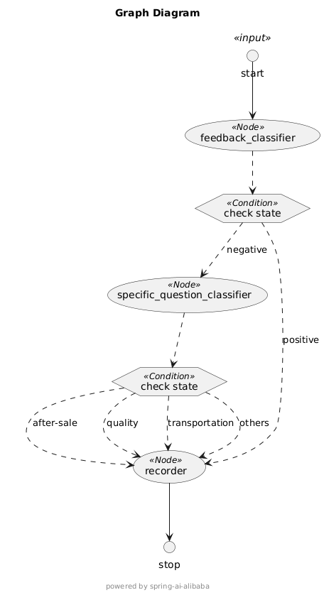
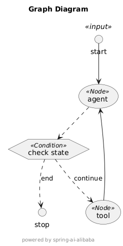
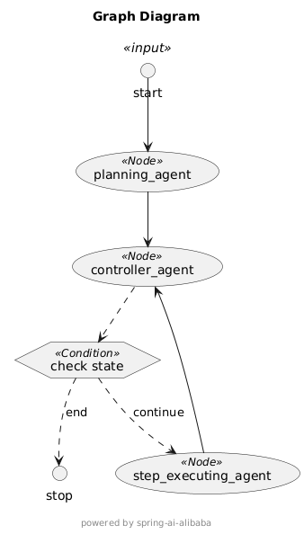

## 如何运行

### 前置条件

1. 配置模型 API-KEY：

```shell
export AI_DASHSCOPE_API_KEY=xxx
```

2. [可选] 配置 <a href="https://serpapi.com/users/sign_in" target="_blank">SerpApi key</a>

```shell
export SERP_API_KEY=xxx
```

> 尽在您想体验 OpenManus 示例时，才需要配置这个选项。

### 启动应用

然后，就可以在 IDE 中直接运行 `GraphApplication` 类启动示例应用。

或者，您可以运行以下 maven 命令启用示例应用（注意要在根目录先 install 源码）：

```shell
mvn clean install
cd spring-ai-alibaba-graph/spring-ai-alibaba-graph-example
mvn spring-boot:run
```

## 工作流示例（客户评价处理）

以下是工作流架构图：



示例实现了一个客户评价处理系统，系统接收用户评论，根据评论内容，自动进行问题分类，总共有两级问题分类：

1. 第一级分类节点，将评论分为 positive 和 negative 两种。如果是 positive 评论则进行系统记录后结束流程；如果是 negative 评论则进行第二级分类。
2. 第二级分类节点，根据 negative 评论的具体内容识别用户的具体问题，如 "after-sale service"、"product quality"、"transportation" 等，根据具体问题分流到具体的问题处理节点。
3. 最后问题处理节点进行处理并记录后，流程结束。

浏览器访问如下示例链接，查看运行效果：

* http://localhost:18080/customer/chat?query=我收到的产品有快递破损，需要退换货？
* http://localhost:18080/customer/chat?query=我的产品不能正常工作了，要怎么去做维修？
* http://localhost:18080/customer/chat?query=商品收到了，非常好，下次还会买。

## React Agent 示例

以下是 React Agent 架构图：



在本示例中，我们仅为 Agent 绑定了一个天气查询服务，React Agent 的结束条件也很简单（采用默认行为，模型判断无 tool_call 则结束）。

浏览器访问如下示例链接，查看运行效果：

* http://localhost:18080/react/chat?query=分别帮我查询杭州、上海和南京的天气

## Multi-agent OpenManus 示例

以下是 OpenManus 实现的架构图：



在 OpenManus 示例中，我们实现了一个 multi-agent 系统。其中，有三个核心 agent 互相协作完成用户任务：

1. Planning Agent，负责任务规划
2. Supervisor Agent，负责监督 Executor Agent 完成规划的任务
3. Executor Agent，负责执行每一步任务

浏览器访问如下示例链接，查看运行效果：

* http://localhost:18080/manus/chat?query=帮我查询阿里巴巴近一周的股票信息

## BigTool 示例

在 BigTool 示例中，我们实现了能够访问大量工具的智能体。它能够在海量工具库中精准匹配并高效调用所需的Tool, 减少Tool检索的次数，提高大量工具下处理性能。

本示例将 java.lang.Math 下所有静态方法进行封装，并注册为 Tool（约80个），来模拟多 Tool 场景。通过 Bigtool 进行筛选出 3 个最佳 Tool，进行任务处理。

1. Tool Agent，负责选取最优的工具。
2. CalculateAgent，负责根据ToolAgent筛选出的工具，执行任务。

浏览器访问如下示例链接，查看运行效果：

* http://localhost:18080/bigtool/search?query=计算0.5的余弦

## Relection 示例

浏览器访问如下示例链接，查看运行效果：

* http://localhost:18080/reflection/chat?query=写一篇论文，题目是东北经济落后分析

> Tip: 演示代码中通过迭代次数来实现停止运行，也可以在`reflection`的图中控制结束时机。具体逻辑可以参考`ReflectionAgent`类。

### 实现流程详解

1. **初始化阶段**:
    * 创建两个核心节点：生成论文的`AssistantGraphNode`和评判论文的`JudgeGraphNode`
    * 使用`ReflectAgent`将这两个节点连接起来，设置最大迭代次数为2（Example使用）
    * 编译状态图，准备执行

2. **执行流程**:
    * 用户发送查询(例如"写一篇关于环保的论文")
    * 查询被转换为`UserMessage`并传入反思图
    * 执行流程如下:
        1. 从START节点开始，进入GRAPH节点(AssistantGraphNode)
        2. GRAPH节点生成初始论文
        3. `graphCount`方法检查迭代次数，决定是继续到反思节点还是结束
        4. 进入REFLECTION节点(JudgeGraphNode)，评判论文并提供改进建议
        5. `apply`方法检查最后一条消息类型，如果是用户消息，则继续到GRAPH节点
        6. GRAPH节点根据反馈生成改进版论文
        7. 重复上述步骤，直到达到最大迭代次数或最后一条消息是助手消息

3. **返回结果**:
    * 控制器提取最终改进后的论文
    * 返回给用户

**Example:**

```text
USER
写一篇论文，题目是东北经济落后分析
===================================
ASSISTANT
东北经济的落后问题，一直以来都是中国区域经济发展不平衡的重要体现。作为曾经工业和农业的重镇，东北地区在改革开放后逐渐失去了昔日的辉煌，其经济增速明显低于全国平均水平。本文将从产业结构单一、人口流失严重、体制机制僵化以及思想观念保守四个方面分析东北经济落后的原因，并探讨可能的解决路径。

首先，东北地区的产业结构过于单一，是导致其经济滞后的首要原因。长期以来，东北以重工业和资源型产业为主导，这些行业在计划经济时期曾为国家发展作出巨大贡献。然而，随着市场经济的发展和全球产业分工的变化，传统重工业面临产能过剩和技术落后的困境。同时，新兴产业和服务业的发展相对滞后，难以形成新的经济增长点。这种结构性问题使得东北经济对外部环境变化缺乏适应能力，也限制了区域经济的多元化发展。

其次，人口流失现象加剧了东北经济的衰退。近年来，东北地区的青壮年劳动力大量流向东南沿海等经济发达地区，造成人才外流和劳动力短缺的问题。根据统计数据显示，东北三省的人口自然增长率持续下降，老龄化问题日益严重。年轻人口的减少不仅削弱了本地消费市场的活力，还对社会保障体系构成压力。此外，人口流失进一步打击了投资者信心，使东北地区的资本流入更加困难，形成了恶性循环。

第三，体制机制的僵化也是制约东北经济发展的重要因素。尽管近年来政府推行了一系列改革措施，但国有企业占比高、行政干预强等问题依然突出。一些地方仍存在官僚主义作风和腐败现象，营商环境不够理想，企业经营成本较高。这些问题阻碍了民营经济的发展，也降低了市场资源配置效率。因此，深化体制改革、优化营商环境成为推动东北经济复苏的关键所在。

最后，思想观念的保守也在一定程度上拖累了东北经济的进步。相比南方地区开放包容的态度，东北部分人群对创新思维和外来文化的接受度较低，这影响了新技术、新理念的传播与应用。同时，部分地方政府官员和企业领导者缺乏长远眼光，习惯于沿用传统的管理模式，未能及时调整战略以应对市场变化。要改变这一局面，需要通过教育和宣传提升全社会的创新意识和发展理念。

综上所述，东北经济落后是由多方面原因共同作用的结果。要实现振兴东北的目标，必须从调整产业结构、遏制人口流失、深化体制改革以及转变思想观念等方面入手，制定科学合理的政策措施。只有这样，才能让东北重新焕发生机，为中国整体经济平衡发展贡献力量。
===================================
USER
### 长度
- **建议扩展**：虽然文章涵盖了东北经济落后的主要原因，但每个部分的分析显得较为简略。可以进一步补充具体的数据、案例或政策背景来支持观点。例如，在讨论产业结构单一的问题时，可以引用某些具体行业的衰退数据或对比其他地区的成功转型案例。
  
### 深度
- **增加证据**：在提到“人口流失严重”时，可以加入更详细的统计数据（如近年东北三省的人口变化趋势）以及对当地教育、医疗等公共服务资源减少的影响进行深入探讨。
- **深化分析**：关于体制机制僵化这一部分，除了指出问题外，还可以具体说明哪些改革措施已经被尝试过但未见成效，并分析其失败的原因。
- **拓展视角**：除了列举现有问题，还可以从国际经验中寻找解决类似区域经济困境的办法，为东北振兴提供更多思路。

### 结构
- **优化引言**：开头可以直接点明主题并提出全文的核心论点，比如明确列出造成东北经济落后的几个主要原因，这样能让读者更快抓住文章重点。
- **改善过渡句**：段落之间需要更强的逻辑连接词或句子，使内容更加流畅自然。例如，在从“产业结构单一”转到“人口流失”时，可以通过总结前一部分影响并引出新话题的方式来增强连贯性。
- **强化结论**：结尾部分目前只是简单重复了前面提到的几点建议，可以在此基础上展望未来可能的发展方向或者强调实施这些策略的重要性。

### 风格与语气
- **保持一致性**：整篇文章应维持一种正式且客观的学术风格。注意避免使用过于口语化的表达，如“习惯于沿用传统的管理模式”，可以改为“倾向于延续传统管理模式”。

### 语言运用
- **丰富词汇**：尽量避免重复使用相同的词语，如“问题”可以用“挑战”、“障碍”等替代；“导致”也可以换成“引发”、“促使”等。
- **修正语法错误**：仔细检查句子结构是否正确，确保主谓一致和时态准确。例如，“一些地方仍存在官僚主义作风和腐败现象，营商环境不够理想”可调整为更简洁流畅的表述：“部分地区仍受官僚主义及腐败问题困扰，营商环境亟待改善。”
- **提升句式多样性**：适当采用复合句或倒装句等形式，让语言表达更具层次感和吸引力。例如，“要改变这一局面，需要通过教育和宣传提升全社会的创新意识和发展理念”可以改为“唯有借助教育普及与理念宣传，全面提升社会创新能力与发展视野，方能彻底扭转当前局势。”
 ===================================
ASSISTANT
东北经济落后的原因复杂多样，其核心问题主要集中在产业结构单一、人口流失严重、体制机制僵化以及思想观念保守等方面。作为中国工业化的摇篮，东北地区曾为国家发展作出重要贡献，但随着改革开放的深入和全球经济格局的变化，该地区的经济增长逐渐乏力。本文将从上述四个方面详细分析东北经济落后的成因，并探讨可能的解决路径。

首先，东北地区的产业结构长期依赖于传统重工业和资源型产业，这种单一的经济模式难以适应现代市场经济的需求。例如，煤炭、钢铁等行业的衰退直接导致了当地经济增速放缓。据统计，近年来这些传统产业的产能利用率持续下降，而新兴产业如信息技术、新能源等尚未形成规模效应。与长三角、珠三角等地区相比，东北在高科技产业和服务业领域的投入明显不足，缺乏新的经济增长点。此外，部分企业技术创新能力较弱，难以在国际竞争中占据有利地位，这进一步加剧了经济发展的困境。

其次，人口流失已成为制约东北经济发展的重要因素。根据第七次全国人口普查数据，东北三省的人口总量在过去十年间减少超过1000万，其中青壮年劳动力的外流尤为突出。这一现象不仅削弱了本地劳动力市场的活力，还对教育、医疗等公共服务体系造成巨大冲击。例如，许多中小城市因人口减少而面临学校合并、医院萎缩等问题，进一步降低了居民的生活质量。同时，人口老龄化趋势加速，社会保障压力日益增大，这对地方财政构成了严峻挑战。因此，如何吸引并留住人才成为振兴东北经济的关键之一。

第三，体制机制的僵化是阻碍东北经济转型的重要障碍。尽管中央政府出台了一系列支持东北振兴的政策，但由于历史遗留问题较多，地方改革进展缓慢。一些国有企业仍存在效率低下、管理不善的问题，而行政干预过多则抑制了民营经济的发展空间。例如，某些地方政府在招商引资过程中过度承诺优惠政策，却未能兑现承诺，损害了投资者信心。此外，腐败问题和官僚作风也在一定程度上恶化了营商环境。虽然近年来推行了“放管服”改革，但效果尚未完全显现，制度性交易成本依然较高。

最后，思想观念的保守限制了东北地区的创新发展潜力。相较于东南沿海地区开放包容的文化氛围，东北部分地区对新事物的接受度较低，创新意识相对薄弱。这种文化差异反映在企业管理层面，表现为许多传统企业不愿主动拥抱数字化转型或引入先进的管理模式。同时，地方政府在制定政策时也倾向于沿用旧有经验，缺乏前瞻性和灵活性。为了突破这一瓶颈，需要通过教育和宣传培养全社会的创新精神，并借鉴国际成功经验，探索适合东北特色的可持续发展模式。

综上所述，东北经济落后是由多重因素叠加造成的，包括产业结构单一、人口流失严重、体制机制僵化以及思想观念保守等。要实现全面振兴，必须采取系统性的措施，包括优化产业结构、改善营商环境、加强人才培养以及推动思想解放。未来，应以创新驱动为核心，结合区域特色优势，打造具有竞争力的现代化经济体系，从而为东北经济注入新的活力与发展动力。
===================================
USER
### 长度
- 文章内容较为精炼，但某些部分可以进一步扩展以增强说服力。例如，在讨论“产业结构单一”时，可以引入具体行业（如钢铁、煤炭）的数据变化或对比其他地区成功转型的案例，使分析更加深入。
- 对于“人口流失严重”这一部分，可以补充更多关于东北三省人口流动的具体数据和趋势分析，还可以探讨这种现象对地方经济长远发展的潜在影响。

### 深度
- 在分析“体制机制僵化”时，除了描述问题本身，还可以进一步探讨哪些具体的改革措施曾被尝试过，以及为何未能取得显著成效。这样可以为读者提供更全面的理解。
- 关于“思想观念保守”，建议增加一些实际案例或研究结果来支持观点，比如通过调查数据说明东北地区的创新意识水平与其他地区之间的差异。

### 结构
- 引言部分可以直接点明主题，并简要概述全文的核心论点，以便让读者更快地抓住文章的重点。例如，在开头明确列出造成东北经济落后的几个主要原因。
- 各段落之间的过渡需要更加自然流畅。可以在每一段结束时用一句话总结前文内容并引出下一部分的内容，从而加强逻辑连贯性。
- 结尾部分目前只是简单重申了前面提到的问题和建议，可以在此基础上提出对未来发展的展望或者强调实施这些策略的重要性，使结论更具启发性。

### 风格与语气
- 整体风格应保持正式且客观的学术写作方式。注意避免使用过于口语化或模糊的表达，如“习惯于沿用传统管理模式”，可以改为更精确的语言：“倾向于延续传统的管理方式”。
- 确保语气始终专业而不带个人情绪，即使是在批评现状时也要采用建设性的措辞。

### 语言运用
- 丰富词汇量，尽量减少重复使用相同的词语。例如，“问题”可以用“挑战”、“障碍”等词代替；“导致”也可以根据上下文选择“引发”、“促使”等替代词。
- 检查语法错误并确保句子结构正确无误。例如，“部分地区仍受官僚主义及腐败问题困扰，营商环境亟待改善。”比原句更加简洁明了。
- 提升句式多样性，适当采用复合句或倒装句等形式，使语言表达更具层次感和吸引力。例如，将“唯有借助教育普及与理念宣传，全面提升社会创新能力与发展视野，方能彻底扭转当前局势”作为结尾的一句话，显得更有力度。
===================================
ASSISTANT
东北经济落后问题的根源在于产业结构单一、人口流失严重、体制机制僵化以及思想观念保守等多重因素交织作用的结果。作为中国工业化的发源地，东北地区在计划经济时代曾扮演重要角色，但改革开放后逐渐显现出增长乏力的态势。本文将从上述四个方面展开分析，并探讨可能的解决路径。

首先，东北地区的产业结构长期以来以重工业和资源型产业为主导，这种单一模式限制了区域经济的可持续发展。例如，煤炭、钢铁等传统行业曾是东北经济的支柱，但随着市场需求变化和技术升级，这些行业面临产能过剩和竞争力下降的问题。据统计，近年来东北三省的工业增加值增速显著低于全国平均水平，而新兴产业如信息技术、高端制造等领域的发展相对滞后。与长三角和珠三角地区相比，东北在科技创新和产业升级方面的投入不足，缺乏能够带动整体经济转型的核心产业。因此，调整产业结构、推动多元化发展已成为当务之急。

其次，人口流失现象进一步加剧了东北经济的困境。根据第七次全国人口普查数据，东北三省在过去十年间人口减少超过1000万，其中青壮年劳动力的外流尤为突出。这一趋势不仅导致本地劳动力市场萎缩，还对地方财政和社会保障体系造成巨大压力。此外，人口老龄化问题日益严重，进一步削弱了经济活力。例如，许多中小城市因人口减少而出现学校关闭、医院闲置等情况，公共服务质量随之下降。长期来看，人口流失可能导致东北地区陷入恶性循环，即经济疲软吸引不了人才，而人才流失又进一步拖累经济发展。

第三，体制机制的僵化是制约东北经济发展的深层次原因。尽管中央政府多次出台政策支持东北振兴，但由于历史遗留问题复杂，改革进展缓慢。例如，在国有企业改革方面，虽然部分企业尝试引入现代管理制度，但效率低下、管理不善的问题仍然存在。同时，行政干预过多影响了市场机制的正常运行，民营企业的发展空间受到限制。此外，部分地区在招商引资过程中存在过度承诺优惠政策却未能兑现的现象，损害了投资者信心。尽管近年来推行了“放管服”改革，但制度性交易成本依然较高，营商环境有待进一步优化。

最后，思想观念的保守在一定程度上阻碍了东北地区的创新发展。相较于东南沿海地区开放包容的文化氛围，东北部分地区对新事物的接受度较低，创新意识相对薄弱。例如，一项关于企业家创新意愿的调查显示，东北地区的企业家普遍倾向于维持现有业务模式，而非主动寻求技术革新或管理模式变革。这种保守态度反映在企业管理层面，表现为许多传统企业不愿投资于数字化转型或引进先进的管理方法。为突破这一瓶颈，需要通过教育和宣传培养全社会的创新精神，同时借鉴国际成功经验，探索适合东北特色的可持续发展模式。

综上所述，东北经济落后是由产业结构单一、人口流失严重、体制机制僵化以及思想观念保守等多种因素共同作用的结果。要实现全面振兴，必须采取系统性的措施，包括优化产业结构、改善营商环境、加强人才培养以及推动思想解放。未来，应以创新驱动为核心，结合区域特色优势，打造具有竞争力的现代化经济体系，从而为东北经济注入新的活力与发展动力。唯有如此，才能彻底扭转当前局势，让东北重新焕发昔日光彩。
===================================
```

## 更多示例

更多示例请关注官网文档更新。
