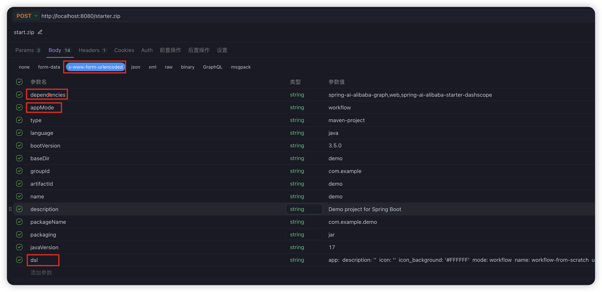

# Spring AI Alibaba Graph Studio 

## 一、DSL导出离线项目

基于 [Spring Initializr](https://start.spring.io/) 扩展的 **Graph Studio** 模块，提供从自定义 DSL → Java 源码 → 可运行 `CompiledGraph` 的一站式解决方案。
开发者只需编写或从dify等平台导出一段 YAML/JSON DSL，就能一键生成包含文档抽取、HTTP 调用、RAG 检索、LLM 推理等节点的 Spring Boot + Spring AI Alibaba Graph项目。

---

### ✨ 核心架构

```text
┌───────────────┐    1. POST /starter.zip     ┌────────────────────────┐
│ Initializr    │ ─────────────────────────▶│ GraphProjectContributor │
│ Web Layer     │                            └─────────┬─────────────┘
└───────────────┘                                      │
                                                       │
                                                  2. importDSL
                                             ┌─────▼─────┐
                                             │ DSL Adapter│
                                             └─────┬─────┘
                                                       │ 3. mapToWorkflow
                        ┌──────────────┐        ┌───▼──────────────┐
                        │ Mustache     │  ◀─────│ WorkflowProject  │
                        │ Template     │        │ Generator        │
                        └──────────────┘        └───┬──────────────┘
                                                       │ 4. renderNodeSections & renderEdgeSections
                                              ┌────────▼─────────┐
                                              │ Generated Code   │
                                              │ (GraphBuilder)   │
                                              └────────┬─────────┘
                                                       │ 5. package zip
                                                  ┌────▼─────┐
                                                  │   ZIP    │
                                                  │ Response │
                                                  └──────────┘
```

1. **GraphProjectContributor**：接管 `/starter.zip` 请求，根据 DSL、`appMode`、`dependencies` 调用 Initializr 生成流程。
2. **DSL Adapter**：反序列化 DSL（YAML/JSON）为 `Map`，生成 `AppMetadata` + `Workflow` 对象。
3. **WorkflowProjectGenerator**：基于 `Node`/`Edge` 列表，用 `NodeSection` 渲染 Java 源码片段。
4. **Mustache 模板**：`GraphBuilder.java.tpl` 填充 `{{stateSection}}`、`{{nodeSection}}`、`{{edgeSection}}`。
5. **打包 ZIP**：返回包含生成源码的压缩包。

---

### 🚀 快速开始

1. 克隆仓库并启动服务：
   ```bash
   git clone git@github.com:alibaba/spring-ai-alibaba.git 
   cd graph-studio
   ./mvnw spring-boot:run
   ```
   
2. 调用 `/starter.zip`：
   - **Postman (x-www-form-urlencoded)**
     - `dependencies`: `spring-ai-alibaba-graph,web,spring-ai-alibaba-starter-dashscope`
     - `appMode`: `workflow`
     - `dsl`: 粘贴多行 YAML DSL（保持缩进和换行）
     - 其余参数同 [Spring Initializr](https://start.spring.io/)
     
     
   
3. 解压 ZIP，编译并运行生成项目：
   ```bash
   unzip starter.zip && cd starter
   ./mvnw spring-boot:run
   ```

---

### 📝 DSL 示例  [客户评价处理工作流]

```yaml
app:
  description: ''
  icon: 💭
  icon_background: '#D1E9FF'
  mode: workflow
  name: 客户评价处理工作流
  use_icon_as_answer_icon: false
dependencies:
  - current_identifier: null
    type: marketplace
    value:
      marketplace_plugin_unique_identifier: langgenius/openai:0.0.26@c1e643ac6a7732f6333a783320b4d3026fa5e31d8e7026375b98d44418d33f26
kind: app
version: 0.3.0
workflow:
  conversation_variables: []
  environment_variables: []
  features:
    file_upload:
      allowed_file_extensions:
        - .JPG
        - .JPEG
        - .PNG
        - .GIF
        - .WEBP
        - .SVG
      allowed_file_types:
        - image
      allowed_file_upload_methods:
        - local_file
        - remote_url
      enabled: false
      fileUploadConfig:
        audio_file_size_limit: 50
        batch_count_limit: 5
        file_size_limit: 15
        image_file_size_limit: 10
        video_file_size_limit: 100
        workflow_file_upload_limit: 10
      image:
        enabled: false
        number_limits: 3
        transfer_methods:
          - local_file
          - remote_url
      number_limits: 3
    opening_statement: ''
    retriever_resource:
      enabled: false
    sensitive_word_avoidance:
      enabled: false
    speech_to_text:
      enabled: false
    suggested_questions: []
    suggested_questions_after_answer:
      enabled: false
    text_to_speech:
      enabled: false
      language: ''
      voice: ''
  graph:
    edges:
      - data:
          sourceType: start
          targetType: question-classifier
        id: 1711529033302-1711529036587
        source: '1711529033302'
        sourceHandle: source
        target: '1711529036587'
        targetHandle: target
        type: custom
      - data:
          sourceType: question-classifier
          targetType: http-request
        id: 1711529036587-1711529059204
        source: '1711529036587'
        sourceHandle: '1711529038361'
        target: '1711529059204'
        targetHandle: target
        type: custom
      - data:
          sourceType: question-classifier
          targetType: question-classifier
        id: 1711529036587-1711529066687
        source: '1711529036587'
        sourceHandle: '1711529041725'
        target: '1711529066687'
        targetHandle: target
        type: custom
      - data:
          sourceType: question-classifier
          targetType: http-request
        id: 1711529066687-1711529077513
        source: '1711529066687'
        sourceHandle: '1711529068175'
        target: '1711529077513'
        targetHandle: target
        type: custom
      - data:
          sourceType: question-classifier
          targetType: http-request
        id: 1711529066687-1711529078719
        source: '1711529066687'
        sourceHandle: '1711529068956'
        target: '1711529078719'
        targetHandle: target
        type: custom
      - data:
          isInIteration: false
          sourceType: http-request
          targetType: variable-aggregator
        id: 1711529059204-source-1718995432944-target
        source: '1711529059204'
        sourceHandle: source
        target: '1718995432944'
        targetHandle: target
        type: custom
        zIndex: 0
      - data:
          isInIteration: false
          sourceType: http-request
          targetType: variable-aggregator
        id: 1711529077513-source-1718995432944-target
        source: '1711529077513'
        sourceHandle: source
        target: '1718995432944'
        targetHandle: target
        type: custom
        zIndex: 0
      - data:
          isInIteration: false
          sourceType: http-request
          targetType: variable-aggregator
        id: 1711529078719-source-1718995432944-target
        source: '1711529078719'
        sourceHandle: source
        target: '1718995432944'
        targetHandle: target
        type: custom
        zIndex: 0
      - data:
          isInIteration: false
          sourceType: variable-aggregator
          targetType: end
        id: 1718995432944-source-1718995448481-target
        source: '1718995432944'
        sourceHandle: source
        target: '1718995448481'
        targetHandle: target
        type: custom
        zIndex: 0
    nodes:
      - data:
          desc: ''
          selected: false
          title: Start
          type: start
          variables:
            - label: Customer Review
              max_length: 48
              options: []
              required: true
              type: paragraph
              variable: review
        dragging: false
        height: 90
        id: '1711529033302'
        position:
          x: 80
          y: 282
        positionAbsolute:
          x: 80
          y: 282
        selected: false
        sourcePosition: right
        targetPosition: left
        type: custom
        width: 244
      - data:
          classes:
            - id: '1711529038361'
              name: 正面评价
            - id: '1711529041725'
              name: 负面评价
          desc: 定义一个用户问题的主题分类，主题定义了对话的进展方式
          instructions: ''
          model:
            completion_params:
              frequency_penalty: 0
              max_tokens: 512
              presence_penalty: 0
              temperature: 0.7
              top_p: 1
            mode: chat
            name: gpt-3.5-turbo
            provider: langgenius/openai/openai
          query_variable_selector:
            - '1711529033302'
            - review
          selected: false
          title: Question Classifier
          topics: []
          type: question-classifier
        dragging: false
        height: 216
        id: '1711529036587'
        position:
          x: 364
          y: 282
        positionAbsolute:
          x: 364
          y: 282
        selected: false
        sourcePosition: right
        targetPosition: left
        type: custom
        width: 244
      - data:
          authorization:
            config: null
            type: no-auth
          body:
            data: ''
            type: none
          desc: 发送正面评价至公司品牌宣传部门的系统
          headers: ''
          method: get
          params: ''
          retry_config:
            max_retries: 3
            retry_enabled: true
            retry_interval: 100
          selected: false
          timeout:
            connect: 10
            max_connect_timeout: 300
            max_read_timeout: 600
            max_write_timeout: 600
            read: 60
            write: 20
          title: HTTP Request
          type: http-request
          url: https://www.example.com
          variables: []
        height: 168
        id: '1711529059204'
        position:
          x: 648
          y: 282
        positionAbsolute:
          x: 648
          y: 282
        selected: false
        sourcePosition: right
        targetPosition: left
        type: custom
        width: 244
      - data:
          classes:
            - id: '1711529068175'
              name: 售后问题
            - id: '1711529068956'
              name: 运输问题
          desc: 定义一个用户问题的主题分类，主题定义了对话的进展方式
          instructions: ''
          model:
            completion_params:
              frequency_penalty: 0
              max_tokens: 512
              presence_penalty: 0
              temperature: 0.7
              top_p: 1
            mode: chat
            name: gpt-3.5-turbo
            provider: langgenius/openai/openai
          query_variable_selector:
            - '1711529033302'
            - review
          selected: false
          title: Question Classifier 2
          topics: []
          type: question-classifier
        dragging: false
        height: 216
        id: '1711529066687'
        position:
          x: 648
          y: 422
        positionAbsolute:
          x: 648
          y: 422
        selected: false
        sourcePosition: right
        targetPosition: left
        type: custom
        width: 244
      - data:
          authorization:
            config: null
            type: no-auth
          body:
            data: ''
            type: none
          desc: 发送运输类负面评价至运输部门
          headers: ''
          method: get
          params: ''
          retry_config:
            max_retries: 3
            retry_enabled: true
            retry_interval: 100
          selected: false
          timeout:
            connect: 10
            max_connect_timeout: 300
            max_read_timeout: 600
            max_write_timeout: 600
            read: 60
            write: 20
          title: HTTP Request 2
          type: http-request
          url: https://www.example.com
          variables: []
        height: 152
        id: '1711529077513'
        position:
          x: 932
          y: 422
        positionAbsolute:
          x: 932
          y: 422
        selected: false
        sourcePosition: right
        targetPosition: left
        type: custom
        width: 244
      - data:
          authorization:
            config: null
            type: no-auth
          body:
            data: ''
            type: none
          desc: 发送运输类负面评价至产品体验部门
          headers: ''
          method: get
          params: ''
          retry_config:
            max_retries: 3
            retry_enabled: true
            retry_interval: 100
          selected: false
          timeout:
            connect: 10
            max_connect_timeout: 300
            max_read_timeout: 600
            max_write_timeout: 600
            read: 60
            write: 20
          title: HTTP Request 3
          type: http-request
          url: https://www.example.com
          variables: []
        height: 152
        id: '1711529078719'
        position:
          x: 932
          y: 562
        positionAbsolute:
          x: 932
          y: 562
        selected: false
        sourcePosition: right
        targetPosition: left
        type: custom
        width: 244
      - data:
          author: Dify
          desc: ''
          height: 236
          selected: false
          showAuthor: true
          text: '{"root":{"children":[{"children":[{"detail":0,"format":0,"mode":"normal","style":"","text":"这个工作流利用大型语言模型（LLM）对客户评论进行分类，并将其转发到内部系统。","type":"text","version":1}],"direction":"ltr","format":"start","indent":0,"type":"paragraph","version":1,"textFormat":0},{"children":[],"direction":"ltr","format":"start","indent":0,"type":"paragraph","version":1,"textFormat":0},{"children":[{"detail":0,"format":1,"mode":"normal","style":"font-size:
          16px;","text":"开始节点： ","type":"text","version":1}],"direction":"ltr","format":"start","indent":0,"type":"paragraph","version":1,"textFormat":1},{"children":[{"detail":0,"format":0,"mode":"normal","style":"","text":"       ","type":"text","version":1},{"detail":0,"format":1,"mode":"normal","style":"","text":"功能：","type":"text","version":1},{"detail":0,"format":0,"mode":"normal","style":"","text":"收集用户输入的客户评论。
          ","type":"text","version":1}],"direction":"ltr","format":"start","indent":0,"type":"paragraph","version":1,"textFormat":0},{"children":[{"detail":0,"format":0,"mode":"normal","style":"","text":"       ","type":"text","version":1},{"detail":0,"format":1,"mode":"normal","style":"","text":"变量：","type":"text","version":1},{"detail":0,"format":0,"mode":"normal","style":"","text":"
          review 是客户评论文本","type":"text","version":1}],"direction":"ltr","format":"start","indent":0,"type":"paragraph","version":1,"textFormat":0}],"direction":"ltr","format":"","indent":0,"type":"root","version":1}}'
          theme: blue
          title: ''
          type: ''
          width: 380
        height: 236
        id: '1718995401679'
        position:
          x: -40
          y: 407
        positionAbsolute:
          x: -40
          y: 407
        selected: false
        sourcePosition: right
        targetPosition: left
        type: custom-note
        width: 380
      - data:
          desc: ''
          output_type: string
          selected: false
          title: Variable Aggregator
          type: variable-aggregator
          variables:
            - - '1711529059204'
              - body
            - - '1711529077513'
              - body
            - - '1711529078719'
              - body
        height: 152
        id: '1718995432944'
        position:
          x: 1256
          y: 280
        positionAbsolute:
          x: 1256
          y: 280
        selected: false
        sourcePosition: right
        targetPosition: left
        type: custom
        width: 244
      - data:
          desc: ''
          outputs:
            - value_selector:
                - '1718995432944'
                - output
              variable: output
          selected: false
          title: End
          type: end
        height: 90
        id: '1718995448481'
        position:
          x: 1560
          y: 280
        positionAbsolute:
          x: 1560
          y: 280
        sourcePosition: right
        targetPosition: left
        type: custom
        width: 244
      - data:
          author: Dify
          desc: ''
          height: 88
          selected: false
          showAuthor: true
          text: '{"root":{"children":[{"children":[{"detail":0,"format":0,"mode":"normal","style":"","text":"使用
          HTTP 请求将反馈发送至公司内部系统。","type":"text","version":1}],"direction":"ltr","format":"","indent":0,"type":"paragraph","version":1,"textFormat":0}],"direction":"ltr","format":"","indent":0,"type":"root","version":1}}'
          theme: blue
          title: ''
          type: ''
          width: 240
        height: 88
        id: '1718995540857'
        position:
          x: 1229
          y: 539
        positionAbsolute:
          x: 1229
          y: 539
        selected: false
        sourcePosition: right
        targetPosition: left
        type: custom-note
        width: 240
      - data:
          author: Dify
          desc: ''
          height: 435
          selected: false
          showAuthor: true
          text: '{"root":{"children":[{"children":[{"detail":0,"format":11,"mode":"normal","style":"font-size:
          16px;","text":"详细流程","type":"text","version":1}],"direction":"ltr","format":"","indent":0,"type":"paragraph","version":1,"textFormat":11},{"children":[{"detail":0,"format":1,"mode":"normal","style":"font-size:
          16px;","text":"用户输入：","type":"text","version":1}],"direction":"ltr","format":"","indent":0,"type":"paragraph","version":1,"textFormat":1},{"children":[{"detail":0,"format":0,"mode":"normal","style":"","text":"       用户在开始节点输入客户评论。","type":"text","version":1}],"direction":"ltr","format":"","indent":0,"type":"paragraph","version":1,"textFormat":0},{"children":[{"detail":0,"format":1,"mode":"normal","style":"font-size:
          16px;","text":"初步分类：","type":"text","version":1}],"direction":"ltr","format":"","indent":0,"type":"paragraph","version":1,"textFormat":1},{"children":[{"detail":0,"format":0,"mode":"normal","style":"","text":"        评论被分类为正面评论或负面评论。","type":"text","version":1}],"direction":"ltr","format":"","indent":0,"type":"paragraph","version":1,"textFormat":0},{"children":[{"detail":0,"format":1,"mode":"normal","style":"font-size:
          16px;","text":"正面评论处理：","type":"text","version":1}],"direction":"ltr","format":"","indent":0,"type":"paragraph","version":1,"textFormat":1},{"children":[{"detail":0,"format":0,"mode":"normal","style":"","text":"        正面评论被发送到品牌营销部门。","type":"text","version":1}],"direction":"ltr","format":"","indent":0,"type":"paragraph","version":1,"textFormat":0},{"children":[{"detail":0,"format":1,"mode":"normal","style":"font-size:
          16px;","text":"负面评论处理：","type":"text","version":1}],"direction":"ltr","format":"","indent":0,"type":"paragraph","version":1,"textFormat":1},{"children":[{"detail":0,"format":0,"mode":"normal","style":"","text":"        负面评论进一步分类为售后问题或运输问题。","type":"text","version":1}],"direction":"ltr","format":"","indent":0,"type":"paragraph","version":1,"textFormat":0},{"children":[{"detail":0,"format":1,"mode":"normal","style":"font-size:
          16px;","text":"售后问题处理：","type":"text","version":1}],"direction":"ltr","format":"","indent":0,"type":"paragraph","version":1,"textFormat":1},{"children":[{"detail":0,"format":0,"mode":"normal","style":"","text":"        负面售后反馈被发送到售后部门。","type":"text","version":1}],"direction":"ltr","format":"","indent":0,"type":"paragraph","version":1,"textFormat":0},{"children":[{"detail":0,"format":1,"mode":"normal","style":"font-size:
          16px;","text":"运输问题处理：","type":"text","version":1}],"direction":"ltr","format":"","indent":0,"type":"paragraph","version":1,"textFormat":1},{"children":[{"detail":0,"format":0,"mode":"normal","style":"","text":"        负面运输反馈被发送到运输部门和产品体验部门。","type":"text","version":1}],"direction":"ltr","format":"","indent":0,"type":"paragraph","version":1,"textFormat":0},{"children":[{"detail":0,"format":1,"mode":"normal","style":"font-size:
          16px;","text":"变量聚合器：","type":"text","version":1}],"direction":"ltr","format":"","indent":0,"type":"paragraph","version":1,"textFormat":1},{"children":[{"detail":0,"format":0,"mode":"normal","style":"","text":"        HTTP请求的响应被分配到变量中。","type":"text","version":1}],"direction":"ltr","format":"","indent":0,"type":"paragraph","version":1,"textFormat":0},{"children":[{"detail":0,"format":1,"mode":"normal","style":"font-size:
          16px;","text":"工作流完成：","type":"text","version":1}],"direction":"ltr","format":"","indent":0,"type":"paragraph","version":1,"textFormat":1},{"children":[{"detail":0,"format":0,"mode":"normal","style":"","text":"        工作流标记为完成，并生成最终输出。","type":"text","version":1}],"direction":"ltr","format":"","indent":0,"type":"paragraph","version":1,"textFormat":0}],"direction":"ltr","format":"","indent":0,"type":"root","version":1}}'
          theme: blue
          title: ''
          type: ''
          width: 398
        height: 435
        id: '1718995570152'
        position:
          x: 443.1489102726852
          y: 705.1650449303348
        positionAbsolute:
          x: 443.1489102726852
          y: 705.1650449303348
        selected: true
        sourcePosition: right
        targetPosition: left
        type: custom-note
        width: 398
    viewport:
      x: -137.7061529600045
      y: 393.0799644994046
      zoom: 0.6597539553864473

```

---

### 🛠 扩展指南

- **新增节点**：实现 `XxxNodeDataConverter` + `XxxNodeSection`。
- **自定义 Adapter**：注册新的 `DSLAdapter` 支持更多方言。
- **调整模板**：修改 `GraphBuilder.java.mustache, GraphRunController.java.mustache` 填充自定义逻辑。
- **自定义依赖**: 在 `initializr.yml` 中添加对应依赖。

---

## 二、导入DSL生成APP并直接运行

开发中...

------

## 🤝 贡献

欢迎提 Issue、PR，共同完善 Graph Studio！

---

## 📄 License

Apache License 2.0

