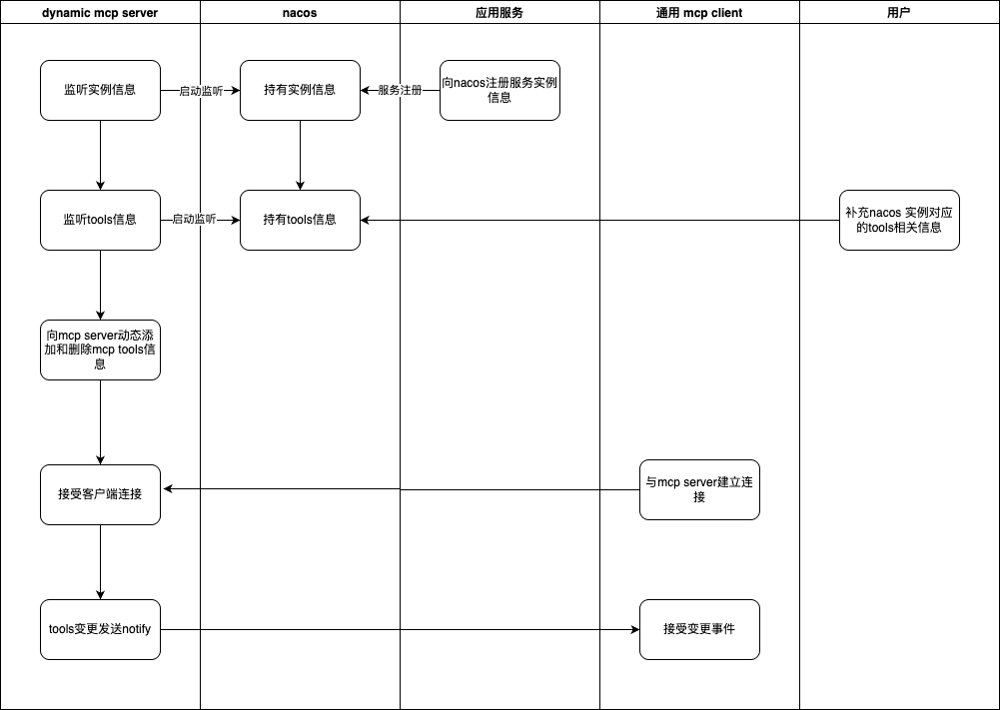

# Spring AI Alibaba Mcp Dynamic Server


```xml
<dependencyManagement>
    <dependencies>
        <dependency>
            <groupId>org.springframework.boot</groupId>
            <artifactId>spring-boot-dependencies</artifactId>
            <version>3.4.0</version>
            <type>pom</type>
            <scope>import</scope>
        </dependency>
    </dependencies>
</dependencyManagement>

<dependency>
    <groupId>org.springframework</groupId>
    <artifactId>spring-web</artifactId>
</dependency>

<dependency>
    <groupId>com.alibaba.cloud.ai</groupId>
    <artifactId>spring-ai-alibaba-mcp-nacos-dynamic-server</artifactId>
</dependency>

<!--WebMvc SSE-->
<dependency>
    <groupId>org.springframework.ai</groupId>
    <artifactId>spring-ai-mcp-server-webmvc-spring-boot-starter</artifactId>
    <version>1.0.0-M6</version>
</dependency>

<!--WebFlux SSE-->
<dependency>
    <groupId>org.springframework.ai</groupId>
    <artifactId>spring-ai-mcp-server-webflux-spring-boot-starter</artifactId>
    <version>1.0.0-M6</version>
</dependency>
```

```java


@SpringBootApplication
public class SpringAiMcpApplication {
    
    public static void main(String[] args) {
        SpringApplication.run(SpringAiMcpApplication.class, args);
    }
    
}
```

*-mcp-tools.json: your mcp tools config

```json

{
  "protocol": "http",
  "tools": [
    {
      "name": "get_adcode",
      "description": "get adcode via address",
      "requestMethod": "GET",
      "requestPath": "/git/version",
      "inputSchema": {
        "type": "object",
        "properties": {
          "address": {
            "type": "string",
            "description": "address"
          }
        }
      }
    },
    {
      "name": "get_address_via_ip",
      "description": "get address via ip",
      "requestMethod": "POST",
      "requestPath": "/getAddress",
      "inputSchema": {
        "type": "object",
        "properties": {
          "ip": {
            "type": "string",
            "description": "ip address"
          }
        }
      }
    }
  ],
  "toolsMeta": {
    "get_adcode": {
      "credentialRef": "amap-key.json",
      "InvokeContext": {
        "path": "/v3/geocode/geo",
        "method": "GET"
      }
    },
    "get_address_via_ip": {
      "credentialRef": "amap-key.json",
      "InvokeContext": {
        "path": "/v3/ip",
        "method": "GET"
      }
    }
  }
}
```

```
application.yaml
```yaml
spring:
  ai:
    mcp:
      server:
        name: webmvc-mcp-server
        version: 1.0.0
    alibaba:
      mcp:
        nacos:
          enabled: true
          server-addr: <nacos-sever-addr>
          username: <nacos-username>
          password: <nacos-password>
          service-namespace: <nacos-namespace>  
          service-group: <nacos-group>
```

The server can auto add tools to mcp server or remove tools from mcp server dynamically

read instance info from nacos service list and tools info from nacos config


