# Spring AI Alibaba DataAgent

## 项目简介

这是一个基于Spring AI Alibaba的自然语言转SQL项目，能让你用自然语言直接查询数据库，不需要写复杂的SQL。

## 项目结构

这个项目分为三个部分：

```
spring-ai-alibaba-nl2sql/
├── spring-ai-alibaba-nl2sql-management    # 管理端（可直接启动的Web应用）
├── spring-ai-alibaba-nl2sql-chat         # 核心功能（不能独立启动，供集成使用）
└── spring-ai-alibaba-nl2sql-common       # 公共代码
```

## 快速启动

项目进行本地测试是在spring-ai-alibaba-nl2sql-management中进行

### 1. 业务数据库准备

可以在spring-ai-alibaba-example项目仓库获取测试表和数据：

- Schema：https://github.com/springaialibaba/spring-ai-alibaba-examples/blob/main/spring-ai-alibaba-nl2sql-example/chat/sql/schema.sql
- Data：https://github.com/springaialibaba/spring-ai-alibaba-examples/blob/main/spring-ai-alibaba-nl2sql-example/chat/sql/insert.sql

将表和数据导入到你的MySQL数据库中。

### 2. 配置management数据库

在`spring-ai-alibaba-nl2sql-management/src/main/resources/application.yml`中配置你的MySQL数据库连接信息。

> 初始化行为说明：默认开启自动创建表并插入示例数据（`spring.sql.init.mode: always`）。生产环境建议关闭，避免示例数据回填覆盖你的业务数据。

```yaml
spring:
  datasource:
    url: jdbc:mysql://127.0.0.1:3306/nl2sql?useUnicode=true&characterEncoding=utf-8&zeroDateTimeBehavior=convertToNull&transformedBitIsBoolean=true&allowMultiQueries=true&allowPublicKeyRetrieval=true&useSSL=false&serverTimezone=Asia/Shanghai
    username: ${MYSQL_USERNAME:root}
    password: ${MYSQL_PASSWORD:root}
    driver-class-name: com.mysql.cj.jdbc.Driver
    type: com.alibaba.druid.pool.DruidDataSource
```

### 2.1 可选：启用/关闭自动初始化（schema.sql + data.sql）

- 默认配置：`application.yml` 中已设置为开启

```yaml
spring:
  sql:
    init:
      mode: always           # 默认：每次启动执行 schema.sql 与 data.sql
      schema-locations: classpath:sql/schema.sql
      data-locations: classpath:sql/data.sql
```

- 若不希望每次启动回填示例数据，可将 `mode` 改为 `never` 关闭：

```yaml
spring:
  sql:
    init:
      mode: never            # 关闭自动初始化
      schema-locations: classpath:sql/schema.sql
      data-locations: classpath:sql/data.sql
```

注意：默认开启时（`mode: always`），`data.sql` 会在每次启动回填示例数据（即使你手动删除了数据）。生产环境请改为 `mode: never`，避免覆盖/复原业务数据。

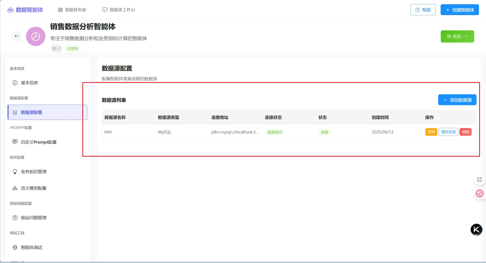


### 3. 配置 API Key

```yaml
spring:
  ai:
    openai:
      base-url: https://dashscope.aliyuncs.com/compatible-mode
      api-key: ${AI_DASHSCOPE_API_KEY}
      model: qwen-max
      embedding:
        model: text-embedding-v4
```


### 4. 启动管理端

在`spring-ai-alibaba-nl2sql-management`目录下，运行 `spring-ai-alibaba-nl2sql/spring-ai-alibaba-nl2sql-management/src/main/java/com/alibaba/cloud/ai/Application.java` 类。

### 5. 启动WEB页面

进入 `spring-ai-alibaba-nl2sql/spring-ai-alibaba-nl2sql-web-ui` 目录

#### 安装依赖


```bash
# 使用 npm
npm install

# 或使用 yarn
yarn install
```

### 启动服务

```bash
# 使用 npm
npm run dev

# 或使用 yarn
yarn dev
```

启动成功后，访问地址 http://localhost:3000

## 系统体验

访问 http://localhost:3000 ，可以看到有四个智能体（目前这四个只是占位显示，并没有对接数据）

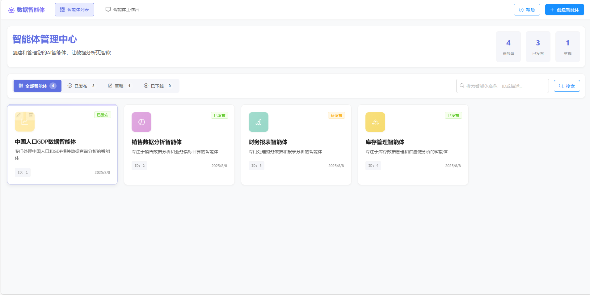


点击右上角“创建智能体” ，这里只需要输入智能体名称，其他配置都选默认。

创建成功后，可以看到智能体配置页面。

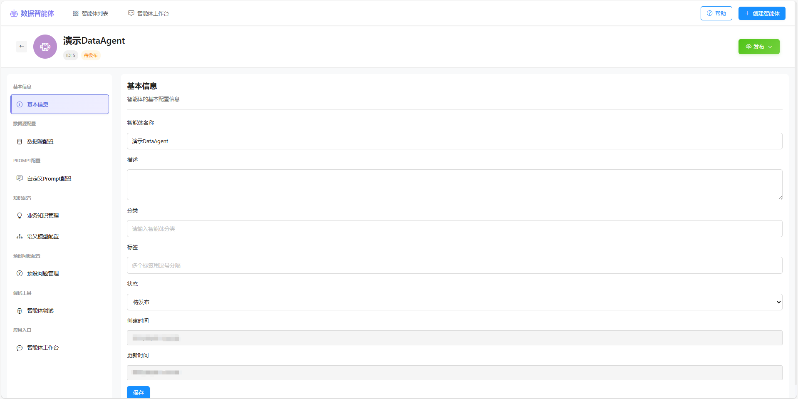

进入数据源配置页面，配置业务数据库（我们在环境初始化时第一步提供的业务数据库）。

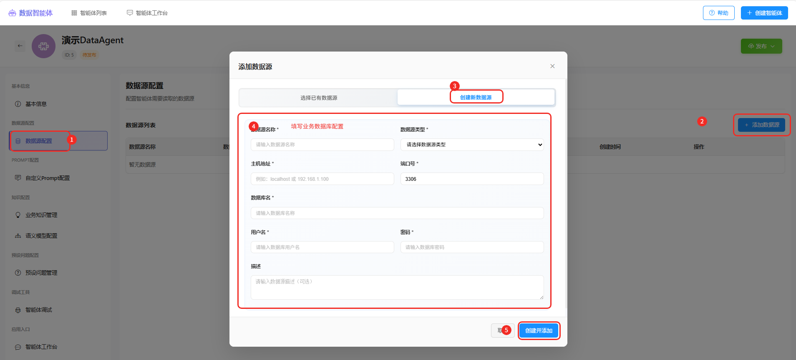

添加完成后，可以在列表页面验证数据源连接是否正常。

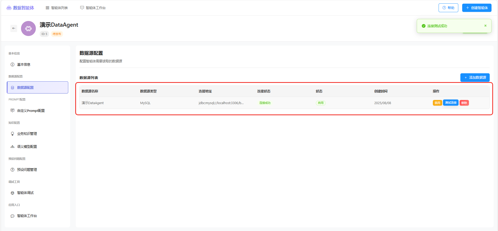

预设问题管理，可以为智能体设置预设问题

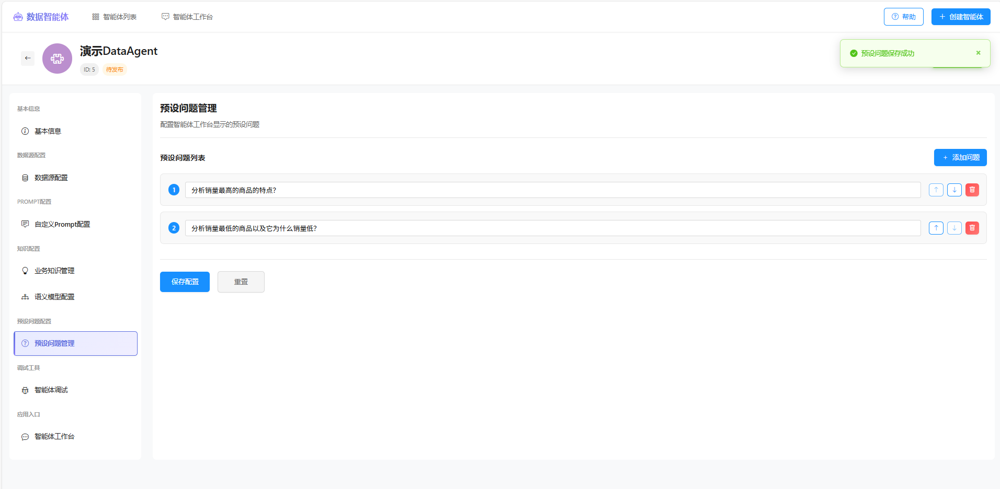

智能体调试页面可以定制化配置数据源，然后初始化数据源到向量库，进行效果调试。

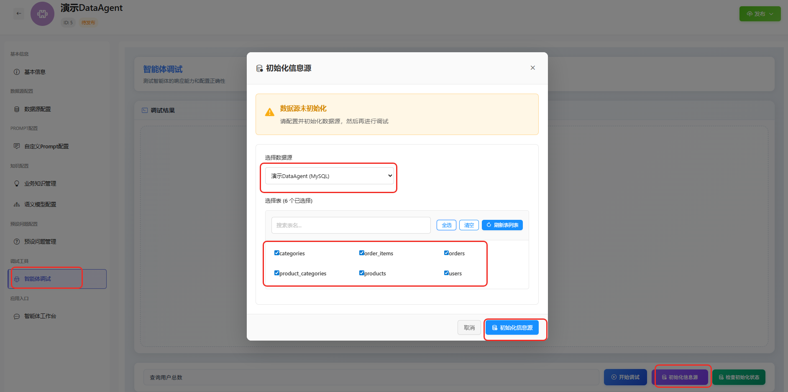

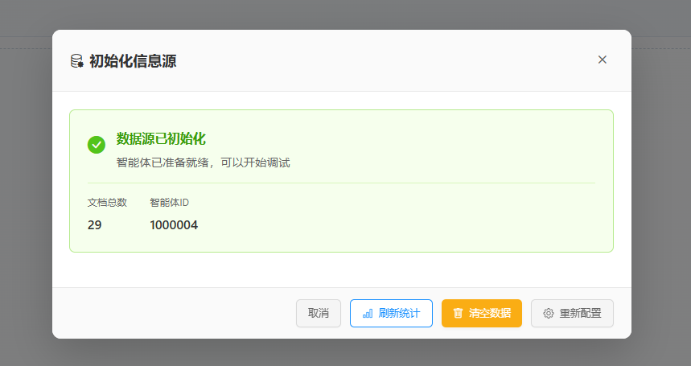

成功后可以在智能体调试页面输入自然语言进行查询。

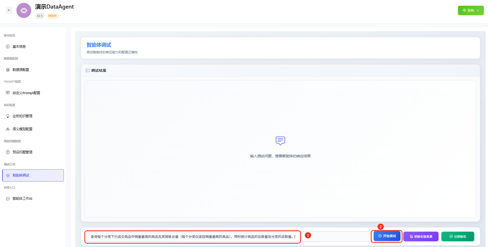

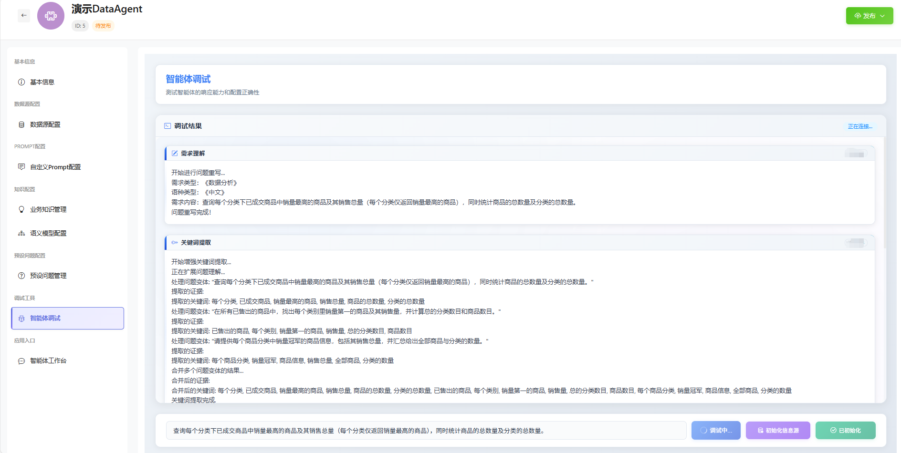

> 调试和发布的智能体数据是分离的，调试时的数据不会影响发布后的智能体。

调试没问题后，可以发布智能体。

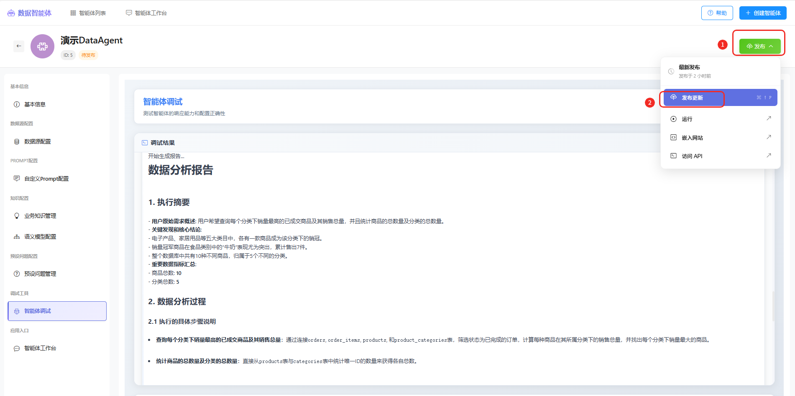

> 目前“嵌入网站”和“访问API”当前版本暂未实现。

点击发布后会更新元数据到发布后的智能体。

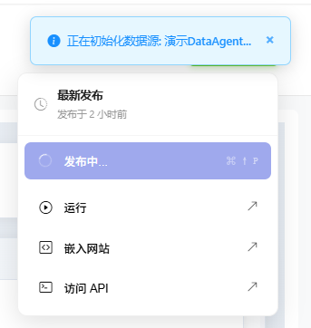

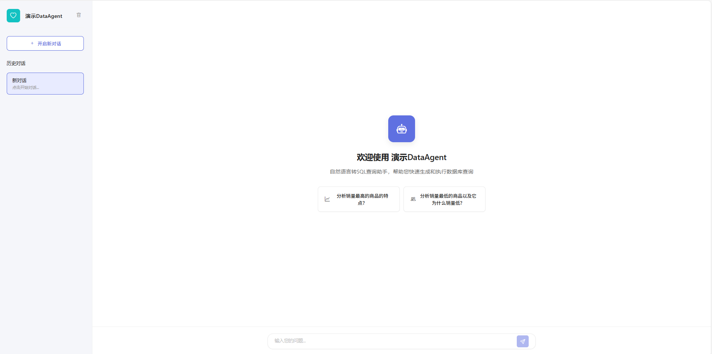

分析问题

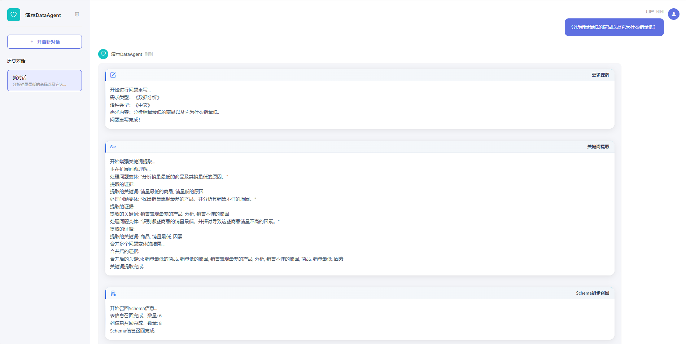

分析结果

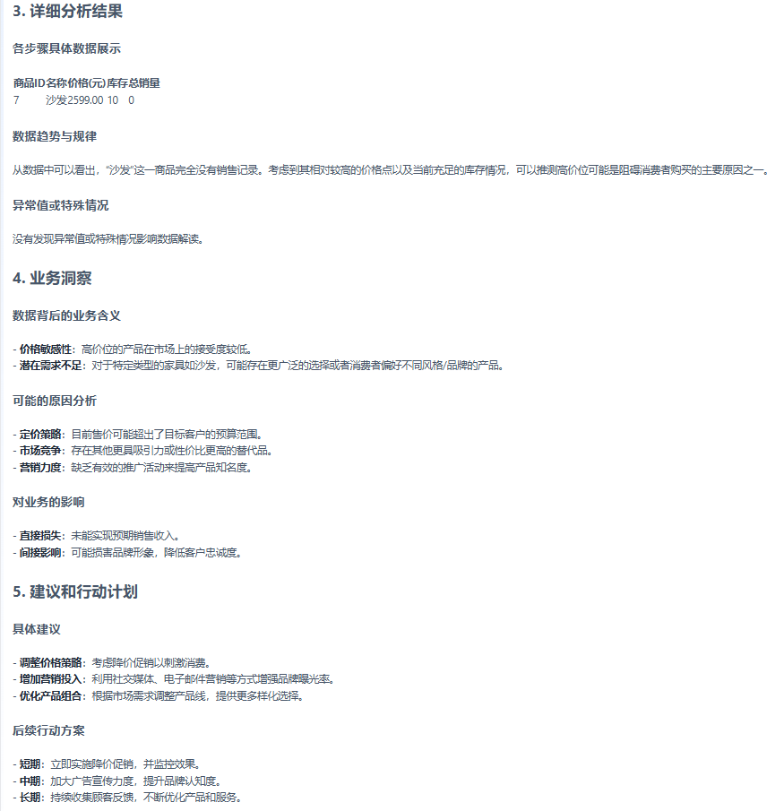

> 注意：Python节点默认启用的是模拟节点，目前会造成幻觉问题，如需解决幻觉问题，需要实际启动Python执行功能。
> 如果你没有环境执行Python节点，临时解决方法：在提问的问题中，添加“请不要通过Python分析”。
