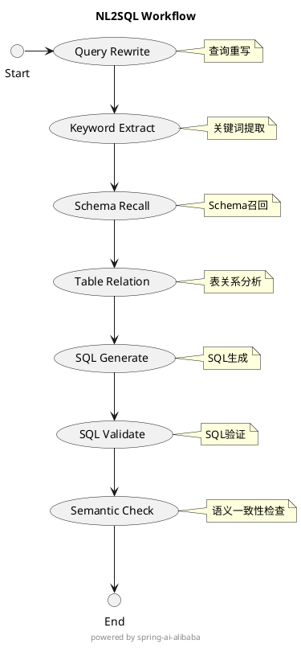

# 自然语言转SQL模块 (NL2SQL)

## 模块简介

<div align="center">


</div>

随着大模型技术的快速发展，自然语言到 SQL（NL2SQL）能力在数据分析领域的应用日益广泛。然而，传统 NL2SQL 方案存在以下挑战：

- Schema 理解偏差
- 复杂查询生成效率低
- 执行结果不可控

这些问题导致业务场景中频繁出现"答非所问"或"生成失败"的情况。为了让更多开发者能够便捷地使用这一能力，我们将[阿里云析言GBI](https://bailian.console.aliyun.com/xiyan#/home)中的核心能力进行了模块化改造，主要包括：

- Schema 召回
- SQL 生成
- SQL 执行

本模块提供一个轻量级的**自然语言查询转 SQL 语句**服务，具有以下特点：

- 🔍 基于用户输入的自然语言问题
- 📊 结合数据库 Schema 和业务逻辑解释（evidence）
- 🤖 通过大模型推理生成精准的 SQL 查询
- 📈 支持执行 SQL 并返回格式化结果

> 💡 该模块被设计为可复用的 Service 层组件，**仅提供核心功能实现，不包含 RESTful 接口及独立启动能力**。适用于集成到其他 Spring Boot 项目中使用。

---

## ✨ 功能特性

### 🎯 自然语言理解与关键词提取
- 智能提取用户提问中的关键词和时间表达式
- 基于优化的 Prompt 工程，引导大模型准确理解用户意图
- 支持复杂的多条件组合和上下文理解

### 🔍 Schema 精准匹配
- 采用向量库技术，高效召回相关表结构信息
- 智能筛选最相关的数据库表结构
- 支持复杂的表关系推理和字段映射

### ⚡ SQL 生成
- 基于大模型推理，生成语义准确的 SQL 查询语句
- 支持嵌入业务逻辑解释（evidence）提升准确性
- 内置 SQL 语法校验和优化机制

### 📊 SQL 执行与结果展示
- 支持直接执行生成的 SQL 语句
- 自动格式化查询结果为 Markdown 表格
- 提供友好的错误提示和执行状态反馈

---

## 🛠 技术栈

### 核心依赖
- ⚡ **运行环境**: Java 17+ (Spring Boot)
- 🔗 **基础模块**: `com.alibaba.cloud.ai:common:${spring-ai-alibaba.version}`
- 🤖 **AI 能力**: 支持多种大模型服务（如 Qwen、DashScope）

### 存储与连接
- 📊 **数据库支持**: MySQL / PostgreSQL
- 🔍 **向量存储**: AnalyticDB / SimpleVector

### 工具支持
- 🛠 **JSON 处理**: Gson、Jackson
- 📝 **文档处理**: Markdown 解析器
- 🔧 **开发工具**: Maven / Gradle

---

## 🚀 快速开始

### 📋 前置要求

在开始使用之前，请确保您的环境满足以下要求：

| 依赖项 | 版本要求 | 说明 |
|--------|----------|------|
| [Java](https://www.oracle.com/java/technologies/javase-jdk17-downloads.html) | >= 17 | 运行环境 |
| [PostgreSQL](https://www.postgresql.org/) / [MySQL](https://www.mysql.com/) | 最新稳定版 | 数据库支持 |
| [Maven](https://maven.apache.org/) / [Gradle](https://gradle.org/) | 最新稳定版 | 项目构建工具 |

### 📦 安装依赖

选择以下任一方式将模块添加到您的 Spring Boot 项目中：

<details>
<summary>📎 Maven 配置</summary>

```xml
<dependency>
    <groupId>com.alibaba.cloud.ai</groupId>
    <artifactId>spring-ai-alibaba-starter-nl2sql</artifactId>
    <version>${spring-ai-alibaba.version}</version>
</dependency>
```
</details>

<details>
<summary>📎 Gradle 配置</summary>

```groovy
implementation 'com.alibaba.cloud.ai:spring-ai-alibaba-starter-nl2sql:${spring-ai-alibaba.version}'
```
</details>

---

## ⚙️ 配置指南

### 📝 配置详解

本模块提供了灵活的配置选项，以适应不同的使用场景：

<details open>
<summary>📌 向量存储选项</summary>

#### 1️⃣ AnalyticDB（推荐用于生产环境）
- ✨ 支持大规模数据存储和高性能检索
- 🚀 分布式架构，支持横向扩展
- 📊 企业级特性：高可用、数据备份、访问控制
- 🔐 安全特性：传输加密、访问认证

#### 2️⃣ SimpleVector（适合开发测试）
- 💡 零配置，即开即用
- 🎯 轻量级实现，适合本地开发
- 📝 支持小规模数据场景
- 🔄 快速迭代和测试

> 💡 **选择建议**：
> - 开发测试环境：使用 SimpleVector，简单快捷
> - 生产环境：使用 AnalyticDB，性能和可靠性更好

</details>

### ⚙️ 配置详解

<details>
<summary>📌 AnalyticDB 配置</summary>

```yaml
spring:
  ai:
    vectorstore:
      analytic:
        # 基础配置
        collectName: ${VECTOR_COLLECTION_NAME}  # 向量集合名称
        regionId: ${REGION_ID}                  # 实例区域，如：cn-hangzhou
        dbInstanceId: ${INSTANCE_ID}            # AnalyticDB 实例 ID
        
        # 安全凭证（建议使用环境变量）
        accessKeyId: ${ACCESS_KEY_ID}           # 阿里云访问密钥ID
        accessKeySecret: ${ACCESS_KEY_SECRET}   # 阿里云访问密钥密码
        
        # 数据库访问凭证
        managerAccount: ${DB_MANAGER}           # 管理员账号
        managerAccountPassword: ${DB_PASSWORD}   # 管理员密码
        namespace: ${NAMESPACE}                 # 命名空间
        namespacePassword: ${NS_PASSWORD}       # 命名空间密码
        
        # 向量检索参数
        defaultTopK: 10                        # 返回结果数量
        defaultSimilarityThreshold: 0.01       # 相似度阈值(0.01-0.75)
```

> ⚠️ **重要提示**
> 1. AnalyticDB 需开启向量引擎优化，详见[官方文档](https://help.aliyun.com/zh/analyticdb/analyticdb-for-postgresql/getting-started/create-an-instance-instances-with-vector-engine-optimization-enabled)
> 2. 所有敏感信息请使用环境变量或配置中心管理
> 3. 建议在生产环境中使用 RAM 用户，遵循最小权限原则

</details>

<details>
<summary>📌 应用配置</summary>

```yaml
spring:
  ai:
    # DashScope 配置
    openai:
      base-url: https://dashscope.aliyuncs.com/compatible-mode
      api-key: ${DASHSCOPE_API_KEY}
      model: qwen-max    # 推荐：复杂任务用 qwen-max，一般任务用 qwen-plus
    
    dashscope:
      api-key: ${DASHSCOPE_API_KEY}

# 数据库配置
chatbi:
  dbconfig:
    # 数据源配置
    url: ${JDBC_URL}        # 如：jdbc:mysql://host:port/database
    username: ${DB_USER}
    password: ${DB_PASSWORD}
    
    # 连接参数
    connectiontype: jdbc
    dialecttype: mysql      # 可选：mysql、postgresql
    schema: ${DB_SCHEMA}    # PostgreSQL需要
```

> 🔒 **安全建议**
> 1. 使用环境变量或配置中心管理所有敏感信息
> 2. 定期轮换密钥和密码
> 3. 使用加密连接（SSL/TLS）
> 4. 为不同环境（开发、测试、生产）使用不同的凭证

</details>

<details>
<summary>📌 SimpleVector 配置</summary>

无需特殊配置，系统将自动启用 SimpleVector 作为默认向量存储。

> 💡 **说明**: SimpleVector 适合本地开发和测试环境使用，不建议在生产环境中使用。

</details>

## 🔧 服务配置

<details>
<summary>📌 大模型服务（LLM）</summary>

确保以下组件已正确配置：
1. `LlmService` 实现类已注入 Spring 容器
2. 大模型 API 调用权限已授予
3. 相关配置项已在 `application.yml` 中设置

> 💡 **提示**：建议在开发环境中使用较小的模型进行测试，生产环境再切换到完整模型。

</details>

<details>
<summary>📌 向量服务</summary>

系统依赖以下组件：
1. `VectorStoreService` 接口及其实现类
2. 向量存储配置类（如 `AnalyticDbVectorStoreProperties`）
3. 向量计算和索引服务

> ⚠️ **注意**：首次使用时需要初始化向量库，可能需要较长时间。

</details>

## 🏗️ 系统架构

### 核心组件

<details>
<summary>📌 服务层</summary>

#### BaseNl2SqlService
主要的对外接口服务类，负责自然语言到 SQL 的转换流程。

**核心方法**

```java
/**
 * 将自然语言转换为SQL查询
 * @param query 自然语言问题
 * @return 格式化的SQL结果
 */
String nl2sql(String query);
```

**主要职责**
- 自然语言解析和理解
- Schema 匹配和关联
- SQL 生成和优化
- 结果验证和格式化

</details>

### NL2SQL Graph

#### 工作流设计

<details>
<summary>📌 工作流程图</summary>



> 💡 **说明**: 工作流程图展示了NL2SQL模块的主要处理步骤和数据流向

</details>

### 调用方法

```java

import com.alibaba.cloud.ai.dbconnector.DbConfig;
import com.alibaba.cloud.ai.graph.CompiledGraph;
import com.alibaba.cloud.ai.graph.OverAllState;
import com.alibaba.cloud.ai.graph.StateGraph;
import com.alibaba.cloud.ai.graph.exception.GraphStateException;
import com.alibaba.cloud.ai.request.SchemaInitRequest;
import com.alibaba.cloud.ai.service.simple.SimpleVectorStoreService;
import org.slf4j.Logger;
import org.slf4j.LoggerFactory;
import org.springframework.beans.factory.annotation.Autowired;
import org.springframework.beans.factory.annotation.Qualifier;
import org.springframework.web.bind.annotation.GetMapping;
import org.springframework.web.bind.annotation.RequestMapping;
import org.springframework.web.bind.annotation.RequestParam;
import org.springframework.web.bind.annotation.RestController;

import java.util.Arrays;
import java.util.Map;
import java.util.Optional;

import static com.alibaba.cloud.ai.constant.Constant.INPUT_KEY;
import static com.alibaba.cloud.ai.constant.Constant.RESULT;

@RestController
@RequestMapping("nl2sql")
public class Nl2sqlController {

	private static final Logger logger = LoggerFactory.getLogger(Nl2sqlController.class);

	private final CompiledGraph compiledGraph;

	@Autowired
	private SimpleVectorStoreService simpleVectorStoreService;

	@Autowired
	private DbConfig dbConfig;

	@Autowired
	public Nl2sqlController(@Qualifier("nl2sqlGraph") StateGraph stateGraph) throws GraphStateException {
		this.compiledGraph = stateGraph.compile();
		this.compiledGraph.setMaxIterations(100);
	}

	@GetMapping("/search")
	public String search(@RequestParam String query) throws Exception {
		SchemaInitRequest schemaInitRequest = new SchemaInitRequest();
		schemaInitRequest.setDbConfig(dbConfig);
		schemaInitRequest
			.setTables(Arrays.asList("categories", "order_items", "orders", "products", "users", "product_categories"));
		simpleVectorStoreService.schema(schemaInitRequest);

		Optional<OverAllState> invoke = compiledGraph.invoke(Map.of(INPUT_KEY, query));
		OverAllState overAllState = invoke.get();
		return overAllState.value(RESULT).get().toString();
	}

}
```

### 效果

> 目前只有后台日志输出，暂不支持前端展示。

```text
2025-06-18T23:34:38.463+08:00  INFO 8496 --- [nio-8080-exec-1] c.a.cloud.ai.node.QueryRewriteNode       : 进入 QueryRewriteNode 节点
2025-06-18T23:34:38.463+08:00  INFO 8496 --- [nio-8080-exec-1] c.a.cloud.ai.node.QueryRewriteNode       : [QueryRewriteNode] 处理用户输入: 查询每个分类下已经成交且销量最高的商品及其销售总量，每个分类只返回销量最高的商品。
2025-06-18T23:34:46.044+08:00  INFO 8496 --- [nio-8080-exec-1] c.a.cloud.ai.node.QueryRewriteNode       : [QueryRewriteNode] 问题重写结果: 查询每个分类下已经成交且销量最高的商品及其销售总量，每个分类只返回销量最高的商品。
2025-06-18T23:34:46.047+08:00  INFO 8496 --- [nio-8080-exec-1] c.a.c.a.d.QueryRewriteDispatcher         : 【QueryRewriteDispatcher】进入KEYWORD_EXTRACT_NODE节点
2025-06-18T23:34:46.050+08:00  INFO 8496 --- [nio-8080-exec-1] c.a.cloud.ai.node.KeywordExtractNode     : 进入 KeywordExtractNode 节点
2025-06-18T23:34:47.461+08:00  INFO 8496 --- [nio-8080-exec-1] c.a.cloud.ai.node.KeywordExtractNode     : evidences：[] , keywords: [每个分类, 已成交, 销量最高, 商品, 销售总量]
2025-06-18T23:34:47.462+08:00  INFO 8496 --- [nio-8080-exec-1] c.a.cloud.ai.node.KeywordExtractNode     : KeywordExtractNode 节点输出 evidences：[] , keywords: [每个分类, 已成交, 销量最高, 商品, 销售总量]
2025-06-18T23:34:47.462+08:00  INFO 8496 --- [nio-8080-exec-1] c.a.cloud.ai.node.SchemaRecallNode       : 进入 SchemaRecallNode 节点
2025-06-18T23:34:48.346+08:00  INFO 8496 --- [nio-8080-exec-1] c.a.cloud.ai.node.SchemaRecallNode       : [SchemaRecallNode] Schema召回结果 - 表文档数量: 6, 关键词相关列文档组数: 5
2025-06-18T23:34:48.359+08:00  INFO 8496 --- [nio-8080-exec-1] c.a.cloud.ai.node.TableRelationNode      : 进入 TableRelationNode 节点
2025-06-18T23:34:48.362+08:00  INFO 8496 --- [nio-8080-exec-1] c.a.cloud.ai.node.TableRelationNode      : [TableRelationNode] 执行常规Schema选择
2025-06-18T23:34:49.817+08:00  INFO 8496 --- [nio-8080-exec-1] c.a.cloud.ai.node.TableRelationNode      : [TableRelationNode] Schema处理结果: SchemaDTO(name=nl2sql, description=null, tableCount=null, table=[TableDTO(name=categories, description=商品分类表, column=[ColumnDTO(name=name, description=分类名称, enumeration=0, range=null, type=text, samples=null, data=null, mapping=null), ColumnDTO(name=id, description=分类ID，主键自增, enumeration=0, range=null, type=number, samples=null, data=null, mapping=null)], primaryKeys=[id]), TableDTO(name=product_categories, description=商品与分类关联表, column=[ColumnDTO(name=product_id, description=商品ID, enumeration=0, range=null, type=number, samples=null, data=null, mapping=null), ColumnDTO(name=category_id, description=分类ID, enumeration=0, range=null, type=number, samples=null, data=null, mapping=null)], primaryKeys=[product_id]), TableDTO(name=products, description=商品表, column=[ColumnDTO(name=id, description=商品ID，主键自增, enumeration=0, range=null, type=number, samples=null, data=null, mapping=null), ColumnDTO(name=created_at, description=商品上架时间, enumeration=0, range=null, type=datetime, samples=null, data=null, mapping=null), ColumnDTO(name=price, description=商品单价, enumeration=0, range=null, type=number, samples=null, data=null, mapping=null), ColumnDTO(name=stock, description=商品库存数量, enumeration=0, range=null, type=number, samples=null, data=null, mapping=null), ColumnDTO(name=name, description=商品名称, enumeration=0, range=null, type=text, samples=null, data=null, mapping=null)], primaryKeys=[id]), TableDTO(name=order_items, description=订单明细表, column=[ColumnDTO(name=id, description=订单明细ID，主键自增, enumeration=0, range=null, type=number, samples=null, data=null, mapping=null), ColumnDTO(name=quantity, description=购买数量, enumeration=0, range=null, type=number, samples=null, data=null, mapping=null), ColumnDTO(name=unit_price, description=下单时商品单价, enumeration=0, range=null, type=number, samples=null, data=null, mapping=null), ColumnDTO(name=product_id, description=商品ID, enumeration=0, range=null, type=number, samples=null, data=null, mapping=null), ColumnDTO(name=order_id, description=订单ID, enumeration=0, range=null, type=number, samples=null, data=null, mapping=null)], primaryKeys=[id]), TableDTO(name=orders, description=订单表, column=[ColumnDTO(name=user_id, description=下单用户ID, enumeration=0, range=null, type=number, samples=null, data=null, mapping=null), ColumnDTO(name=id, description=订单ID，主键自增, enumeration=0, range=null, type=number, samples=null, data=null, mapping=null), ColumnDTO(name=order_date, description=下单时间, enumeration=0, range=null, type=datetime, samples=null, data=null, mapping=null), ColumnDTO(name=total_amount, description=订单总金额, enumeration=0, range=null, type=number, samples=null, data=null, mapping=null), ColumnDTO(name=status, description=订单状态（pending/completed/cancelled等）, enumeration=0, range=null, type=text, samples=null, data=null, mapping=null)], primaryKeys=[id])], foreignKeys=[[order_items.order_id=orders.id, product_categories.category_id=categories.id, orders.user_id=users.id, product_categories.product_id=products.id, order_items.product_id=products.id]])
2025-06-18T23:34:49.829+08:00  INFO 8496 --- [nio-8080-exec-1] c.alibaba.cloud.ai.node.SqlGenerateNode  : 进入 SqlGenerateNode 节点
2025-06-18T23:34:51.941+08:00  INFO 8496 --- [nio-8080-exec-1] c.alibaba.cloud.ai.node.SqlGenerateNode  : 召回信息是否满足需求：否，原因：问题中涉及的“销量”字段未直接存在于schema中，且无法通过现有字段推导出销量定义。
2025-06-18T23:34:51.943+08:00  INFO 8496 --- [nio-8080-exec-1] c.alibaba.cloud.ai.node.SqlGenerateNode  : 首次生成SQL
2025-06-18T23:34:51.944+08:00  INFO 8496 --- [nio-8080-exec-1] c.alibaba.cloud.ai.node.SqlGenerateNode  : 召回信息不满足需求，开始重新生成SQL
2025-06-18T23:34:51.946+08:00  INFO 8496 --- [nio-8080-exec-1] c.alibaba.cloud.ai.node.SqlGenerateNode  : 召回信息不满足需求，需要补充Schema信息
2025-06-18T23:34:51.947+08:00  INFO 8496 --- [nio-8080-exec-1] c.a.c.a.d.SqlGenerateDispatcher          : SQL 生成结果: SQL_GENERATE_SCHEMA_MISSING
2025-06-18T23:34:51.947+08:00  WARN 8496 --- [nio-8080-exec-1] c.a.c.a.d.SqlGenerateDispatcher          : SQL生成缺少Schema，跳转到KEYWORD_EXTRACT_NODE节点
2025-06-18T23:34:51.951+08:00  INFO 8496 --- [nio-8080-exec-1] c.a.cloud.ai.node.KeywordExtractNode     : 进入 KeywordExtractNode 节点
2025-06-18T23:34:53.383+08:00  INFO 8496 --- [nio-8080-exec-1] c.a.cloud.ai.node.KeywordExtractNode     : evidences：[] , keywords: [每个分类, 已成交, 销量最高, 商品, 销售总量, 只返回销量最高的商品]
2025-06-18T23:34:53.384+08:00  INFO 8496 --- [nio-8080-exec-1] c.a.cloud.ai.node.KeywordExtractNode     : Schema 召回缺失补充
2025-06-18T23:34:54.762+08:00  INFO 8496 --- [nio-8080-exec-1] c.a.cloud.ai.node.KeywordExtractNode     : Schema 召回缺失补充 keywords: [销量, 字段, schema, 推导, 销量定义]
2025-06-18T23:34:54.762+08:00  INFO 8496 --- [nio-8080-exec-1] c.a.cloud.ai.node.KeywordExtractNode     : KeywordExtractNode 节点输出 evidences：[] , keywords: [每个分类, 已成交, 销量最高, 商品, 销售总量, 只返回销量最高的商品, 销量, 字段, schema, 推导, 销量定义]
2025-06-18T23:34:54.764+08:00  INFO 8496 --- [nio-8080-exec-1] c.a.cloud.ai.node.SchemaRecallNode       : 进入 SchemaRecallNode 节点
2025-06-18T23:34:56.350+08:00  INFO 8496 --- [nio-8080-exec-1] c.a.cloud.ai.node.SchemaRecallNode       : [SchemaRecallNode] Schema召回结果 - 表文档数量: 6, 关键词相关列文档组数: 11
2025-06-18T23:34:56.361+08:00  INFO 8496 --- [nio-8080-exec-1] c.a.cloud.ai.node.TableRelationNode      : 进入 TableRelationNode 节点
2025-06-18T23:34:56.363+08:00  INFO 8496 --- [nio-8080-exec-1] c.a.cloud.ai.node.TableRelationNode      : [TableRelationNode] 使用Schema补充建议处理: 否，原因：问题中涉及的“销量”字段未直接存在于schema中，且无法通过现有字段推导出销量定义。
2025-06-18T23:34:58.696+08:00  INFO 8496 --- [nio-8080-exec-1] c.a.cloud.ai.node.TableRelationNode      : [TableRelationNode] Schema处理结果: SchemaDTO(name=nl2sql, description=null, tableCount=null, table=[TableDTO(name=categories, description=商品分类表, column=[ColumnDTO(name=name, description=分类名称, enumeration=0, range=null, type=text, samples=null, data=null, mapping=null), ColumnDTO(name=id, description=分类ID，主键自增, enumeration=0, range=null, type=number, samples=null, data=null, mapping=null)], primaryKeys=[id]), TableDTO(name=product_categories, description=商品与分类关联表, column=[ColumnDTO(name=product_id, description=商品ID, enumeration=0, range=null, type=number, samples=null, data=null, mapping=null), ColumnDTO(name=category_id, description=分类ID, enumeration=0, range=null, type=number, samples=null, data=null, mapping=null)], primaryKeys=[product_id]), TableDTO(name=products, description=商品表, column=[ColumnDTO(name=id, description=商品ID，主键自增, enumeration=0, range=null, type=number, samples=null, data=null, mapping=null), ColumnDTO(name=created_at, description=商品上架时间, enumeration=0, range=null, type=datetime, samples=null, data=null, mapping=null), ColumnDTO(name=price, description=商品单价, enumeration=0, range=null, type=number, samples=null, data=null, mapping=null), ColumnDTO(name=stock, description=商品库存数量, enumeration=0, range=null, type=number, samples=null, data=null, mapping=null), ColumnDTO(name=name, description=商品名称, enumeration=0, range=null, type=text, samples=null, data=null, mapping=null)], primaryKeys=[id]), TableDTO(name=order_items, description=订单明细表, column=[ColumnDTO(name=id, description=订单明细ID，主键自增, enumeration=0, range=null, type=number, samples=null, data=null, mapping=null), ColumnDTO(name=quantity, description=购买数量, enumeration=0, range=null, type=number, samples=null, data=null, mapping=null), ColumnDTO(name=unit_price, description=下单时商品单价, enumeration=0, range=null, type=number, samples=null, data=null, mapping=null), ColumnDTO(name=product_id, description=商品ID, enumeration=0, range=null, type=number, samples=null, data=null, mapping=null), ColumnDTO(name=order_id, description=订单ID, enumeration=0, range=null, type=number, samples=null, data=null, mapping=null)], primaryKeys=[id]), TableDTO(name=orders, description=订单表, column=[ColumnDTO(name=user_id, description=下单用户ID, enumeration=0, range=null, type=number, samples=null, data=null, mapping=null), ColumnDTO(name=id, description=订单ID，主键自增, enumeration=0, range=null, type=number, samples=null, data=null, mapping=null), ColumnDTO(name=order_date, description=下单时间, enumeration=0, range=null, type=datetime, samples=null, data=null, mapping=null), ColumnDTO(name=total_amount, description=订单总金额, enumeration=0, range=null, type=number, samples=null, data=null, mapping=null), ColumnDTO(name=status, description=订单状态（pending/completed/cancelled等）, enumeration=0, range=null, type=text, samples=null, data=null, mapping=null)], primaryKeys=[id])], foreignKeys=[[order_items.order_id=orders.id, product_categories.category_id=categories.id, orders.user_id=users.id, product_categories.product_id=products.id, order_items.product_id=products.id]])
2025-06-18T23:34:58.698+08:00  INFO 8496 --- [nio-8080-exec-1] c.alibaba.cloud.ai.node.SqlGenerateNode  : 进入 SqlGenerateNode 节点
2025-06-18T23:35:00.761+08:00  INFO 8496 --- [nio-8080-exec-1] c.alibaba.cloud.ai.node.SqlGenerateNode  : 召回信息是否满足需求：否，因为问题中需要的“users”表在schema中未定义，且多表查询中的连接逻辑无法完全推导。
2025-06-18T23:35:00.762+08:00  INFO 8496 --- [nio-8080-exec-1] c.alibaba.cloud.ai.node.SqlGenerateNode  : SQL生成次数增加到: 2
2025-06-18T23:35:00.763+08:00  INFO 8496 --- [nio-8080-exec-1] c.alibaba.cloud.ai.node.SqlGenerateNode  : 召回信息不满足需求，开始重新生成SQL
2025-06-18T23:35:00.763+08:00  INFO 8496 --- [nio-8080-exec-1] c.a.c.a.d.SqlGenerateDispatcher          : SQL 生成结果: SQL_GENERATE_SCHEMA_MISSING
2025-06-18T23:35:00.763+08:00  WARN 8496 --- [nio-8080-exec-1] c.a.c.a.d.SqlGenerateDispatcher          : SQL生成缺少Schema，跳转到KEYWORD_EXTRACT_NODE节点
2025-06-18T23:35:00.766+08:00  INFO 8496 --- [nio-8080-exec-1] c.a.cloud.ai.node.KeywordExtractNode     : 进入 KeywordExtractNode 节点
2025-06-18T23:35:02.204+08:00  INFO 8496 --- [nio-8080-exec-1] c.a.cloud.ai.node.KeywordExtractNode     : evidences：[] , keywords: [每个分类, 已成交, 销量最高, 商品, 销售总量, 只返回销量最高的商品]
2025-06-18T23:35:02.206+08:00  INFO 8496 --- [nio-8080-exec-1] c.a.cloud.ai.node.KeywordExtractNode     : Schema 召回缺失补充
2025-06-18T23:35:04.119+08:00  INFO 8496 --- [nio-8080-exec-1] c.a.cloud.ai.node.KeywordExtractNode     : Schema 召回缺失补充 keywords: [销量, schema, users表, 多表查询, 连接逻辑]
2025-06-18T23:35:04.120+08:00  INFO 8496 --- [nio-8080-exec-1] c.a.cloud.ai.node.KeywordExtractNode     : KeywordExtractNode 节点输出 evidences：[] , keywords: [每个分类, 已成交, 销量最高, 商品, 销售总量, 只返回销量最高的商品, 销量, schema, users表, 多表查询, 连接逻辑]
2025-06-18T23:35:04.123+08:00  INFO 8496 --- [nio-8080-exec-1] c.a.cloud.ai.node.SchemaRecallNode       : 进入 SchemaRecallNode 节点
2025-06-18T23:35:05.816+08:00  INFO 8496 --- [nio-8080-exec-1] c.a.cloud.ai.node.SchemaRecallNode       : [SchemaRecallNode] Schema召回结果 - 表文档数量: 6, 关键词相关列文档组数: 11
2025-06-18T23:35:05.825+08:00  INFO 8496 --- [nio-8080-exec-1] c.a.cloud.ai.node.TableRelationNode      : 进入 TableRelationNode 节点
2025-06-18T23:35:05.826+08:00  INFO 8496 --- [nio-8080-exec-1] c.a.cloud.ai.node.TableRelationNode      : [TableRelationNode] 使用Schema补充建议处理: 否，原因：问题中涉及的“销量”字段未直接存在于schema中，且无法通过现有字段推导出销量定义。
否，因为问题中需要的“users”表在schema中未定义，且多表查询中的连接逻辑无法完全推导。
2025-06-18T23:35:07.764+08:00  INFO 8496 --- [nio-8080-exec-1] c.a.cloud.ai.node.TableRelationNode      : [TableRelationNode] Schema处理结果: SchemaDTO(name=nl2sql, description=null, tableCount=null, table=[TableDTO(name=categories, description=商品分类表, column=[ColumnDTO(name=name, description=分类名称, enumeration=0, range=null, type=text, samples=null, data=null, mapping=null), ColumnDTO(name=id, description=分类ID，主键自增, enumeration=0, range=null, type=number, samples=null, data=null, mapping=null)], primaryKeys=[id]), TableDTO(name=product_categories, description=商品与分类关联表, column=[ColumnDTO(name=product_id, description=商品ID, enumeration=0, range=null, type=number, samples=null, data=null, mapping=null), ColumnDTO(name=category_id, description=分类ID, enumeration=0, range=null, type=number, samples=null, data=null, mapping=null)], primaryKeys=[product_id]), TableDTO(name=products, description=商品表, column=[ColumnDTO(name=id, description=商品ID，主键自增, enumeration=0, range=null, type=number, samples=null, data=null, mapping=null), ColumnDTO(name=created_at, description=商品上架时间, enumeration=0, range=null, type=datetime, samples=null, data=null, mapping=null), ColumnDTO(name=price, description=商品单价, enumeration=0, range=null, type=number, samples=null, data=null, mapping=null), ColumnDTO(name=stock, description=商品库存数量, enumeration=0, range=null, type=number, samples=null, data=null, mapping=null), ColumnDTO(name=name, description=商品名称, enumeration=0, range=null, type=text, samples=null, data=null, mapping=null)], primaryKeys=[id]), TableDTO(name=order_items, description=订单明细表, column=[ColumnDTO(name=id, description=订单明细ID，主键自增, enumeration=0, range=null, type=number, samples=null, data=null, mapping=null), ColumnDTO(name=quantity, description=购买数量, enumeration=0, range=null, type=number, samples=null, data=null, mapping=null), ColumnDTO(name=unit_price, description=下单时商品单价, enumeration=0, range=null, type=number, samples=null, data=null, mapping=null), ColumnDTO(name=product_id, description=商品ID, enumeration=0, range=null, type=number, samples=null, data=null, mapping=null), ColumnDTO(name=order_id, description=订单ID, enumeration=0, range=null, type=number, samples=null, data=null, mapping=null)], primaryKeys=[id]), TableDTO(name=orders, description=订单表, column=[ColumnDTO(name=user_id, description=下单用户ID, enumeration=0, range=null, type=number, samples=null, data=null, mapping=null), ColumnDTO(name=id, description=订单ID，主键自增, enumeration=0, range=null, type=number, samples=null, data=null, mapping=null), ColumnDTO(name=order_date, description=下单时间, enumeration=0, range=null, type=datetime, samples=null, data=null, mapping=null), ColumnDTO(name=total_amount, description=订单总金额, enumeration=0, range=null, type=number, samples=null, data=null, mapping=null), ColumnDTO(name=status, description=订单状态（pending/completed/cancelled等）, enumeration=0, range=null, type=text, samples=null, data=null, mapping=null)], primaryKeys=[id]), TableDTO(name=users, description=用户表, column=[ColumnDTO(name=email, description=用户邮箱, enumeration=0, range=null, type=text, samples=null, data=null, mapping=null), ColumnDTO(name=username, description=用户名, enumeration=0, range=null, type=text, samples=null, data=null, mapping=null), ColumnDTO(name=id, description=用户ID，主键自增, enumeration=0, range=null, type=number, samples=null, data=null, mapping=null), ColumnDTO(name=created_at, description=用户注册时间, enumeration=0, range=null, type=datetime, samples=null, data=null, mapping=null)], primaryKeys=[id])], foreignKeys=[[order_items.order_id=orders.id, product_categories.category_id=categories.id, orders.user_id=users.id, product_categories.product_id=products.id, order_items.product_id=products.id]])
2025-06-18T23:35:07.785+08:00  INFO 8496 --- [nio-8080-exec-1] c.alibaba.cloud.ai.node.SqlGenerateNode  : 进入 SqlGenerateNode 节点
2025-06-18T23:35:08.612+08:00  INFO 8496 --- [nio-8080-exec-1] c.alibaba.cloud.ai.node.SqlGenerateNode  : 召回信息是否满足需求：是
2025-06-18T23:35:08.612+08:00  INFO 8496 --- [nio-8080-exec-1] c.alibaba.cloud.ai.node.SqlGenerateNode  : 开始生成SQL
2025-06-18T23:35:17.558+08:00  INFO 8496 --- [nio-8080-exec-1] c.alibaba.cloud.ai.node.SqlGenerateNode  : 生成的SQL为：WITH CategorySales AS (
    SELECT
        c.id AS category_id,
        c.name AS category_name,
        p.id AS product_id,
        p.name AS product_name,
        SUM(oi.quantity) AS total_sales
    FROM
        categories c
    JOIN
        product_categories pc ON c.id = pc.category_id
    JOIN
        products p ON pc.product_id = p.id
    JOIN
        order_items oi ON p.id = oi.product_id
    JOIN
        orders o ON oi.order_id = o.id
    WHERE
        o.status = 'completed'
    GROUP BY
        c.id, c.name, p.id, p.name
),
MaxSalesPerCategory AS (
    SELECT
        category_id,
        MAX(total_sales) AS max_sales
    FROM
        CategorySales
    GROUP BY
        category_id
)
SELECT
    cs.category_id,
    cs.category_name,
    cs.product_id,
    cs.product_name,
    cs.total_sales
FROM
    CategorySales cs
JOIN
    MaxSalesPerCategory ms ON cs.category_id = ms.category_id AND cs.total_sales = ms.max_sales
2025-06-18T23:35:17.558+08:00  INFO 8496 --- [nio-8080-exec-1] c.alibaba.cloud.ai.node.SqlGenerateNode  : SqlGenerateNode 节点执行完成
2025-06-18T23:35:17.560+08:00  INFO 8496 --- [nio-8080-exec-1] c.a.c.a.d.SqlGenerateDispatcher          : SQL 生成结果: WITH CategorySales AS (
    SELECT
        c.id AS category_id,
        c.name AS category_name,
        p.id AS product_id,
        p.name AS product_name,
        SUM(oi.quantity) AS total_sales
    FROM
        categories c
    JOIN
        product_categories pc ON c.id = pc.category_id
    JOIN
        products p ON pc.product_id = p.id
    JOIN
        order_items oi ON p.id = oi.product_id
    JOIN
        orders o ON oi.order_id = o.id
    WHERE
        o.status = 'completed'
    GROUP BY
        c.id, c.name, p.id, p.name
),
MaxSalesPerCategory AS (
    SELECT
        category_id,
        MAX(total_sales) AS max_sales
    FROM
        CategorySales
    GROUP BY
        category_id
)
SELECT
    cs.category_id,
    cs.category_name,
    cs.product_id,
    cs.product_name,
    cs.total_sales
FROM
    CategorySales cs
JOIN
    MaxSalesPerCategory ms ON cs.category_id = ms.category_id AND cs.total_sales = ms.max_sales
2025-06-18T23:35:17.560+08:00  INFO 8496 --- [nio-8080-exec-1] c.a.c.a.d.SqlGenerateDispatcher          : SQL生成成功，进入SQL校验节点: SQL_VALIDATE_NODE
2025-06-18T23:35:17.562+08:00  INFO 8496 --- [nio-8080-exec-1] c.alibaba.cloud.ai.node.SqlValidateNode  : 进入 SqlValidateNode 节点
2025-06-18T23:35:17.562+08:00  INFO 8496 --- [nio-8080-exec-1] c.alibaba.cloud.ai.node.SqlValidateNode  : [SqlValidateNode] 开始验证SQL语句: WITH CategorySales AS (
    SELECT
        c.id AS category_id,
        c.name AS category_name,
        p.id AS product_id,
        p.name AS product_name,
        SUM(oi.quantity) AS total_sales
    FROM
        categories c
    JOIN
        product_categories pc ON c.id = pc.category_id
    JOIN
        products p ON pc.product_id = p.id
    JOIN
        order_items oi ON p.id = oi.product_id
    JOIN
        orders o ON oi.order_id = o.id
    WHERE
        o.status = 'completed'
    GROUP BY
        c.id, c.name, p.id, p.name
),
MaxSalesPerCategory AS (
    SELECT
        category_id,
        MAX(total_sales) AS max_sales
    FROM
        CategorySales
    GROUP BY
        category_id
)
SELECT
    cs.category_id,
    cs.category_name,
    cs.product_id,
    cs.product_name,
    cs.total_sales
FROM
    CategorySales cs
JOIN
    MaxSalesPerCategory ms ON cs.category_id = ms.category_id AND cs.total_sales = ms.max_sales
2025-06-18T23:35:17.584+08:00  INFO 8496 --- [nio-8080-exec-1] com.alibaba.druid.pool.DruidDataSource   : {dataSource-38} inited
2025-06-18T23:35:17.601+08:00  INFO 8496 --- [nio-8080-exec-1] c.alibaba.cloud.ai.node.SqlValidateNode  : [SqlValidateNode] SQL语法验证通过
2025-06-18T23:35:17.601+08:00  INFO 8496 --- [nio-8080-exec-1] c.a.c.a.d.SqlValidateDispatcher          : SQL语法校验是否通过: true
2025-06-18T23:35:17.601+08:00  INFO 8496 --- [nio-8080-exec-1] c.a.c.a.d.SqlValidateDispatcher          : [SqlValidateDispatcher] SQL语法校验通过，跳转到节点: SEMANTIC_CONSISTENC_NODE
2025-06-18T23:35:17.604+08:00  INFO 8496 --- [nio-8080-exec-1] c.a.c.ai.node.SemanticConsistencNode     : 进入 SemanticConsistencNode 节点
2025-06-18T23:35:18.267+08:00  INFO 8496 --- [nio-8080-exec-1] c.a.c.ai.node.SemanticConsistencNode     : 语义一致性校验结果详情: 通过
2025-06-18T23:35:18.267+08:00  INFO 8496 --- [nio-8080-exec-1] c.a.c.ai.node.SemanticConsistencNode     : 语义一致性校验结果: true
2025-06-18T23:35:18.268+08:00  INFO 8496 --- [nio-8080-exec-1] c.a.c.a.d.SemanticConsistenceDispatcher  : 语义一致性校验结果: true，跳转节点配置
2025-06-18T23:35:18.268+08:00  INFO 8496 --- [nio-8080-exec-1] c.a.c.a.d.SemanticConsistenceDispatcher  : 语义一致性校验通过，跳转到结束节点。
```

## 典型使用流程

1. 用户输入自然语言问题，例如：“最近一周销售额最高的产品是哪些？”
2. 模块自动提取关键词“销售额”、“产品”、“最近一周”
3. 结合数据库 Schema 和 evidence 进行表结构筛选
4. 生成对应的 SQL 查询语句
5. 执行 SQL 并返回 Markdown 格式的表格结果

---

## 贡献指南

欢迎参与本模块的开发与优化！请参考 [Spring AI Alibaba 贡献指南](https://github.com/alibaba/spring-ai-alibaba/blob/main/CONTRIBUTING.md) 了解如何参与开源项目的开发。

---

## 许可证

本项目采用 [Apache License 2.0](https://www.apache.org/licenses/LICENSE-2.0) 开源协议。

---

## 联系方式

如有任何问题，请联系：

- 邮箱: kunan.lw@alibaba-inc.com
- GitHub: [willyomg](https://github.com/willyomg)

- 邮箱: xuqirui.xqr@alibaba-inc.com
- GitHub: [littleahri](https://github.com/littleahri)
