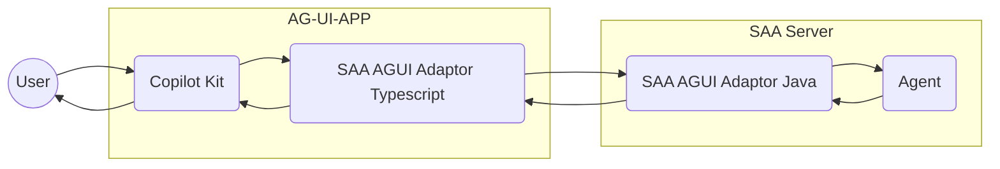

# Visualized agent UI based on CopilotKit

Compatible with [AG-UI protocol][AG-UI] with [CopilotKit] integration

## Architecture


## Getting Started

### Start Spring AI Alibaba Agent

```bash
mvn package spring-boot:test-run
```

### Start CopilotKit App

```bash
cd webui
npm run dev
```

### Open web app

Open browser on [http://localhost:3000](http://localhost:3000) and play with chat


## References

[AG-UI]: https://docs.ag-ui.com/introduction
[CopilotKit]: https://www.copilotkit.ai
